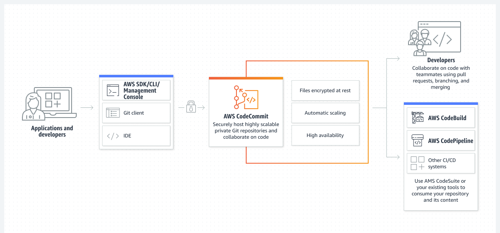

# Day 54: AWS CodeCommit

AWS CodeCommit은 아마존웹서비스(AWS)가 제공하는 완전 관리형 소스 제어 서비스로, 개발자들이 개인 Git 저장소를 쉽게 호스팅하고 관리할 수 있도록 해줍니다. "GitHub이지만 기능이 적은"라고 생각하세요 🤣 (j/k, 자세한 내용은 "CodeCommit vs GitHub" 리소스 참조) 이를 통해 팀들은 코드 협업과 보안 액세스 제어, 암호화 및 자동 백업을 지원으로 코드를 클라우드에 안전하게 저장할 수 있습니다.

개발자들은 AWS CodeCommit을 통해 강력한 코드 리뷰 및 워크플로우 도구를 통해 Git 저장소를 쉽게 생성, 관리 및 협업할 수 있습니다. AWS CodePipeline 및 AWS CodeBuild와 같은 다른 AWS 서비스와 원활하게 통합되어 완벽하게 자동화된 방식으로 애플리케이션을 구축하고 배포할 수 있습니다.

AWS CodeCommit의 몇 가지 주요 기능은 다음과 같습니다:

- 코드 리뷰 및 pull requests을 지원하는 깃 기반 저장소
- 안전한 액세스 제어를 위해 AWS IAM(Identity and Access Management)과의 통합(큰 이점)
- 저장 및 전송 중인 데이터 암호화
- 자동 백업 및 장애 조치 기능을 통한 뛰어난 확장성과 가용성
- AWS CodePipeline 및 AWS CodeBuild와 같은 다른 AWS 개발자 도구와의 통합

CodeCommit을 효과적으로 활용하기 위해서는 Git을 사용하는 방법을 당연히 알아야 합니다. 
[many](https://www.youtube.com/playlist?list=PL2rC-8e38bUXloBOYChAl0EcbbuVjbE3t) [excellent](https://youtu.be/tRZGeaHPoaw) [Git](https://youtu.be/USjZcfj8yxE) [tutorials](https://youtu.be/RGOj5yH7evk)가 있고, (어쨋든 제 섹션이 아닙니다 😉) 그래서 저는 거기를 살펴보진 않을 것입니다.

전반적으로 AWS CodeCommit은 코드 협업, 저장소의 안전한 관리 및 개발 워크플로우의 효율화가 필요한 팀을 위한 강력한 도구입니다.

## Resources: 

[AWS CodeCommit 사용자 안내서](https://docs.aws.amazon.com/codecommit/latest/userguide/welcome.html)

[AWS CodeCommit 개요](https://youtu.be/5kFmfgFYOx4)

[AWS CodeCommit 튜토리얼: your first Repo, Commit and Push](https://youtu.be/t7M8pHCh5Xs)

[AWS CodeCommit vs GitHub: 2023에 빛날 것은?](https://appwrk.com/aws-codecommit-vs-github)

[Day 55](day55.md)에서 다시 만나요.
