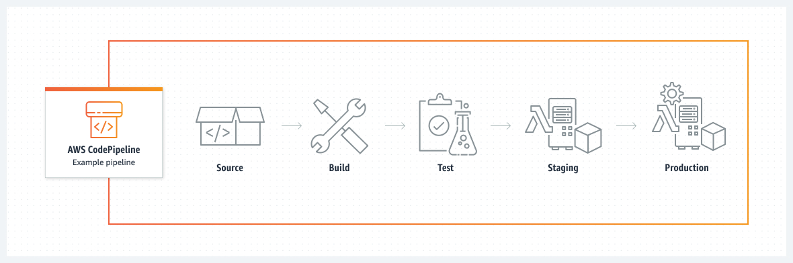

# Day 55: AWS CodePipeline

<i>AWS 서비스의 마지막 날에 우리는 움직이는 부분과 통합이 많은 큰 서비스에 대해 이야기할 것입니다. 이에 대한 학습/이해에 도움이 될 몇 가지 무료 리소스가 있지만 솔직히 가장 좋은 리소스 중 일부는 비용이 들 것입니다. 리소스 섹션에 별도로 나열하여 호출할 것이지만 이 복잡한 서비스를 학습하기에 환상적이기 때문에 언급하지 않는 것은 놓칠 수 있습니다</i>

<b>CodePipeline</b>은 IaC 또는 소프트웨어 릴리즈 프로세스를 자동화할 수 있는 완전 관리형 지속적 전달 서비스입니다. 이를 통해 코드 변경 사항을 (적절한 테스트를 수행하여)안정되게 지속적으로 빌드, 테스트 및 배포하는 파이프라인을 생성할 수 있습니다:

CodePipeline을 사용하면 빌드, 테스트 및 배포 워크플로우를 자동화하는 파이프라인을 생성하여 코드 변경 사항이 대상 환경에 안정적으로 배포되도록 할 수 있습니다. 이를 통해 빠른 릴리즈 주기를 달성하고 개발 및 운영 팀 간의 협업을 개선하며 소프트웨어 릴리스의 전반적인 품질과 신뢰성을 향상시킬 수 있습니다.

AWS CodePipeline은 다른 AWS 서비스와 통합됩니다:

- [Source Action Integrations](https://docs.aws.amazon.com/codepipeline/latest/userguide/integrations-action-type.html#integrations-source)
- [Build Action Integrations](https://docs.aws.amazon.com/codepipeline/latest/userguide/integrations-action-type.html#integrations-build)
- [Test Action Integrations](https://docs.aws.amazon.com/codepipeline/latest/userguide/integrations-action-type.html#integrations-test)
- [Deploy Action Integrations](https://docs.aws.amazon.com/codepipeline/latest/userguide/integrations-action-type.html#integrations-deploy)
- [Approval Action Integrations](https://docs.aws.amazon.com/codepipeline/latest/userguide/integrations-action-type.html#integrations-approval)
- [Invoke Action Integrations](https://docs.aws.amazon.com/codepipeline/latest/userguide/integrations-action-type.html#integrations-invoke)

또한 깃허브(GitHub), 젠킨스(Jenkins), 비트버킷(Bitbucket)과 같은 타사 도구와 통합됩니다. AWS CodePipeline을 사용하여 여러 AWS 계정 및 리전에 걸쳐 애플리케이션 업데이트를 관리할 수 있습니다.

## AWS CodePipeline 시작하기

AWS CodePipeline을 시작하기 위해 [AWS User Guide](https://docs.aws.amazon.com/codepipeline/latest/userguide/welcome.html) 에 몇 가지 우수한 [tutorials](https://docs.aws.amazon.com/codepipeline/latest/userguide/tutorials.html)이 있습니다. 이들은 모두 기본적으로 다음과 같은 세 단계로 나뉩니다:

### Step 1: IAM 역할 만들기

AWS CodePipeline에서 파이프라인을 실행하는 데 필요한 AWS 리소스에 액세스할 수 있는 IAM 역할을 생성해야 합니다. IAM 역할을 생성하려면 [Day 52](day52.md)의 단계를 확인하십시오

### Step 2: CodePipeline 파이프라인 생성

CodePipeline 파이프라인을 만들려면 AWS CodePipeline 콘솔로 이동하여 "파이프라인 생성" 버튼을 클릭한 후 지시사항을 따라 파이프라인을 생성합니다. 코드의 소스 위치, 사용할 빌드 공급자, 사용할 배포 공급자 및 2단계에서 생성한 IAM 역할을 지정해야 합니다.

### Step 3: 코드 변경 테스트 및 배포

CodePipeline 파이프라인을 생성한 후 코드 변경사항을 테스트하고 배포할 수 있습니다. AWS CodePipeline은 자동으로 코드 변경사항을 빌드, 테스트하고 대상 환경에 배포합니다. AWS CodePipeline 콘솔에서 파이프라인의 진행 상황을 모니터링할 수 있습니다.
Once you have created your CodePipeline pipeline, you can test and deploy your code changes. AWS CodePipeline will automatically build, test, and deploy your code changes to your target environments. You can monitor the progress of your pipeline in the AWS CodePipeline console.

## 캡스톤 프로젝트

데브옵스 90일의 이 AWS 섹션을 연결하려면 Adrian Canttrill의 우수한 미니 프로젝트인 [CatPipeline](https://www.youtube.com/playlist?list=PLTk5ZYSbd9MgARTJHbAaRcGSn7EMfxRHm) 을 살펴보시기를 권장합니다. 그 안에서 여러분은 데브옵스 엔지니어의 하루를 경험할 수 있는 재미있는 작은 프로젝트인 CodeCommit, CodeBuild, CodeDeploy 및 CodePipeline을 접할 수 있습니다.

- [YouTube CatPipeline Playlist](https://www.youtube.com/playlist?list=PLTk5ZYSbd9MgARTJHbAaRcGSn7EMfxRHm)
- [GitHub CatPipeline Repo](https://github.com/acantril/learn-cantrill-io-labs/tree/master/aws-codepipeline-catpipeline)

## Resources (무료)

[AWS: Real-world CodePipeline CI/CD 예제](https://youtu.be/MNt2HGxClZ0)

[AWS CodePipeline 사용 설명서](https://docs.aws.amazon.com/codepipeline/latest/userguide/welcome.html)

[AWS CodePipeline 튜토리얼](https://docs.aws.amazon.com/codepipeline/latest/userguide/tutorials.html)

[AWS CodeCommit 튵ㅎ라올: your first Repo, Commit and Push](https://youtu.be/t7M8pHCh5Xs)

[AWS CodeCommit vs GitHub: 2023에 빛날 것은?](https://appwrk.com/aws-codecommit-vs-github)

## Resources (유료)

수많은 <i>훌륭한</i> 강사들이 있고 2-3명을 뽑는 것은 항상 어렵지만, [Adrian Canttrill](https://learn.cantrill.io/), [Andrew Brown](https://www.exampro.co/), 과 [Stephane Maarek](https://www.udemy.com/user/stephane-maarek/) 은 항상 환상적인 콘텐츠에 대해 이야기할 때 생각납니다.

## 마지막 생각

데브옵스 90일의 이 섹션을 통해 AWS 생태계에서 사용할 수 있는 것을 확인할 수 있기를 바랍니다.

공부에 행운을 빌어요! 다음은 Red Hat OpenShift 입니다!
[Day 56](day56.md)에서 다시 만나요.
