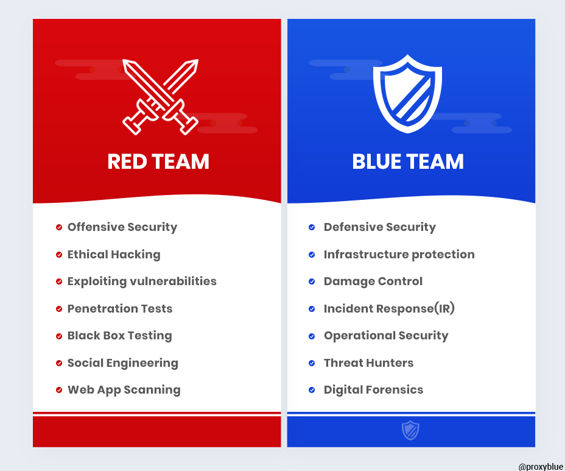
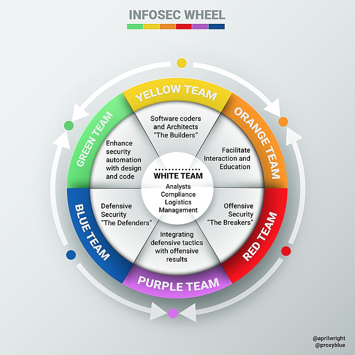

## Đội Đỏ và Đội Xanh

Một điều tôi đã đề cập trong buổi trước, là việc nhắc đến các đội **Đỏ** và **Xanh**. Trong lĩnh vực bảo mật, các đội **Đỏ** và **Xanh** hoạt động như những kẻ tấn công và người phòng thủ để cải thiện tư thế bảo mật của tổ chức.

Cả hai đội đều làm việc để cải thiện tư thế bảo mật của tổ chức nhưng theo những cách khác nhau.

Đội **Đỏ** có vai trò của kẻ tấn công bằng cách cố gắng tìm ra các lỗ hổng trong mã hoặc cơ sở hạ tầng và cố gắng vượt qua các biện pháp phòng thủ an ninh mạng.

Đội **Xanh** bảo vệ chống lại những cuộc tấn công đó và phản ứng khi có sự cố xảy ra.

***[hình ảnh từ nguồn này](https://hackernoon.com/introducing-the-infosec-colour-wheel-blending-developers-with-red-and-blue-security-teams-6437c1a07700)***

### Lợi ích

Một cách rất tốt để hiểu và cải thiện tư thế bảo mật của công ty là thực hiện các bài tập này giữa các đội **Đỏ** và **Xanh**. Toàn bộ ý tưởng là kịch bản này nhằm mô phỏng một cuộc tấn công thực sự. Một số lĩnh vực mà phương pháp này sẽ giúp ích bao gồm:

- Các lỗ hổng
- Củng cố an ninh mạng
- Tăng cường kinh nghiệm trong việc phát hiện và cô lập các cuộc tấn công
- Xây dựng các kế hoạch phản ứng chi tiết
- Nâng cao nhận thức về an ninh của toàn công ty

### Đội Đỏ 

NIST (Viện Tiêu chuẩn và Công nghệ Quốc gia) miêu tả một đội **Đỏ** như sau: 

“một nhóm người được ủy quyền và tổ chức để mô phỏng khả năng tấn công hoặc khai thác của đối thủ tiềm năng nhằm vào tình trạng bảo mật của doanh nghiệp.”

Họ đóng vai trò là kẻ tấn công trong kịch bản hoặc mô phỏng cuộc tấn công.

Khi chúng ta nói về cả đội **Đỏ** và **Xanh**, có thể nó rộng hơn quy trình DevSecOps và các nguyên tắc của vòng đời phần mềm, nhưng biết điều này sẽ không gây hại và các thực hành từ DevSecOps sẽ đảm bảo rằng bạn có một tư thế bảo mật tốt hơn.

Đội **Đỏ** được giao nhiệm vụ suy nghĩ như kẻ tấn công mà chúng ta đã đề cập trong buổi trước. Hãy nghĩ về kỹ thuật xã hội và bao gồm các đội rộng hơn trong doanh nghiệp để thao túng và truy cập vào mạng và dịch vụ.

Một yếu tố cơ bản của đội **Đỏ** là hiểu về phát triển phần mềm. Hiểu và biết cách các ứng dụng được xây dựng, bạn sẽ có thể xác định các điểm yếu có thể có, sau đó viết các chương trình của bạn để cố gắng truy cập và khai thác. Ngoài ra, bạn có thể đã nghe thuật ngữ "kiểm thử xâm nhập" hoặc "kiểm thử pen", mục tiêu tổng thể của đội **Đỏ** là xác định và cố gắng khai thác các lỗ hổng đã biết trong một môi trường. Với sự gia tăng của phần mềm mã nguồn mở, đây là một lĩnh vực khác mà tôi muốn đề cập trong vài buổi tới.

### Đội Xanh 

NIST (Viện Tiêu chuẩn và Công nghệ Quốc gia) miêu tả Đội **Xanh** như sau:

“nhóm chịu trách nhiệm bảo vệ việc sử dụng hệ thống thông tin của doanh nghiệp bằng cách duy trì tư thế bảo mật của nó chống lại một nhóm kẻ tấn công giả lập.”

Đội **Xanh** đóng vai trò phòng thủ, họ sẽ phân tích tư thế bảo mật hiện tại trong doanh nghiệp và sau đó thực hiện các hành động để cải thiện điều đó nhằm ngăn chặn các cuộc tấn công từ bên ngoài. Trong đội **Xanh**, bạn cũng sẽ tập trung vào việc giám sát liên tục (một điều chúng tôi đã đề cập vào phiên bản trước liên quan đến DevOps) để giám sát các vi phạm và phản ứng khi chúng xảy ra.

Là một phần của đội **Xanh**, bạn sẽ phải hiểu các tài sản mà bạn đang bảo vệ và cách tốt nhất để bảo vệ chúng. Trong bối cảnh CNTT ngày nay, chúng ta có rất nhiều lựa chọn đa dạng để chạy các khối công việc, ứng dụng và dữ liệu của mình.

- Đánh giá Rủi ro - thông qua các hình thức đánh giá rủi ro sẽ giúp bạn hiểu rõ những tài sản quan trọng nhất trong doanh nghiệp là gì.

- Threat Intelligence - Những mối đe dọa nào đang tồn tại? Có hàng ngàn lỗ hổng có thể không có giải pháp, làm thế nào bạn có thể giảm thiểu rủi ro của những dịch vụ đó mà không làm tổn hại đến trường hợp sử dụng và nhu cầu kinh doanh?

### Bánh xe màu cho an ninh mạng

Khi an ninh mạng ngày càng trở nên quan trọng với tất cả các thương hiệu lớn bị tấn công, cần có nhiều hơn chỉ các đội **Đỏ** và **Xanh** khi nói đến bảo mật trong một doanh nghiệp.

***[hình ảnh từ nguồn này](https://hackernoon.com/introducing-the-infosec-colour-wheel-blending-developers-with-red-and-blue-security-teams-6437c1a07700)***

- Đội **Vàng** là những người phát triển của chúng ta, các kỹ sư và nhà phát triển phát triển các hệ thống và ứng dụng bảo mật.

"Chúng ta có các đội **Đỏ** và **Xanh** như chúng ta luôn có, nhưng bây giờ với sự xuất hiện của đội **Vàng**, chúng ta có thể có các đội màu thứ cấp (Cam, Xanh Lá và Tím) chuyên về việc kết hợp kỹ năng giữa kẻ tấn công, người phòng thủ và lập trình viên - làm cho mã an toàn hơn và tổ chức an toàn hơn."

Đoạn trích trên được lấy từ tài nguyên hàng đầu được liệt kê ở cuối bài viết.
**Đỏ**, **Xanh**, **Vàng** là các màu cơ bản, kết hợp chúng và chúng ta bắt đầu hiểu được các màu khác hoặc màu thứ cấp xuất hiện như thế nào, một lần nữa, một giải thích rất dễ hiểu trong liên kết đầu tiên.

- **Đội Tím** - Đội đặc biệt! Nếu bạn kết hợp **Xanh** và **Đỏ**, bạn sẽ có **Tím**. Nếu bạn tích hợp phòng thủ với tấn công và bạn cộng tác và chia sẻ kiến thức giữa các đội, bạn sẽ cung cấp một tư thế bảo mật tốt hơn tổng thể.

- **Đội Xanh Lá** - Vòng phản hồi, đội **Xanh Lá** sẽ lấy thông tin từ đội **Xanh** và làm việc chặt chẽ với đội **Vàng** để hiệu quả hơn. Kết hợp **Xanh** và **Xanh Lá** và bạn sẽ có gì? **Tím**?

- **Đội Cam** - Giống như đội **Xanh Lá** làm việc với đội **Xanh** để phản hồi, đội **Cam** làm việc với đội **Đỏ** và truyền đạt những gì họ đã học được cho đội **Vàng** để xây dựng bảo mật tốt hơn vào mã của họ.

Khi tôi bắt đầu nghiên cứu về điều này, tôi nhận ra rằng có thể tôi đang đi xa khỏi các chủ đề DevOps, nhưng xin hỏi bất kỳ ai trong lĩnh vực DevSecOps, điều này có hữu ích không? đúng không? và bạn có điều gì muốn bổ sung không?

Rõ ràng là trong suốt quá trình, chúng tôi có kế hoạch đi sâu vào các chi tiết cụ thể hơn về DevSecOps và các giai đoạn khác nhau, vì vậy tôi đã cẩn thận để không bao phủ những lĩnh vực sẽ được đề cập trong các buổi học sau.

Cũng xin vui lòng thêm bất kỳ tài liệu tham khảo bổ sung nào.

## Tài liệu tham khảo 

- [Introducing the InfoSec colour wheel — blending developers with red and blue security teams.](https://hackernoon.com/introducing-the-infosec-colour-wheel-blending-developers-with-red-and-blue-security-teams-6437c1a07700)

Hẹn gặp lại vào [ngày 5](day05.md).

