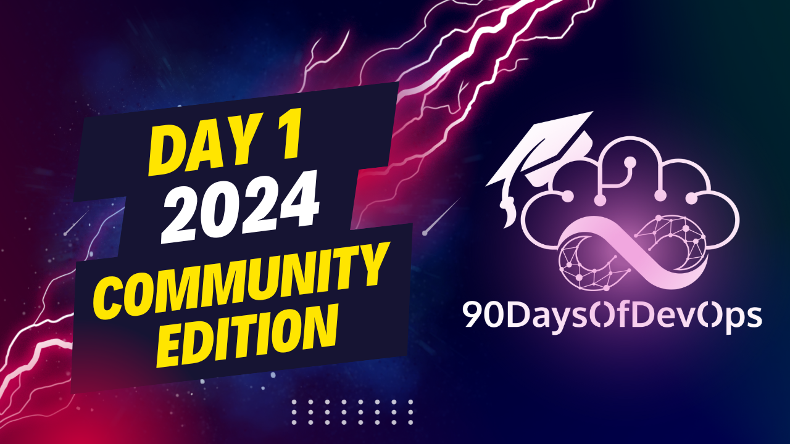

# Day 1 - 2024 - Community Edition - Introduction

 In summary, the speaker is discussing a project they worked on for 90 days, focusing on DevOps and infrastructure as code. They highlight tools like Terraform, Ansible, Jenkins, Argo CD, GitHub Actions, and observability tools like Grafana, Elk Stack, Prometheus, etc. The project also covered data storage, protection, and cybersecurity threats such as ransomware. It consisted of 13 topics covered in blog posts totaling 110,000 words and has received over 20,000 stars on GitHub.

The project's website is at 90daysofdevops.com where you can access the content from each edition (2022, 2023, and the upcoming 2024 Community Edition). The 2024 edition promises to have at least 90 unique sessions from diverse speakers covering a wide range of topics. They encourage viewers to ask questions on Discord or social media if they want to learn more. Videos will be released daily for ongoing engagement and learning.

**IDENTITY:**

The 90 Days of DevOps project aims to provide a comprehensive resource for learning and understanding DevOps concepts, covering 13 topics in total. The project is built upon personal notes and has evolved into a repository with over 22,000 stars on GitHub.

**PURPOSE:**

The primary purpose of the project is to make DevOps accessible to everyone, regardless of their background or location. To achieve this, the project focuses on:

1. Providing practical, hands-on experience with Community Edition tools and software.
2. Covering key topics such as security, cloud computing, data storage, and serverless services.
3. Featuring contributions from diverse authors and experts in the field.

The ultimate goal is to create a valuable resource for anyone looking to learn about DevOps, with a focus on community engagement, accessibility, and continuous learning.

**MAIN POINTS:**

1. The project has undergone significant growth since its inception, with the 2022 edition covering introductory topics and practical hands-on exercises.
2. In 2023, the project expanded to include security-focused content, such as DevSecOps and secure coding practices.
3. The 2024 Community Edition aims to further expand the scope of the project, featuring over 90 unique speakers and sessions on a wide range of topics.

**CALL TO ACTION:**

Get involved by exploring the repository, attending sessions, asking questions in the Discord or social media channels, and engaging with the community.
