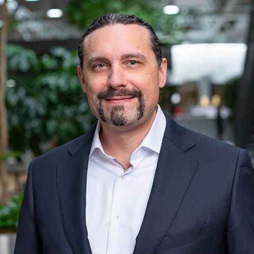
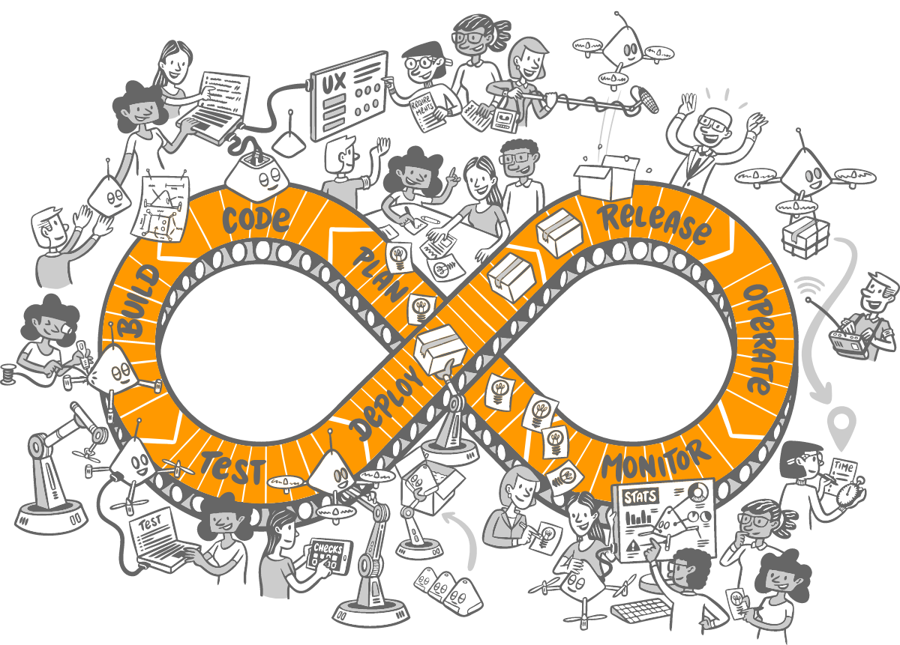
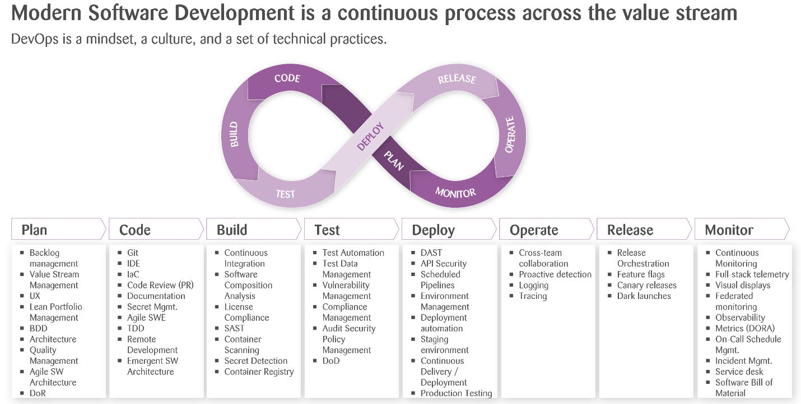
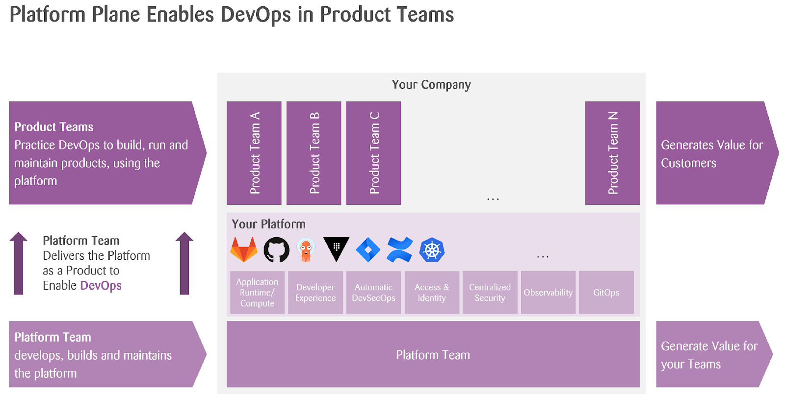
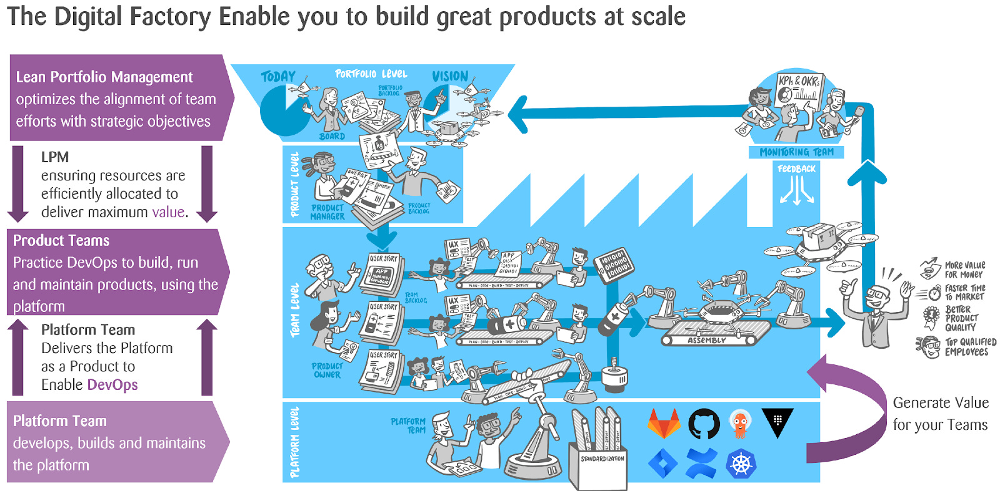
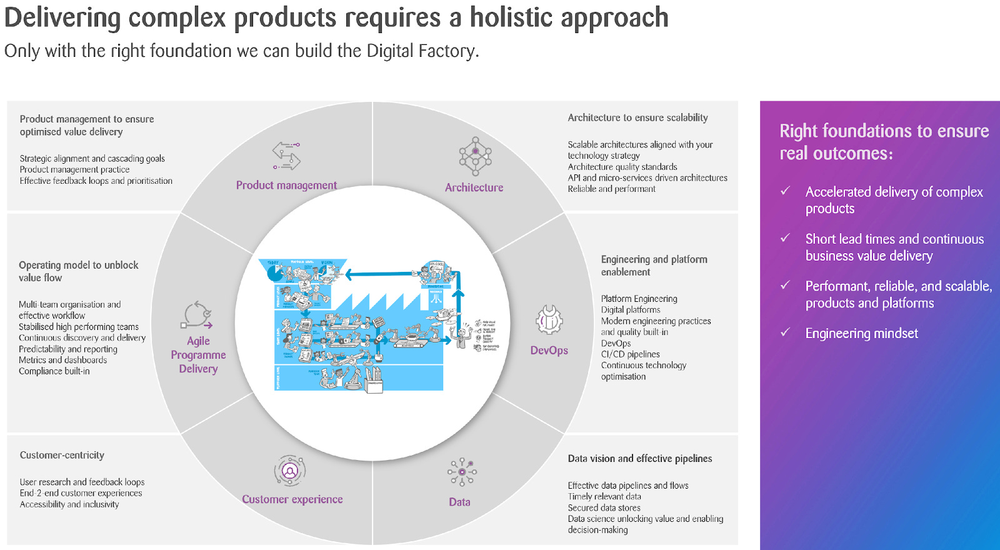

Day 2: The Digital Factory
=========================

## Video

## About Me
I'm [Romano Roth](https://www.linkedin.com/in/romanoroth/), Chief of DevOps and Partner at [Zühlke](https://www.zuehlke.com/en). My journey with Zuhlke began 21 years ago. Over the years, I've evolved from an expert software engineer and software architect to a consultant. Throughout this journey, one question has always fueled my passion: **How can we continuously deliver value while ensuring quality and automation?**

When the DevOps movement began to gain momentum, I was naturally drawn to it. Today, I’m one of the organizers of the monthly [DevOps Meetup in Zürich](https://www.meetup.com/de-DE/DevOps-Meetup-Zurich/) and president of [DevOps Days Zürich](https://www.devopsdays.ch/), an annual conference part of the global DevOps movement. DevOps isn't just a professional interest; it's my passion. That’s why I’ve my own [YouTube channel](https://www.youtube.com/c/RomanoRoth), where I've curated over 100 videos centered on DevOps, architecture, and leadership.

## What is DevOps?
DevOps is a mindset, a culture, and a set of technical practices. It provides communication, integration, automation, and close cooperation among all the people needed to plan, develop, test, deploy, release, and maintain a product.

In short: **Bringing People, Process, and Technology together to continuously deliver value!**

## What are the challenges with DevOps
**Cultural Resistance:** One of the biggest challenges is changing the organizational culture. DevOps requires shifting from traditional siloed roles to a collaborative approach with shared responsibility. This can be met with resistance from teams used to working in siloed organizations.

**Cognitive Load:** Numerous technical practices and tools exist for various stages of the DevOps lifecycle, from ideation over continuous integration over continuous deployment to release on demand. Integrating and maintaining all these technical practices and tools to develop great products can be challenging.

**Scaling DevOps**: What works for a small team or a single project might not work for an entire organization. Scaling DevOps practices while maintaining speed and reliability is a significant challenge.

## How can we scale DevOps?
Scaling DevOps, especially in larger organizations, requires a strategic approach beyond tools and technologies. Here are some considerations to scale DevOps effectively:
- **Cultural Transformation**: Foster a collaborative environment that values learning from failures.
- **Standardization**: Adopt consistent tools and processes across teams to maintain uniformity.
- **Automation**: Streamline operations by automating tasks from ideation over continuous integration over continuous deployment to release on demand.
- **Modular Architecture**: Utilize architecture styles like microservices to reduce interdependencies.
- **Metrics**: Use metrics to measure performance, identify bottlenecks, and drive continuous improvement.
- **Continuous Training**: Invest in ongoing skill development to ensure team members have the necessary skills to work in a DevOps environment.
- **Feedback Loops**: Establish efficient channels for feedback to identify and address issues quickly.
- **Decentralized Decision-making**: Empower teams to make decisions locally, reducing the need for top-down approvals and speeding up the development process.
- **Pilot Programs**: Test and refine DevOps practices through specific pilot projects.
- **Collaboration Platforms**: Use tools that enhance team communication like GitLab, GitHub, and Azure DevOps….
- **Regular Reviews**: Continuously assess and adjust DevOps practices as the organization grows and changes.

## What is Is Platform Engineering?

Platform Engineering and DevOps are not the same, but they are closely related and often overlap in many organizations.

**DevOps** is a mindset, a culture, and a set of technical practices. It provides communication, integration, automation, and close cooperation among all the people needed to plan, develop, test, deploy, release, and maintain a product and deliver continuous value to the customer.

**Platform engineering** is designing and building toolchains and workflows that enable self-service capabilities for product teams that deliver continuous value to the customer.

**Platform engineering** uses **DevOps** practices, which enables product teams to do DevOps.

## What is a Digital Factory?

Throughout my work on various projects across diverse industries and clients, I've observed that **many companies share common challenges and objectives**. I think they all want to build great products, have a faster time to market, and be more efficient. And what they want is to **build up a digital factory**.

At the top of a company, you find the board of directors and the executive board. They shape the company's vision, mission, and strategy. All big ideas are prioritized in a **portfolio kanban**. The board prioritizes these ideas and gives product management the most important and promising ideas. For example, _building drones carrying heavy weight increases the market share_. The product management takes that idea and defines what features are needed for such a drone. Such a drone, for example, needs to have modified software, bigger batteries, and better engines. They give these features down to the teams. The existing teams have started to work on those features. For the new engine, a new team needs to be established. For that, **the platform engineering team will provide a standardized continuous delivery environment** so that that team can start right away. All the parts get assembled, and the drones can now be continuously delivered to the customers.

The teams constantly monitor the drones. **Telemetry and business data are collected**, like how many drones we have sold and customer satisfaction. These metrics are fed back to the portfolio level, where this information informs the board's future decisions.

## How can we implement Digital Factory?

To build a digital factory, you need a holistic approach.
- **Architecture:** Design architectures that align with your technology strategy, ensuring adaptability, scalability, and flexibility.
- **DevOps:** Utilize Platform Engineering to design and build toolchains and workflows that enable self-service capabilities for product teams to enable them to make quality and do DevOps.
- **Data:** Streamline data pipelines for timely, actionable insights. Harness data science to extract value to inform decision-making.
- **Customer experience:** Place user feedback at the heart of product development. Aim for a seamless end-to-end experience.
- **Agile Programme Delivery:** Adopt a multi-team organization to optimize workflows and performance. Continuous discovery, coupled with transparent reporting, drives growth.
- **Product Management for Maximized Value:** Connect the strategy with the execution. Align product initiatives with the company goals. Continuously refine management practices and leverage feedback for prioritization.

