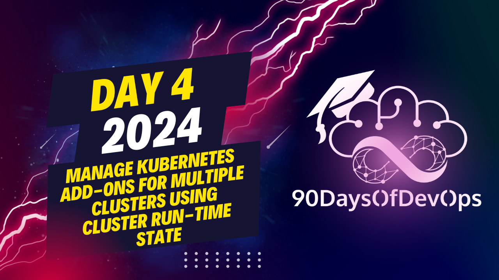

# Day 4 - Manage Kubernetes Add-Ons for Multiple Clusters Using Cluster Run-Time State

 In summary, during the demonstration, we saw how Zelos, a Kubernetes management system, works. Here are the key points:

1. The Drift Detection Manager detects inconsistencies between the configured and actual cluster states in the Management Cluster, and it reconciles the resources to restore the desired state.

2. When checking the Kubernetes versions of various registered clusters, we noticed that most were running versions higher than 127, except for Civo Cluster 1 (version 1264).

3. A new cluster profile was prepared to deploy Prometheus and Grafana Elm Charts in any cluster with the label "deploy_prich." However, none of the existing clusters had this label.

4. To ensure that clusters running Kubernetes versions greater than or equal to 1270 (including Civo Cluster 3, GK Clusters 1 and 2) would deploy Prometheus and Grafana, a classifier instance was deployed that would add the "deploy_prometheus" label to such clusters.

5. After the classifier instance was deployed, it added the "deploy_prometheus" label to clusters meeting the criteria (Civo Cluster 3, GK Clusters 1 and 2).

6. When a cluster profile is deleted (like deleting the Prometheus-Grafana profile), by default, resources deployed on a cluster that no longer matches the profile will be removed from all clusters. This behavior can be configured to leave deployed resources in place.

Additional notes:
- For more information about Zelos, Grafana, and Kubernetes, you can visit the respective repositories and project documentation provided in the demo.
- The presenter is available on LinkedIn for anyone interested in devs, Kubernetes, and Project Fels.

**PURPOSE**

* The purpose of this presentation is to demonstrate how Zelos, a Kubernetes management platform, can be used to manage clusters with different environments and configurations.
* You will show how to deploy cluster profiles, which are collections of Helm charts that define the configuration for a specific environment or use case.

**DEMO**

* You demonstrated three cluster profile instances:
	1. "Caverno" - deploys Caverno El release version 3.0.1 in clusters matching the cluster selector environment functional prediction.
	2. "Engine X" - deploys Engine X Helm chart with continuous sync mode and drift detection.
	3. A classifier instance that detects clusters running a Kubernetes version greater than or equal to 1270 and adds the label "deploy promethus".

**OUTCOME**

* You showed how Zelos can manage clusters with different environments and configurations by deploying cluster profiles.
* You demonstrated the concept of drift detection, where Zelos detects changes to resources deployed in a cluster and reconciles them back to their original state.

**CONCLUSION**

* The presentation concluded with a review of the demo and an invitation for users to connect on LinkedIn or visit the Gab project repository for more information.
