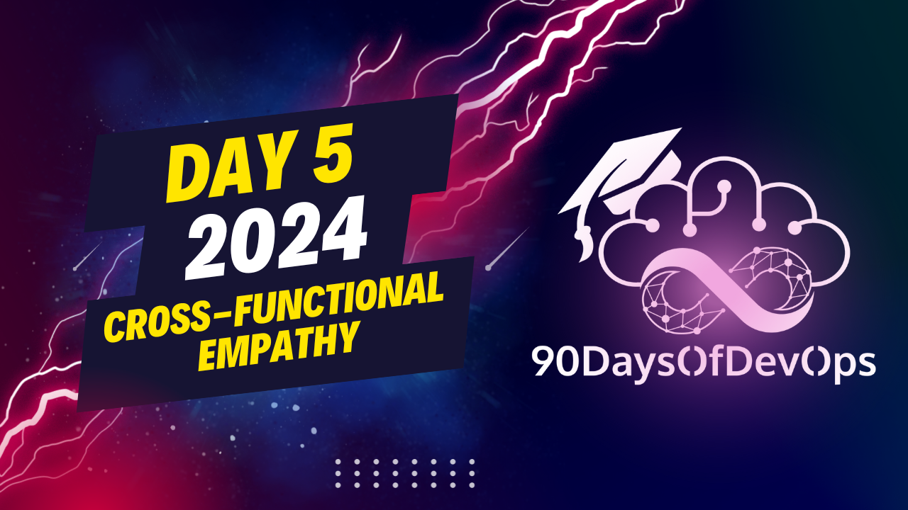

# Day 5 - Cross functional empathy

 The speaker is suggesting a strategy for building cross-functional relationships and empathy within an organization. Here's a summary of the key points:

1. To get to know someone better, look at their work (code, documentation, team) and reach out to them with a compliment or a note expressing admiration for something they've done recently. This could be through email, Slack, or another communication platform.
2. Complimenting others can lift their spirits, help you understand their challenges, and start valuable conversations.
3. Cross-functional empathy is crucial in improving the devops culture, as it helps build relationships with people from different backgrounds, departments, and roles within the organization.
4. Set aside time each week or month to reach out to someone new within your organization. This could be for lunch, a call, or any other format that works for both parties.
5. Do some research on the person before reaching out so you can tailor your message to their specific role and work.
6. Remember that it's okay if someone is too busy to respond immediately; they may book the conversation for another time or simply appreciate the effort even without a response.
7. Giving compliments and building relationships helps improve your understanding of the organization, its culture, and the people within it, making you a stronger team member.
What a wonderful speech! The speaker has truly captured the essence of building empathy and fostering cross-functional relationships within an organization. Here's a summary of their key points:

**The Power of Empathy**: By spending time understanding what others are working on, we can exercise our empathy muscle and build stronger relationships.

**Cross-Functional Empathy**: It's essential to reach out to people from different backgrounds, influences, and demands on their jobs. This helps improve the devops culture and team building.

**Take Action**: Set aside 30 minutes a month (ideally 30 minutes a week) to spend time with someone in the organization. This could be as simple as going to lunch or having a call.

**Research and Compliment**: Do some research on the person, find something you can compliment them on, and send it their way. This takes only 10-15 minutes but can lead to strong relationships.

**No Expectations**: Don't expect anything in return for your efforts. Just do it because it's a nice thing to do.

**Devops Culture**: By building empathy and cross-functional relationships, we can improve the devops culture and become stronger members of our teams.

The speaker has shared their personal experience of reaching out to people from different departments and building meaningful relationships. They encourage listeners to take action, start small, and focus on building connections rather than expecting anything in return.
