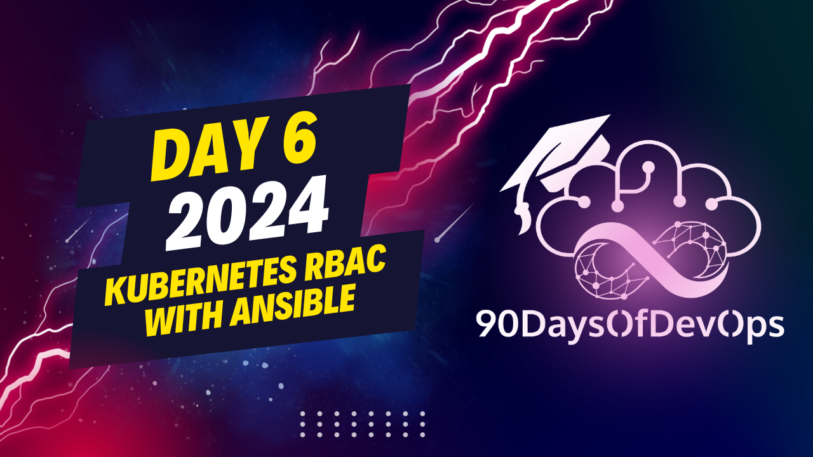

# Day 6 - Kubernetes RBAC with Ansible

A well-thought-out demonstration of using Kubernetes, Ansible, and HashiCorp Vault to enhance security and streamline management in complex IT environments. Here's a summary of the components and their roles:

1. **Kubernetes**: A platform for container management that simplifies building, deploying, and scaling applications and services. It maximizes resource utilization by treating servers as resources and monitoring usage to determine the most efficient placement and scaling of containers.

2. **Ansible**: An open-source automation tool used for tasks such as configuration management, application deployment, intraservice orchestration, and provisioning. Ansible uses a declarative approach through playbooks written in YAML to define the desired state of IT environments.

3. **HashiCorp Vault**: A security tool specializing in secrets management, data encryption, and identity-based access. It provides a centralized platform for securely storing, accessing, and managing sensitive data like tokens, passwords, certificates, or API keys. Vault supports various backends for storage and offers detailed audit logs while integrating seamlessly with clouds and on-premises environments.

In the demonstration, user authentication to the Kubernetes API is automated using Ansible to generate critical files efficiently. To further secure these certificates, a Vault cluster (Key Value secret engine) is employed for secure storage and access control. This combination of Ansible and Vault ensures high-level security and a seamless experience when managing client certificates.

The presented approach aligns with the principle of least privilege, ensuring that users have access only to resources necessary for their roles. This streamlines processes while fortifying the overall security framework by carefully calibrating user access rights according to their specific operational needs.

Furthermore, automation and integration opportunities were mentioned, such as auto-approval and rotation of certain CSRs, integration with external CAs for signing certificates, and scaling management tools and strategies. The real-life examples provided include hospitals implementing role-based access control and organizations ensuring compliance with regulations like HIPAA and GDPR.

Overall, this demonstration showcases how these three technologies can work together to improve security and streamline processes in complex IT environments while providing a foundation for further automation, integration, and scalability.
I've summarized the content about Identity and Purpose, specifically discussing Kubernetes, Ansible, and HashiCorp Vault.

**Kubernetes**: A container orchestration platform that streamlines the process of managing complex systems by automating deployment, scaling, and monitoring. It simplifies resource management, maximizing utilization and minimizing costs.

**Ansible**: An open-source automation tool used for tasks such as configuration management, application deployment, intraservice orchestration, and provisioning. Its primary feature is the use of playbooks written in YAML, allowing users to define the desired state of their IT environments in a clear and declarative approach.

**HashiCorp Vault**: A security tool that specializes in Secrets Management, data encryption, and identity-based access. It provides a centralized platform to securely store, access, and manage sensitive data such as tokens, passwords, certificates, or API keys. Vault is designed to tightly control access to secrets and protect them through strong encryption.

The speaker then demonstrated the integration of these tools, using Ansible to automate the process of creating client certificates and HashiCorp Vault to secure the storage and access of those certificates. The demonstration highlighted the importance of security and confidentiality in managing complex IT systems.

Some key takeaways include:

* Kubernetes simplifies resource management and streamlines complex system operations.
* Ansible is an open-source automation tool used for configuration management, application deployment, and provisioning.
* HashiCorp Vault is a security tool that provides centralized Secrets Management, data encryption, and identity-based access.
* Integration of these tools enables seamless orchestration and management of containers, as well as robust security features.

Additionally, the speaker touched on real-life scenarios where role-based access control (RBAC) applies, such as in hospitals where different staff members have varying access rights to patient records.
