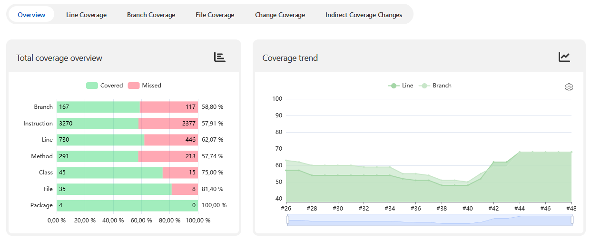

# Day 7: Advanced Code Coverage with Jenkins, GitHub and API Mocking

Presentation by [Oleg Nenashev](https://linktr.ee/onenashev),
Jenkins core maintainer and community builder at WireMock

**TL;DR:** I will talk about how modern Jenkins allows you to analyze 
and improve code coverage with help of the new Coverage Plugin for Jenkins,
support for standard formats (Cobertura, JaCoCo, gcov, JUnit, etc.), 
test parallelization, and GitHub Checks API.
We will also delve into increasing the integration test coverage with help of WireMock and Testcontainers.

## Resources

- Video: Coming Soon (January 07)
- Slides: Coming Soon (January 07)

## Full Abstract

In 2015-2018, I talked about how to use the Jenkins Pipeline and custom libraries to do advanced integration tests and analyze code coverage.
Coverage plugins were rather weak, and one needed some scripts and hacks to make it work, and to DIY for distributed testing. In 2021 the situation has changed significantly thanks to the Coverage and Checks API plugins.
Distributed integration testing also became easier thanks to better coverage collectors and integrations with API mocking tools. So, good time to be alive… and use Jenkins!

We will talk about how modern Jenkins allows you to improve and analyze code coverage.
We will talk about unit and integration testing with WireMock,  
the new Coverage Plugin,
support for standard formats (Cobertura, JaCoCo, gcov, JUnit, etc.),
parallelization for heavy integration tests and API mocking, and integration with GitHub Checks API.
How can you analyze code coverage in Jenkins and when do you need to create your own libraries?
And what’s the fuzz about Testcontainers and WireMock for integration testing?

## References

- [Jenkins Coverage Plugin](https://plugins.jenkins.io/coverage/)
- [GitHub Checks Plugin](https://plugins.jenkins.io/github-checks/)
- [WireMock](https://wiremock.org/)
- [Testcontainers](https://www.testcontainers.org/)
- Demo - Coming soon

Contribute to open source projects:
[Jenkins](https://www.jenkins.io/participate),
[WireMock](https://wiremock.org/participate),
[Testcontainers](https://java.testcontainers.org/contributing/)
