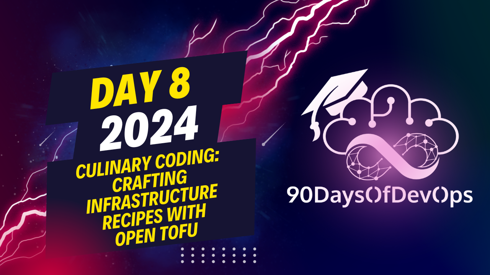

# Day 8 - Culinary Coding: Crafting Infrastructure Recipes with OpenTofu

 In this video, the speaker demonstrates how to use Open Tofu, an open-source tool designed to manage Terraform infrastructure. Here's a summary of the steps taken:

1. Install Open Tofu: The speaker installed Open Tofu on their Mac using Homebrew, but you can find installation instructions for other operating systems at [OpenTofu.org](http://OpenTofu.org).

2. Initialize Open Tofu: After installing, the speaker initialized Open Tofu in their repository, which sets up plugins and modules specific to Open Tofu.

3. Review existing infrastructure: The speaker showed a Terraform dashboard with two instances of Keycloak and one instance of PostgreSQL running. They explained that this is the resource to be deployed if you want to create a similar infrastructure.

4. Make changes to the Terraform file: To create a third instance of Keycloak, the speaker modified their Terraform file accordingly.

5. Run Open Tofu commands: The speaker applied the changes using `tofu apply` and waited for the resources to be provisioned. They also showed how to destroy the infrastructure using `tofu destroy`.

6. Important considerations: The speaker emphasized that the state file used with Terraform is supported by Open Tofu, but it's essential to ensure the version used to create the state file in Terraform is compatible with Open Tofu's migration side to avoid issues.

7. Community resources: The speaker encouraged viewers to join the Open Tofu community for support and collaboration on any questions or requests regarding the tool.

Overall, this video provides a quick introduction to using Open Tofu for managing Terraform infrastructure, demonstrating its ease of use and potential benefits for those new to infrastructure-as-code or experienced users looking to switch from Terraform.

**PURPOSE**: The purpose of this session is to introduce OpenTofu and demonstrate its features through a live demonstration. The speaker aims to educate attendees on how to use OpenTofu to create, modify, and destroy infrastructure resources, such as keycloak and Postgres instances.
