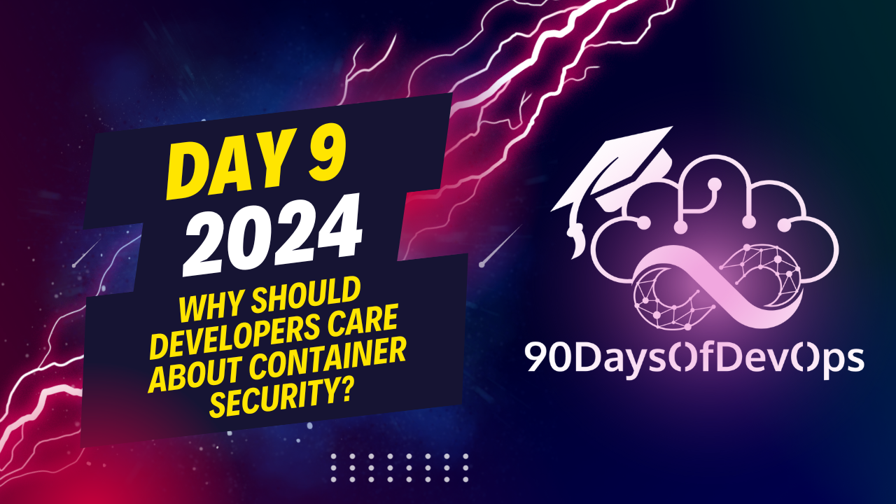

# Day 9 - Why should developers care about container security?

 The text you provided discusses best practices for securing Kubernetes clusters. Here are some key points:

1. Secrets should be encrypted, especially if using managed Kubernetes. Role-Based Access Control (RBAC) is recommended to limit access to necessary resources.

2. Service accounts should only have access to the things they need to run the app; they don't need blanket access. The default namespace should be locked down.

3. The security context of pods and containers is important, especially regarding privilege escalation (set to false by default). Other security measures include running as a non-root user and avoiding images with Pudu commands that could potentially grant root access.

4. Network policy is encouraged for firewalling purposes, implementing zero trust on the network. Only specified pods or services should be able to communicate.

5. All of these practices need to be enforced using admission controllers like OPA's Gatekeeper, Kerno, and the built-in Pod Security Admission (PSA).

6. A fast feedback loop is necessary, using tools like Sneak for local scanning in CI and providing developers with proactive information about security issues.

7. Practice defense in depth to deal with potential security threats, even those that current tools might not catch.

8. The speaker recommends visiting snak.io to learn more about their tools, including one focused on containers. They also suggest reading their blog post on security context and the 10 most important things to consider for security.

The speaker emphasizes the importance of maintaining a strong sense of identity and purpose when working with containers. This includes:

1. **Immutable Containers**: Using Docker containers with immutable layers makes it harder for attackers to modify the container.
2. **Secrets Management**: Storing sensitive information, such as credentials, in secret stores like Kubernetes Secrets or third-party tools like Vault or CyberArk is crucial.
3. **Role-Based Access Control (RBAC)**: Implementing RBAC in Kubernetes ensures that users only have access to what they need to perform their tasks.
4. **Security Context**: Configuring security context on pods and containers helps prevent privilege escalation and restricts access to sensitive information.

The speaker also stresses the importance of enforcing these best practices through admission controllers like OPA's Gatekeeper, Kerno, or Pod Security Admission (PSA). These tools can block malicious deployments from entering the cluster.

In conclusion, maintaining a strong sense of identity and purpose in container security requires a combination of technical measures, such as immutable containers, secrets management, RBAC, and security context, as well as cultural practices like enforcement through admission controllers.

## About Me
[Eric Smalling](https://about.me/ericsmalling) 
Staff Solutions Architect at [Chainguard](https://chainguard.dev)

For about 30 years, I've been an enterprise software developer, architect, and consultant with a focus on CI/CD, DevOps, and container-based solutions over the last decade.

I am also a Docker Captain, and am certified in Kubernetes (CKA, CKAD, CKS), and have been a Docker user since 2013.

## Description?
Container scanning tools, industry publications, and application security experts are constantly telling us about best practices for how to build our images and run our containers.
Often these non-functional requirements seem abstract and are not described well enough for those of us that don’t have an appsec background to fully understand why they are important.

This session explores several of the most common secure container practices, shows examples of how workloads can be exploited if not followed and, most importantly,
how to easily find and fix issues when building containers BEFORE you ship them.
Additionally, we'll discuss tactics to minimize exploit exposure by hardening runtime container and Kubernetes configurations. 

## Links referenced in the video
- Security Context blog: https://snyk.co/k8s-securitycontext
- Network Policy recipes: https://github.com/ahmetb/kubernetes-...
- Ko Build tool: https://ko.build
- Jib Build tool: https://github.com/GoogleContainerToo...