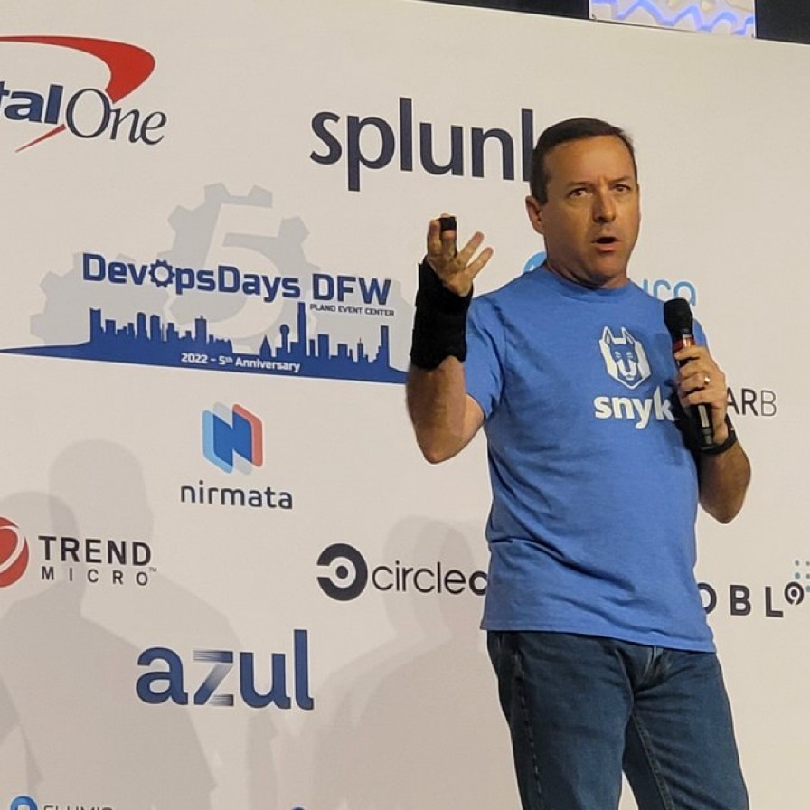

Day 9: Why should developers care about container security?
=========================

## Video

## About Me
[Eric Smalling](https://about.me/ericsmalling) 
Staff Solutions Architect at [Chainguard](https://chainguard.dev)

For about 30 years, I've been an enterprise software developer, architect, and consultant with a focus on CI/CD, DevOps, and container-based solutions over the last decade.

I am also a Docker Captain, and am certified in Kubernetes (CKA, CKAD, CKS), and have been a Docker user since 2013.

## Description?
Container scanning tools, industry publications, and application security experts are constantly telling us about best practices for how to build our images and run our containers.
Often these non-functional requirements seem abstract and are not described well enough for those of us that don’t have an appsec background to fully understand why they are important.

This session explores several of the most common secure container practices, shows examples of how workloads can be exploited if not followed and, most importantly,
how to easily find and fix issues when building containers BEFORE you ship them.
Additionally, we'll discuss tactics to minimize exploit exposure by hardening runtime container and Kubernetes configurations. 

## Links referenced in the video
- Security Context blog: https://snyk.co/k8s-securitycontext
- Network Policy recipes: https://github.com/ahmetb/kubernetes-...
- Ko Build tool: https://ko.build
- Jib Build tool: https://github.com/GoogleContainerToo...