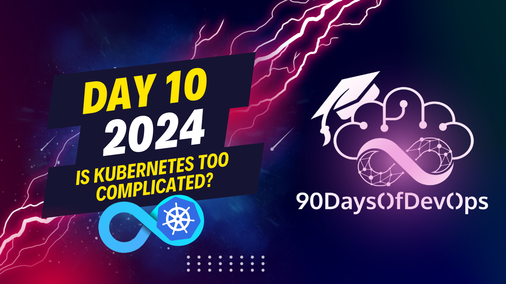

# Day 10 - Is Kubernetes Too Complicated?

This session provides a comprehensive explanation about Kubernetes, its components, benefits, challenges, and ways to learn it. Here is a summary:

* Kubernetes (k8s) is an open-source platform for managing containerized workloads and services.
* Worker nodes or minions are the machines that run applications and workloads in a Kubernetes cluster. They have containers that are part of pods, and each node includes a control plane, container runtime, and cube proxy.
* The control plane manages and coordinates the cluster, while worker nodes execute and run the actual workloads. This division of responsibilities ensures efficient, reliable, and scalable management of containerized applications across the Kubernetes cluster.
* The benefits of using Kubernetes are numerous, including faster development, greater agility, and improved efficiency in response to changing market conditions and customer demand. However, installing, upgrading, monitoring, scaling, and securing Kubernetes can be challenging for smaller organizations or those with limited resources.
* The complexity of the Kubernetes ecosystem can also be a barrier to adoption, as it requires learning various tools and services from service meshes to security monitoring logging, etc. Therefore, it's essential to use a few other projects from the Cloud Native Computing Foundation (CNCF) landscape to truly harness the power of Kubernetes.
* To simplify Kubernetes and make it more accessible to a wider audience, higher-level abstractions, clearer documentation, interactive learning opportunities, and community support are essential. It's crucial to learn the fundamentals first, including operating systems, infrastructure networking, storage APIs, and containerization, before diving into advanced topics like Kubernetes.
* Finally, hands-on practice, exploring Kubernetes documentation, joining the Kubernetes community, setting goals for certifications, and using free resources online are great ways to learn Kubernetes.

In conclusion, Kubernetes is both a simplification and complication in cloud native computing. It has made many aspects of managing containerized workloads easier, but it requires significant investment in terms of time and resources to truly harness its power. By finding ways to simplify the system and make it more accessible to a wider audience, we can fully realize the promise of cloud native computing and build the next generation of scalable and resilient applications.
You want me to summarize the content about Identity and Purpose, specifically focusing on Kubernetes. Here's a concise summary:

Kubernetes (k8s) has become prevalent due to its ability to abstract away underlying infrastructure, allowing developers to focus on building applications rather than managing infrastructure. However, the complexity of installing, upgrading, monitoring, scaling, and securing k8s can be a barrier to adoption, particularly for smaller organizations or those with limited resources.

The kubernetes ecosystem is vast and overwhelming, requiring operators to learn various tools and services from the Cloud Native Computing Foundation (CNCF) landscape. To truly harness the power of k8s, one needs to use multiple projects and tools, which can be daunting for newcomers.

The speaker likens kubernetes to a house with no plumbing or electricity - it's a "carve out" that requires you to choose your own adventure. Kubernetes is not the end game; it's a platform for building platforms.

To simplify kubernetes and make it more accessible, options include creating higher-level abstractions like Helm charts, operators, and service meshes, as well as improving documentation and training resources.

The speaker emphasizes the importance of learning the fundamentals (operating systems, infrastructure, networking, storage, APIs, and containerization) before diving into advanced topics. They also recommend hands-on practice, exploring the kubernetes documentation, joining online communities, and considering certifications like CKD, CKA, or CKS.

In conclusion, while kubernetes is both a simplification and complication, it's essential to find ways to simplify the system and make it more accessible to a wider audience. The speaker encourages learners not to be discouraged if they're just starting out and offers themselves as a contact for any questions or help.
