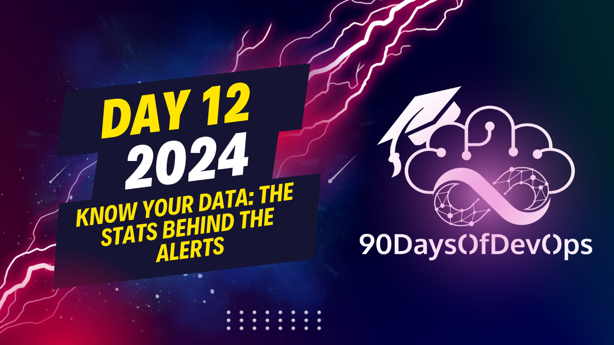

# Day 12 - Know your data: The Stats behind the Alerts

 In this text, the speaker is discussing different types of statistical curves and their applications, particularly in analyzing lead times, recovery times, alerts, and other performance metrics. They emphasize that while normal curves are commonly used, they may not be suitable for all types of data, such as irregularly occurring events like latencies or response times. For these, an exponential curve is recommended.

The exponential curve models the time or rate between unrelated events and can provide valuable insights into network performance, user requests, system values, and messaging. The speaker explains how to calculate probabilities, median points, and cumulative densities using this curve. They also warn against ignoring scale and other common pitfalls in data analysis, such as confusing correlation with causation or failing to account for biases.

The speaker concludes by emphasizing the importance of careful thought and judicious use of print statements in debugging and understanding complex data sets. They provide resources for further learning and encourage the audience to connect with them on various platforms.

**KEY TAKEAWAYS**

1. **Coin Flip Probabilities**: Contrary to popular belief, coin flips are not always 50-50. The flipper's technique and physics can affect the outcome.
2. **Bayes' Theorem**: A mathematical method for updating probabilities based on new data, used in predictive modeling and AB testing.
3. **Common Pitfalls**:
	* Ignoring scale
	* Confusing correlation with causation
	* Failing to account for biases (e.g., survivorship bias, recency bias)
4. **Correlation vs. Causation**: Understanding the difference between these two concepts is crucial in data analysis.

**SUMMARY STATISTICS**

Our summary statistics are measures of central tendency and patterns that do not show individual behavior. We often rely on a few basic arithmetic operations (mean, median, percentile) to make sense of our data.

**DEBUGGING TIPS**

1. **Careful Thought**: The most effective debugging tool is still careful thought.
2. **Judiciously Placed Print Statements**: These can provide valuable insights and help identify patterns or trends in your data.
