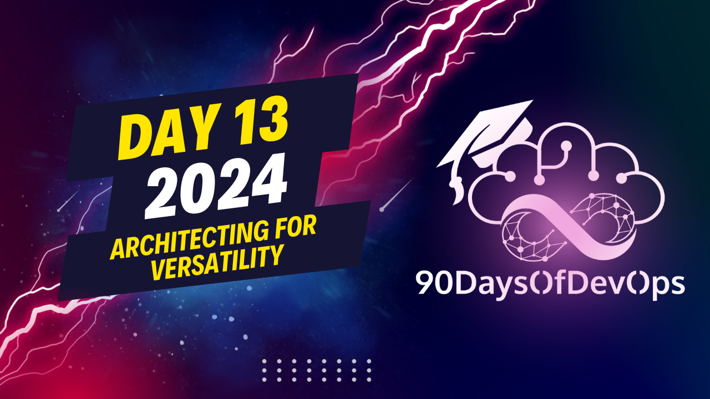

# Day 13 - Architecting for Versatility

A discussion about the benefits and drawbacks of using a single cloud provider versus a multi-cloud or hybrid environment. Here's a summary of the points made:

Benefits of using a single cloud provider:
1. Simplified development, implementation, and transition due to consistent technology stack and support.
2. Easier financial and administrative management, including contracts, payments, private pricing agreements, etc.
3. Access to managed services with the flexibility to interact with them globally (e.g., using kubernetes API).
4. Cost savings through optimized container launching abilities and least expensive data storage patterns.
5. Less specialized observability and security approach.

Drawbacks of using a single cloud provider:
1. Vendor lock-in, limiting the ability to keep up with the competition or try new technologies.
2. Potential availability issues for certain types of compute or storage within a region.
3. Prices changes and economic conditions that may impact costs and savings.
4. The need to transition from Opex to Capex for long-term cost savings.
5. Competition against the service provider for customers.
6. Challenges in moving to another environment or spanning multiple ones due to specialized automation, observability, and data replication.
7. Over-specialization on a specific environment or platform that could limit flexibility in the future.

To make your architecture versatile for an easier transition to different environments:
1. Leverage open source services from cloud hyperscalers (e.g., Redis, Elastic Search, Kubernetes, Postgres) with global or universal APIs.
2. Write code that can run on various processors and instances across multiple providers.
3. Plan for multivendor environments by considering unified security approaches and aggregating metrics and logging.
4. Consider testing in multiple environments and having rollback procedures.
5. Plan backup requirements, retention life cycles, and tests to be provider-neutral.
6. Avoid over-optimization and consider future flexibility when making decisions about development, code deployment pipelines, managed services, etc.
Here is a summary of the content:

**Identity and Purpose**

The speaker, Tim Banks, emphasizes the importance of considering one's identity and purpose when approaching technology. He argues that relying too heavily on a single cloud provider can lead to vendor lock-in and limit flexibility. Instead, he suggests adopting a hybrid or multicloud approach, which can provide more options and better scalability.

**Challenges of Multicloud**

Tim highlights some of the challenges associated with multicloud environments, including:

* Maintaining multiple bespoke environments
* Overspecializing automation or observability
* Replicating data across providers
* Retrofitting existing code to run on different platforms

**Service Versatility**

To mitigate these challenges, Tim recommends leveraging cloud hyperscalers' managed services, such as Redis, Elastic Search, and Kubernetes. He also suggests using open-source services that can be used anywhere, allowing for greater versatility.

**Code Versatility**

Tim emphasizes the importance of writing code that is versatile enough to run on different platforms and architectures. This involves minimizing specialized code and focusing on universally applicable solutions.

**Data ESS**

He discusses the need to consider data storage and egress costs when moving data between providers or environments. Tim recommends looking for least expensive patterns for data storage.

**Observability and Security**

Tim warns against relying too heavily on vendor-specific observability and security tools, which can make it difficult to move between environments. Instead, he suggests devising a unified approach to observability and security that can be applied across multiple environments.

**Agility and Planning**

Throughout the discussion, Tim emphasizes the importance of agility and planning in technology adoption. He argues that having a clear understanding of one's goals and constraints can help avoid overcommitting oneself to a particular solution or provider.

Overall, Tim's message is one of caution and forward-thinking, encouraging listeners to consider the long-term implications of their technology choices and plan accordingly.
