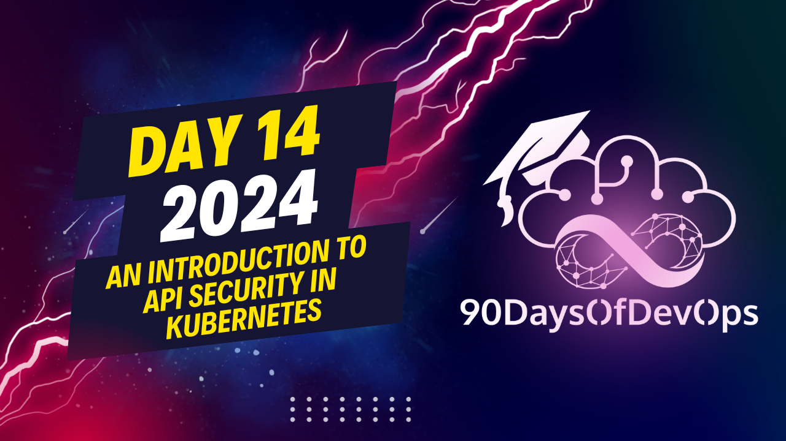

# Day 14 - An introduction to API Security in Kubernetes

 In this explanation, the speaker discusses the implementation of a firewall (Web Application Firewall or WAF) as an additional layer of security for an application. The WAF is deployed in front of the existing application through an Ingress configuration. This setup prevents unauthorized access and blocks potential attacks such as SQL injection attempts.

The WAF also provides monitoring and logging capabilities, recording detections and prevention actions taken against potential threats, which can be used for further analysis or evidence purposes. The speaker suggests that a management console is useful for efficiently organizing and managing multiple applications and clusters connected to the WAF.

Open AppC is mentioned as an example of a centralized management solution for WAF deployments in different environments like Docker, Linux systems, or Kubernetes. However, the speaker does not demonstrate the connection process during this presentation. They encourage the audience to explore more resources and make an informed decision on the Web Application Firewall solution that best suits their needs.
The topic is about applying an Open AppSec web application firewall (WAF) using Helm. The speaker walks the audience through the process, highlighting key points and providing context.

Here are some key takeaways:

1. **Identity and Purpose**: The speaker emphasizes the importance of understanding security and its dynamic nature. They recommend not taking on too much complexity and instead focusing on a WAF solution that can learn and adapt.
2. **Applying Open AppSec**: The speaker demonstrates how to apply an Open AppSec WAF using Helm, emphasizing the simplicity of the process.
3. **Monitoring and Logging**: The speaker highlights the importance of monitoring and logging in a WAF solution, citing examples such as detecting and preventing SQL injection attacks.
4. **Central Management Console**: The speaker mentions that Open AppSec has a central management console for managing multiple clusters and applications.

In summary, this presentation aims to introduce the audience to the concept of web application firewalls (WAFs) and demonstrate how to apply an Open AppSec WAF using Helm.
