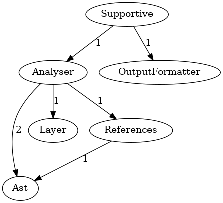

Using code dependency analysis to decide what to test
===================

By [Patrick Kusebauch](https://github.com/patrickkusebauch)

> [!IMPORTANT]
> Find out how to save 90+% of your test runtime and resources by eliminating 90+% of your tests while keeping your test
> coverage and confidence. Save over 40% of your CI pipeline runtime overall.

## Introduction

Tests are expensive to run and the larger the code base the more expensive it becomes to run them all. At some point
your test runtime might even become so long it will be impossible to run them all on every commit as your rate of
incoming commits might be higher than your ability to test them. But how else can you have confidence that your
introduced changes have not broken some existing code?

Even if your situation is not that dire yet, the time it takes to run test makes it hard to get fast feedback on your
changes. It might even force you to compromise on other development techniques. To lump several changes into larger
commits, because there is no time to test each small individual change (like type fixing, refactoring, documentation
etc.). You might like to do trunk-based development, but have feature branches instead, so that you can open PRs and
test a whole slew of changes all at once. Your DORA metrics are compromised by your slow rate of development. Instead of
being reactive to customer needs, you have to plan your projects and releases months in advance because that's how often
you are able to fully test all the changes.

Slow testing can have huge consequences on how the whole development process looks like. While speeding up test
execution per-se is very individual problem in every project, there is another technique that can be applied everywhere.
You have to become more picky about what tests to run. So how do you decide what to test?

## Theory

### What is code dependency analysis?

Code dependency analysis is the process of (usually statically) analysing the code to determine what code is used by
other code. The most common example of this is analysing the specified dependencies of a project to determine potential
vulnerabilities. This is what tools like [OWASP Dependency Check](https://owasp.org/www-project-dependency-check/) do.
Another use case is to generate a Software Bill of Materials (SBOM) for a project.

There is one other use case that not many people talk about. That is using code dependency analysis to create a Directed
Acyclic Graph (DAG) of the various components/modules/domains of a project. This DAG can then be used to determine how
changes to one component will affect other components.

Imagine you have a project with the following structure of components:



The `Supportive` component depends on the `Analyser` and `OutputFormatter` components. The `Analyser` in turn depends on
3 other components - `Ast`, `Layer` and `References`. Lastly `References` depend on the `Ast` component.

If you make a change to the `OutputFormatter` component you will want to run the **contract tests**
for `OutputFormatter` and **integration tests** for `Supportive` but no tests for `Ast`. If you make changes
to `References` you will want to run the **contract tests** for `References`, **integration tests** for `Analyser` and
`Supportive` but no tests for `Layer` or `OutputFormatter`. In fact, there is no one module that you can change that
would require you to run all the tests.

> [!NOTE]
> By **contract tests** I mean tests that test the defined API of the component. In other words what the component
> promises (by contract) to the outside users to always be true about the usage of the component. Such a test mocks out
> all outside interaction with any other component.
>
> By contrast, **integration tests** in this context mean tests that test that the interaction with a dependent
> component is properly programmed. For that reason the underlying (dependent) component is not mocked out.

### How do you create the dependency DAG?

There are very few tools that can do this as of today, even though the concept is very simple. So simple you can do it
yourself if there is no tool available for your language of choice.

You need to parse and lex the code to create an Abstract Syntax Tree (AST) and then walk the AST of every file to find
the dependencies. The same functionality your IDE does any time you "Find references..." or what your language server
sends over [LSP (Language Server Protocol)](https://en.wikipedia.org/wiki/Language_Server_Protocol).

You group the dependencies by predefined components/modules/domains, and then combine all the dependencies into a single
graph.

### How do you use the DAG to decide what to test?

Once you have the DAG there is a 4-step process to run your testing:

1. Get the list of changed files (for example by running `git diff`)
2. Feed the list to the dependency analysis tool to get the list of changed components (and optionally the list of
   depending components as well for integration testing)
3. Feed the list to your testing tool of choice to run the test-suites corresponding to each changed component
4. Revel in how much time you have saved on testing.

## Practice

This is not just some theoretical idea, but rather something you can try out yourself today. If you are lucky, there is
already an open-source tool in your language of choice that lets you do it today. If you are not, the following
demonstration will give you enough guidance to write it yourself. If you do, please let me know, I would love to see it.

The tool that I have used today for demonstration is [deptrac](https://qossmic.github.io/deptrac/), and it is written in
PHP and for PHP.

All you have to do to create a DAG is to specify the modules/domains:

```yaml
# deptrac.yaml
deptrac:
  paths:
    - src

  layers:
    - name: Analyser
      collectors:
        - type: directory
          value: src/Analyser/.*
    - name: Ast
      collectors:
        - type: directory
          value: src/Ast/.*
    - name: Layer
      collectors:
        - type: directory
          value: src/Layer/.*
    - name: References
      collectors:
        - type: directory
          value: src/References/.*
    - name: Contract
      collectors:
        - type: directory
          value: src/Contract/.*
```

### The 4-step process

Once you have the DAG you can use combine it with the list of changed files to determine what modules/domains to test. A
simple git command will give you the list of changed files:

```bash
git diff --name-only
```

You can then use this list to find the modules/domains that have changed and then use the DAG to find the modules that
depend on those modules.

```bash
# to get the list of changed components
git diff --name-only | xargs php deptrac.php changed-files

# to get the list of changed modules with the depending components
git diff --name-only | xargs php deptrac.php changed-files --with-dependencies
```

If you pick the popular PHPUnit framework for your testing and
follow [their recommendation for organizing code](https://docs.phpunit.de/en/10.5/organizing-tests.html), it will be
very easy for you to create a test-suite per component. To run a test for a component you just have to pass the
parameter `--testsuite {componentName}` to the PHPUnit executable:

```bash
git diff --name-only |\
xargs php deptrac.php changed-files |\
sed 's/;/ --testsuite /g; s/^/--testsuite /g' |\
xargs ./vendor/bin/phpunit
```

Or if you have integration test for the dependent modules, and decide to name you integration test-suites
as `{componentName}Integration`:

```bash
git diff --name-only |\
xargs php deptrac.php changed-files --with-dependencies |\
sed '1s/;/ --testsuite /g; 2s/;/Integration --testsuite /g; /./ { s/^/--testsuite /; 2s/$/Integration/; }' |\
sed ':a;N;$!ba;s/\n/ /g' |\
xargs ./vendor/bin/phpunit
```

### Real life comparison results

I have run the following script a set of changes to compare what the saving were:

```shell
# Compare timing
iterations=10

total_time_with=0
for ((i = 1; i <= $iterations; i++)); do
  # Run the command
  runtime=$(
    TIMEFORMAT='%R'
    time (./vendor/bin/phpunit >/dev/null 2>&1) 2>&1
  )

  miliseconds=$(echo "$runtime" | tr ',' '.')
  total_time_with=$(echo "$total_time_with + $miliseconds * 1000" | bc)
done

average_time_with=$(echo "$total_time_with / $iterations" | bc)
echo "Average time (not using deptrac): $average_time_with ms"

# Compare test coverage
tests_with=$(./vendor/bin/phpunit | grep -oP 'OK \(\K\d+')
echo "Executed tests (not using deptrac): $tests_with tests"

echo ""

total_time_without=0
for ((i = 1; i <= $iterations; i++)); do
  # Run the command
  runtime=$(
    TIMEFORMAT='%R'
    time (
      git diff --name-only |
        xargs php deptrac.php changed-files --with-dependencies |
        sed '1s/;/ --testsuite /g; 2s/;/Integration --testsuite /g; /./ { s/^/--testsuite /; 2s/$/Integration/; }' |
        sed ':a;N;$!ba;s/\n/ /g' |
        xargs ./vendor/bin/phpunit >/dev/null 2>&1
    ) 2>&1
  )

  miliseconds=$(echo "$runtime" | tr ',' '.')
  total_time_without=$(echo "$total_time_without + $miliseconds * 1000" | bc)
done

average_time_without=$(echo "$total_time_without / $iterations" | bc)
echo "Average time (using deptrac): $average_time_without ms"
tests_execution_without=$(git diff --name-only |
  xargs php deptrac.php changed-files --with-dependencies |
  sed '1s/;/ --testsuite /g; 2s/;/Integration --testsuite /g; /./ { s/^/--testsuite /; 2s/$/Integration/; }' |
  sed ':a;N;$!ba;s/\n/ /g' |
  xargs ./vendor/bin/phpunit)
tests_without=$(echo "$tests_execution_without" | grep -oP 'OK \(\K\d+')
tests_execution_without_time=$(echo "$tests_execution_without" | grep -oP 'Time: 00:\K\d+\.\d+')
echo "Executed tests (using deptrac): $tests_without tests"

execution_time=$(echo "$tests_execution_without_time * 1000" | bc | awk '{gsub(/\.?0+$/, ""); print}')
echo "Time to find tests to execute (using deptrac): $(echo "$average_time_without - $tests_execution_without_time * 1000" | bc | awk '{gsub(/\.?0+$/, ""); print}') ms"
echo "Time to execute tests (using deptrac): $execution_time ms"

echo ""

percentage=$(echo "scale=3; $tests_without / $tests_with * 100" | bc | awk '{gsub(/\.?0+$/, ""); print}')
echo "Percentage of tests not needing execution given the changed files: $(echo "100 - $percentage" | bc)%"
percentage=$(echo "scale=3; $execution_time / $average_time_with * 100" | bc | awk '{gsub(/\.?0+$/, ""); print}')
echo "Time saved on testing: $(echo "$average_time_with - $execution_time" | bc) ms ($(echo "100 - $percentage" | bc)%)"
percentage=$(echo "scale=3; $average_time_without / $average_time_with * 100" | bc | awk '{gsub(/\.?0+$/, ""); print}')
echo "Time saved overall: $(echo "$average_time_with - $average_time_without" | bc) ms ($(echo "100 - $percentage" | bc)%)"
```

with the following results:

```
Average time (not using deptrac): 984 ms
Executed tests (not using deptrac): 721 tests

Average time (using deptrac): 559 ms
Executed tests (using deptrac): 21 tests
Time to find tests to execute (using deptrac): 491 ms
Time to execute tests (using deptrac): 68 ms

Percentage of tests not needing execution given the changed files: 97.1%
Time saved on testing: 916 ms (93.1%)
Time saved overall: 425 ms (43.2%)
```

Some interesting observations:

- Only **3% of the tests** that normally run on the PR needed to be run to cover the change with tests. That is a
  **saving of 700 tests** in this case.
- **Test execution time has decreased by 93%**. You are mostly left with the constant cost of set-up and tear-down of
  the testing framework.
- **Pipeline overall time has decreased by 43%**. Since the analysis time grows orders of magnitude slower that test
  runtime (it is not completely constant more files still means more to statically analyse), the number is only bound to
  be better the larger the codebase is.

And these saving apply to arguable the worst possible SUT (System Under Test):

- It is a **small application**, so it is hard to get the saving of skipping testing of vast number of components as it
  would be the case for large codebases.
- It is a **CLI script**, so it has no database, no external APIs to call, minimal slow I/O tests. Those are the tests
  you want skipping the most, and they are barely present here.

## Conclusion

Code dependency analysis is a very useful tool for deciding what to test. It is not a silver bullet, but it can help you
reduce the number of tests you run and the time it takes to run them. It can also help you decide what tests to run in
your CI pipeline. It is not a replacement for a good test suite, but it can help you make your test suite more
efficient.

## References

- [deptrac](https://qossmic.github.io/deptrac/)
- [deptracpy](https://patrickkusebauch.github.io/deptracpy/)

See you on [Day 16](day16.md).
