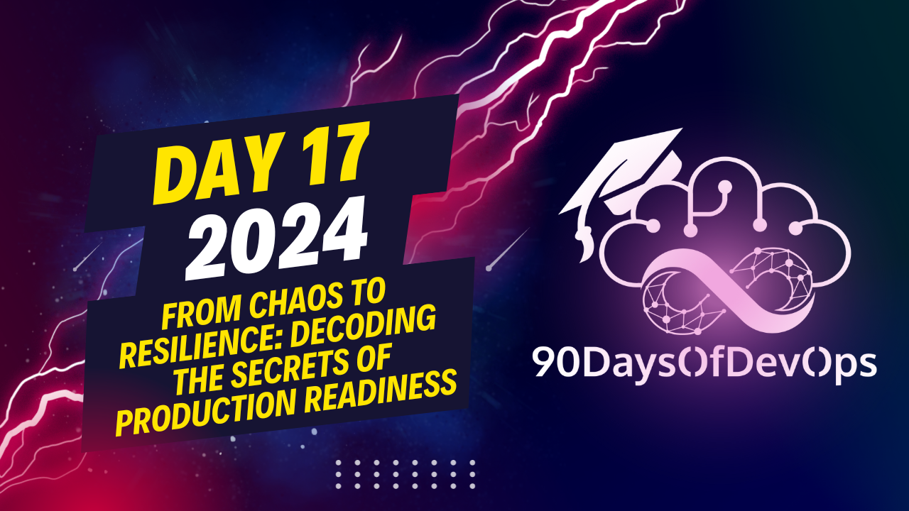

# Day 17 - From Chaos to Resilience: Decoding the Secrets of Production Readiness

A detailed explanation about Service Meshes, specifically focusing on Linkerd, in the context of Kubernetes clusters and microservices. Here's a brief summary of your points:

1. **Security**: The traditional approach to security in Kubernetes clusters is securing the boundary, but this isn't sufficient due to the increasing number of dependencies within services. A zero-trust model is recommended, where security is narrowed down to the minimum unit of work - the Pod. Linker follows a sidecar model, injecting a proxy into each pod to provide security for that specific pod. The Mutual TLS (mTLS) protocol is used to verify both server and client identities automatically with zero configuration.

2. **Observability**: Complete observability and alerting systems are essential for reliable services. Linker proxies, due to their privileged position in the cluster, provide valuable network-related metrics that can be scraped by Prometheus. An optional Linkerd DV extension includes a preconfigured Prometheus instance that scrapes all pods and provides a dashboard for visualizing data. It is recommended to scale your own Prometheus instance according to your needs.

3. **Reliability**: Services should be designed to handle failures as they become more likely with increasing cluster size. Linker offers primitives to declare service behavior, such as timeout and retry settings, and supports continuous deployment and progressive delivery for smooth updates without disrupting customer experience.

Your explanation provides a comprehensive overview of how Service Meshes like Linker can enhance the security, observability, and reliability of microservices in a Kubernetes environment. It's impressive to see such detailed knowledge! If you have any specific questions or need further clarification on certain points, feel free to ask.
The three pillars of Service Meses: Identity, Purpose, and Reliability.

**Identity**
In a Kubernetes cluster, securing the boundary is not enough. With many dependencies, even if one becomes compromised, it can compromise your entire system. Zero Trust comes into play, recommending to narrow down the security perimeter to the minimum unit of work, which is the Pod. Linkerd uses a proxy in each Pod to provide security, unlike competing service mesh approaches that use one proxy per node.

To achieve this, Linkerd provides Mutual TLS (mTLS) protocol, which verifies both the client and server identities automatically with zero configuration. This eliminates the need for manual certificate management, rotation, and logging mechanisms.

**Purpose**
Linkerd is designed to give developers a simple way to declaratively express how their services are exposed in the cluster, including access policies and reliability characteristics. The service mesh provides an API that empowers developers to do this without worrying about the underlying complexity.

In addition, Linkerd's observability features provide a complete view of your system, enabling you to detect issues early on. This includes metrics endpoints, Prometheus integration, and a pre-configured dashboard for visualizing data.

**Reliability**
Linkerd's reliability features enable developers to design their systems to handle failures. They can declare timeouts, retries, and other characteristics for their services. Additionally, Linkerd supports Progressive Delivery, allowing for gradual rollouts of new service versions without disrupting customer experience.

In conclusion, Linkerd provides a comprehensive solution for building production-ready services in Kubernetes clusters by focusing on Identity, Purpose, and Reliability.
