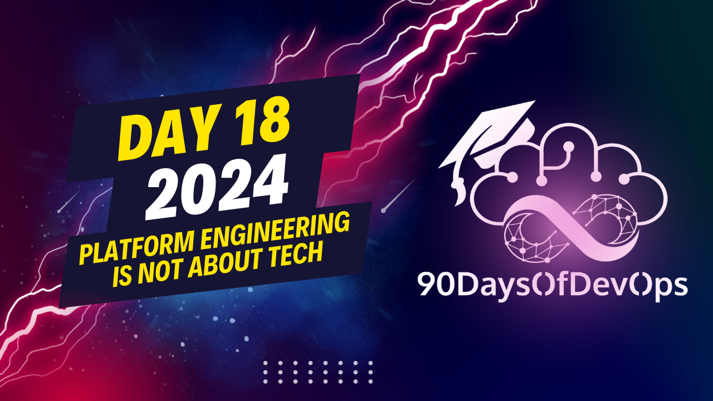

# Day 18 - Platform Engineering Is Not About Tech

 This discussion focuses on the challenges and strategies involved in developing and implementing a successful platform within an organization. Here's a summary of the key points:

1. **Understanding the need**: Before embarking on building a platform, it is crucial to understand the needs of the teams who will be using it. This includes their specific needs as well as any shared needs that could benefit from a unified solution.

2. **Minimum Viable Product (MVP) approach**: Focusing on one priority case can help provide quick business value and create buy-in from the business. This approach is particularly useful for small companies with limited engineering resources.

3. **Invest in training and engagement**: For large organizations, it's important to invest heavily in training and engagement to ensure all stakeholders understand the platform and its benefits. This can help drive adoption across the organization.

4. **Platform as a Product (PaaP)**: The goal should be to provide a better developer experience. This means understanding that technology and organization are closely connected, and focusing on both aspects.

5. **Change management**: Changing habits is one of the most challenging tasks when implementing a new platform. It's important to consider this challenge and work towards improving existing habits over time.

6. **Collaboration and communication**: Successful platforms rely heavily on collaboration and communication among teams. Ensuring these elements are addressed can help ensure the success of the platform itself.

7. **Maintaining a thin platform**: The goal should be to keep the platform as lean as possible, focusing on business value and avoiding continuous growth that could make the platform difficult to maintain. This can involve disposing of or outsourcing less essential parts of the platform.
As an expert content summarizer, I've distilled the key points from this discussion on identity and purpose in platform engineering. Here's a summary:

**Key Takeaways:**

1. **Empowerment**: The goal of engineering is to provide a better self-service developer experience, focusing on empowering developers.
2. **Twinning Technology & Organization**: Technology and organization are closely connected; it's not just about building a platform, but also understanding the needs and habits of the people using it.
3. **Habit Change**: Changing people's habits is one of the most challenging tasks in platform engineering; improving developer habits takes time, effort, and attention.
4. **Collaboration & Communication**: Collaboration and communication are essential keys to the success of a platform; it's not just about building something, but also making it adopted at scale and loved by users.

**Success Stories:**

1. A digital native company in the energy sector successfully implemented a minimum viable product (MVP) approach, focusing on shared needs among teams.
2. A global manufacturing company with over 1,000 engineers worldwide invested heavily in training and engagement to onboard developers for their platform initiative.
3. A multinational system integrator built an internal platform, only to later decide to start anew, recognizing the importance of maintaining a thin and maintainable platform.

**Lessons Learned:**

* It's not about just building an MVP; it's about investing in keeping your platform thin and maintainable over time.
* Avoid continuously adding new stuff to the platform; instead, focus on providing value and simplifying the platform as you go.
* Keep your platform closest possible to your business value, avoiding commoditization.
