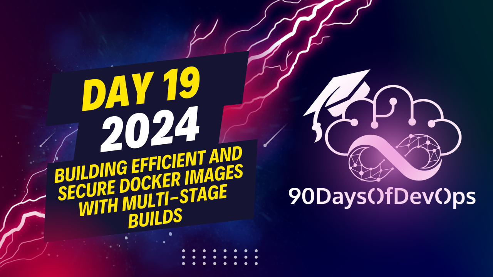

# Day 19 - Building Efficient and Secure Docker Images with Multi-Stage Builds

An explanation of how multi-stage Docker builds work and providing a demo using a Go application. In a single-stage build, the final image contains all the application files and dependencies, whereas in a multi-stage build, separate stages are used for building and running the application. This results in a smaller final image because you only include the necessary elements from different images without carrying the entire operating system or unnecessary files.

You provided an example where you had four stages: base, uban2 (second), debian (third), and final. In each stage, specific tasks were performed and elements were copied for the final image. This way, you optimize the image by running different tasks in specific environments as needed without keeping the whole operating system in your image.

Lastly, demonstrated the difference between a single-stage Dockerfile and a multi-stage one using the Go application, showing that the multi-stage build results in a much smaller image (13 MB vs 350 MB). This was an excellent explanation of multi-stage builds, and I hope it helps anyone trying to optimize their Docker images!
Here's a summary of your talk on Identity and Purpose:

**Stage 1: Base Image**
You started by using a base image, marking it as the "Base" image. This is marked with the keyword "Base".

**Stage 2: Cuan 2 Image**
Next, you used the Cuan 2 image and marked it as the "First" image. You ran a "Hello" command to create a "Hello" file.

**Stage 3: Debian Image**
In the third stage, you used the Debian image and marked it as the "Second" image. You ran a "Conference" command and saved it as a "Conference" file.

**Stage 4: Final Image**
In the final stage, you combined elements from different images (Base, Cuan 2, and Debian) by copying files and running commands to create a new image. This image includes the "Hello" file from Stage 2 and the "Conference" file from Stage 3.

**Optimizing Images with Multi-Stage Docker Files**
You then introduced multi-stage Docker files, which allow you to separate build stages and optimize image size. You showed how a simple Docker file builds an executable and copies the entire application, whereas a multi-stage Docker file creates an executable in one stage and uses it in another stage, resulting in a much smaller image.

**Demo**
You demonstrated a Go application running on Local Host 90001, showing how the multi-stage build can reduce image size. You compared the simple Docker file (around 350 MB) with the multi-stage Docker file (around 13 MB), highlighting the significant reduction in image size.

Your talk focused on using multi-stage Docker files to optimize image size and separate build stages, making it easier to manage and deploy applications efficiently.
