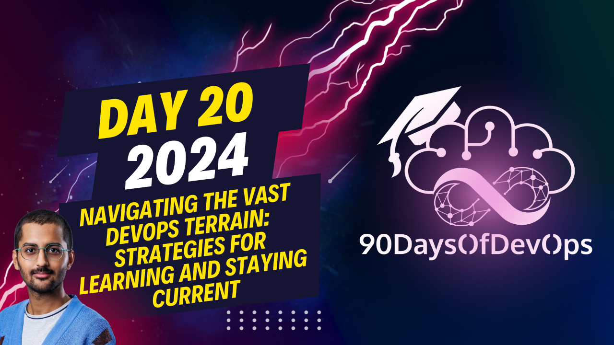

# Day 20 - Navigating the Vast DevOps Terrain: Strategies for Learning and Staying Current

 # ONE SENTENCE SUMMARY:
The speaker shares their personal journey into DevOps, emphasizing the importance of continuous learning in the ever-evolving Cloud Native landscape, and encourages others to join the community.

# MAIN POINTS:
1. The speaker chose DevOps due to its job opportunities and high demand for professionals.
2. Embracing DevOps enhances career prospects and keeps one relevant in a fast-paced industry.
3. DevOps encourages a learning mindset, emphasizing the importance of adaptability in tech.
4. Sharing knowledge through content creation benefits both the sharer and others in the community.
5. Contributing to open source projects helps learn new skills and gain experience.
6. Starting with smaller contributions is recommended when contributing to open source projects.
7. Documentation and Community Support are good ways to get started contributing to open source.
8. The speaker recommends gaining experience and expertise before giving back to the community.
9. Continuous learning and sharing contribute to the growth and success of DevOps communities.
10. The speaker thanks Michael Kade for the 90 days of Devops series and provides a link to the GitHub repository.

# TAKEAWAYS:
1. DevOps offers exciting job opportunities and encourages continuous learning.
2. Embracing a learning mindset is crucial in the tech industry.
3. Sharing knowledge benefits both the sharer and others in the community.
4. Contributing to open source projects is an excellent way to learn and gain experience.
5. Always be eager to learn new things, adapt, and share your knowledge with others.
# ONE SENTENCE SUMMARY:
I share my journey into DevOps, highlighting its importance in maintaining a learning mindset in the ever-evolving Cloud native landscape.

# MAIN POINTS:

1. I chose to learn DevOps for tremendous job opportunities and high demand.
2. DevOps enhances career prospects and keeps individuals relevant in a fast-paced industry.
3. The mindset encouraged by DevOps is essential, as it teaches continuous learning and adaptation.
4. Creating content and sharing knowledge helps both the creator and the community.
5. Contributing to open-source projects is an excellent way to learn while giving back.
6. It's crucial to keep an open mind and continue learning during the process.
7. Start with smaller contributions and gradually take on more significant tasks.
8. Non-code contributions, such as documentation and Community Support, are valuable ways to get started.
9. Giving back to the community by helping beginners is essential for growth and success.
10. DevOps is not just a career path but a mindset that opens doors to exciting job opportunities.

# TAKEAWAYS:

1. Embracing DevOps can lead to tremendous job opportunities and high demand.
2. The Cloud native ecosystem encourages continuous learning and adaptation.
3. Sharing knowledge and creating content benefits both the creator and the community.
4. Contributing to open-source projects is an excellent way to learn while giving back.
5. Maintaining a learning mindset is essential in today's fast-paced technology industry.
