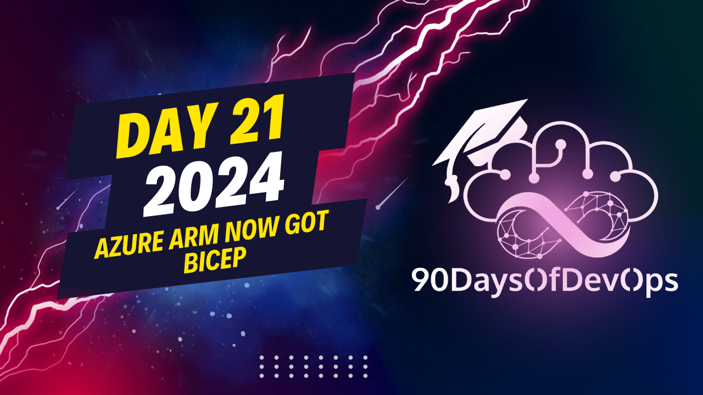

# Day 21 - Azure ARM now got Bicep

A session explaining the concept of Azure Bicep, a declarative language for creating Azure Resource Manager (ARM) templates. Here's a summary of the key points:

1. Bicep allows you to create smaller, reusable packages of specific resources called modules that can be used in deployments. These modules reference other modules and pull in their details.

2. Deployment scripts are your CLI or PowerShell code that can be embedded within the bicep templates. They are useful for executing multiple commands to configure resources, like setting up a domain controller or configuring an app service.

3. Template specs is a way to publish a bicep template into Azure and use it later on as a package for deployment. This allows you to maintain different versions of your templates and revert to earlier versions if necessary.

4. You can maintain the versioning of your templates within Azure DevOps and GitHub, and set up CI/CD pipelines to deploy bicep code directly from these platforms using Azure DevOps or GitHub Actions.

5. To learn more about Bicep, you can follow the "Fundamentals for Bicep" learning path on Microsoft Learn which covers the basics, intermediate, and advanced concepts, as well as deployment configurations with Azure DevOps and GitHub actions.

6. **Batching**: When deploying multiple services at once, batching allows you to define a batch size (e.g., 30) to control the deployment process.
7. **Modularization**: Create modular code for specific resources (e.g., NSG, public IP address, route table) to make deployments more efficient and scalable.

**Bicep Templates**

1. **Deployment Script**: Embed CLI or partial code within Bicep templates using deployment scripts for complex configuration tasks.
2. **Template Specs**: Publish Bicep templates as template specs in Azure, allowing for version control and easy deployment management.

**Additional Concepts**

1. **Advanced Topics**: Explore advanced concepts like deployment configurations, devops pipelines, and GitHub actions for continuous delivery.
2. **Microsoft Learn Resources**: Utilize Microsoft learn resources, such as the "Fundamentals of Bicep" learning path, to get started with Bicep templates and improve your skills.

That's a great summary! I hope it helps others understand the key concepts and benefits of using Bicep templates in Azure deployments.
