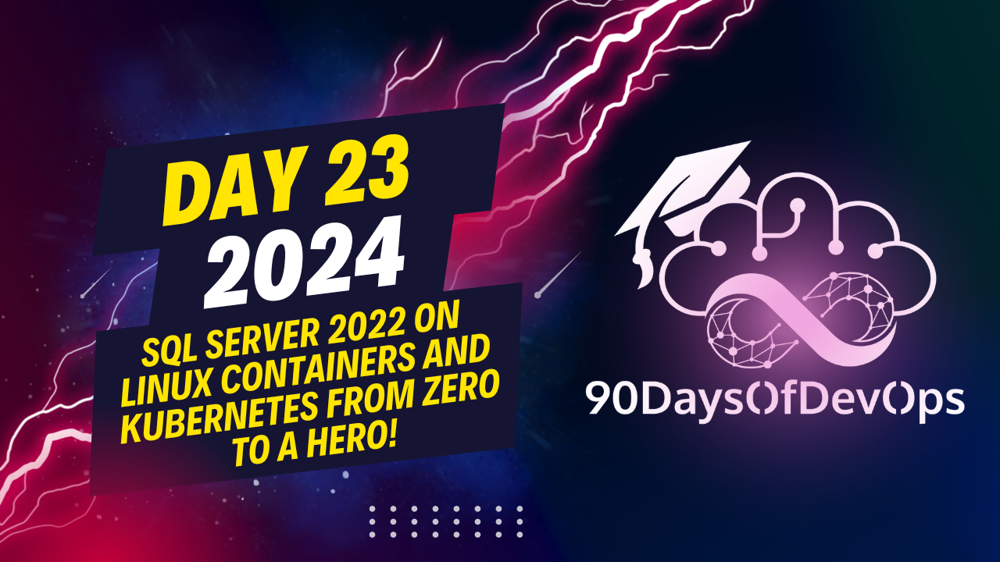

# Day 23 - SQL Server 2022 on Linux Containers and Kubernetes from Zero to a Hero!
[](https://www.youtube.com/watch?v=BgttLzkzNBs)

 To get the IP address of a Docker container, you can use the `docker inspect` command followed by the container ID or name. Here's an example:

```bash
docker inspect <container_id_or_name> -f '{{range .NetworkSettings.Networks}}{{.IPAddress}} {{end}}'
```

Replace `<container_id_or_name>` with the ID or name of your container. This command will return the IP address associated with the container in the default bridge network.

In your case, you can use:

```bash
docker inspect es2 latest -f '{{range .NetworkSettings.Networks}}{{.IPAddress}} {{end}}'
```

And for the other container:

```bash
docker inspect s latest -f '{{range .NetworkSettings.Networks}}{{.IPAddress}} {{end}}'
```

Regarding your question about using Kubernetes or Windows Server Cluster, it's a matter of preference and use case. Both have their pros and cons. Kubernetes is more flexible and can be used with various operating systems, but it might require more effort to set up and manage. On the other hand, Windows Server Cluster is easier to set up and manage but is limited to Windows OS. You should choose the one that best fits your needs and resources.

Regarding Docker vs. Podman, both are container runtimes, but Podman is more focused on security and has fewer system requirements than Docker. Some users prefer Podman for these reasons, but Docker remains the most widely used container runtime due to its extensive ecosystem and user base. It's essential to evaluate your specific needs before choosing one over the other.

**PURPOSE**

The purpose of this presentation is to demonstrate how to upgrade MCR to the latest version using Docker containers. The speaker also shares their opinion on the differences between using Kubernetes for containerization versus Windows clustering, highlighting the pros and cons of each approach.

**KEY TAKEAWAYS**

1. Upgrading MCR to the latest version (22.13) is possible using Docker containers.
2. The process involves creating a new container with the latest version of MCR and then upgrading the existing container to match the new one.
3. Using Windows clustering for containerization can be more straightforward than Kubernetes, especially for those familiar with Windows.
4. However, Kubernetes offers greater flexibility and scalability, making it a suitable choice for larger-scale applications.
5. The speaker recommends using Windows clustering for development and testing purposes, but not for production environments.

**STYLE**

The presentation is informal, with the speaker sharing their personal opinions and experiences. They use simple language to explain complex concepts, making it accessible to a general audience. However, the pace of the presentation can be fast-paced at times, making it challenging to follow along without prior knowledge of containerization and MCR.

**CONFIDENCE**

The speaker appears confident in their expertise, sharing their personal opinions and experiences without hesitation. They use humor and anecdotes to engage the audience, but also provide specific examples and demonstrations to support their points.

Overall, this presentation is geared towards individuals who are familiar with containerization and MCR, but may not be experts in both areas. The speaker's enthusiasm and expertise make it an engaging watch for those looking to learn more about upgrading MCR using Docker containers.
