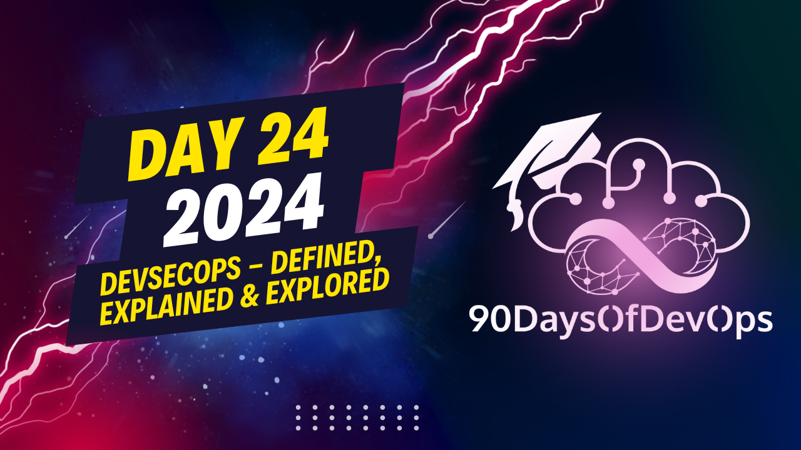

# Day 24 - DevSecOps - Defined, Explained & Explored

A session describing the DevOps pipeline, with an emphasis on Agile methodology, and how it interlocks with various stages of a product development process. The process starts with understanding customer requirements through Agile practices, followed by creating a product catalog which is used as input for DevSecOps.

The product catalog is then translated into a Sprint catalog, which is managed by the development team to deliver Minimum Viable Products (MVPs) in two-week iterations. The process also includes an autonomous team that consists of various roles such as devops coach, devops engineer, tester, and scrum master.

You also mentioned the importance of distributed Agile practices for managing larger teams and complex projects, and introduced the concept of Scrum of Scrums to coordinate multiple teams working on different domains. Lastly, you briefly mentioned a book you wrote on microservices which has a chapter on DevSecOps that may be insightful to readers.

To summarize, it was described the DevOps pipeline, starting with Agile practices for understanding customer requirements and creating product catalogs, moving through Sprint iterations managed by an autonomous team, and concluding with distributed Agile practices for managing larger teams and complex projects. The process interlocks various stages of the product development lifecycle, with each stage building upon the previous one to ultimately deliver valuable products to customers.
Here is the summary:

**IDENTITY and PURPOSE**

The speaker emphasizes the importance of devops in driving cultural change within an organization. They highlight the need for high-performing teams, self-organizing teams, and governance to ensure effective management and monitoring.

Key elements for devops include:

1. **Autonomous Teams**: Self-managing teams that can deliver products without relying on external support.
2. **Governance**: Ensuring the right tools and processes are in place to manage and monitor devops initiatives.
3. **Improvement and Innovation**: Encouraging experimentation and learning from failures to improve processes and deliver better results.
4. **Metrics and KPIs**: Monitoring key performance indicators to track progress and make adjustments as needed.

The speaker also emphasizes the importance of understanding the interlock between Agile and DevOps, highlighting the role of product catalogs, sprint backlogs, and MVP delivery in driving devops initiatives.

In conclusion, the speaker stresses the need for larger teams, distributed agile, and scrums of scrums to manage complexity and drive devops adoption.
