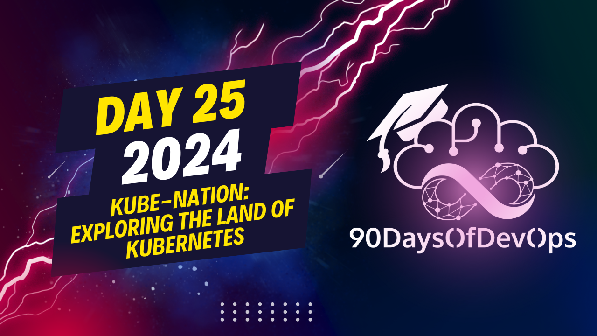

# Day 25  - Kube-Nation: Exploring the Land of Kubernetes

 In the analogy given, a country is compared to a Kubernetes cluster. Here's how the components of a country correspond to the components of a Kubernetes cluster:

1. Land (Servers/Computers): The foundation for building both a country and a Kubernetes cluster. In Kubernetes terms, these are referred to as nodes - one control plane node and multiple worker nodes.

2. Capital City (Control Plane Node): The authority figure in a country is equivalent to the control plane node in Kubernetes. It's where all requests are made and actions taken within the cluster. In technical terms, it's the API server, the entry point to a Kubernetes cluster.

3. Cities/Regions (Worker Nodes): Each city or region in a country is like a worker node in a Kubernetes cluster, dedicated servers or computers that follow instructions from the control plane node.

4. President/Governor (Controller Manager): In a country, the president or governor ensures everything within the region is healthy and functioning correctly. Similarly, the controller manager in Kubernetes makes sure that everything within the cluster is working properly and takes corrective action if necessary.

5. Task Manager (Scheduler): In a country, the task manager determines what actions to take and where to execute them. In Kubernetes, this role is fulfilled by the scheduler, which decides where to run specific actions or containers based on resource availability and other factors.

6. Central Reserve (HCD - etcd database): Just as the history books serve as a record of a country's events, the HCD in Kubernetes is a database created specifically for Kubernetes that stores critical cluster information.

7. Citizens/Containers: People living in homes are equivalent to containers in Kubernetes, which run applications or services within a pod (represented by homes).

8. Communication Agencies (CUEt): In a country, communication agencies establish networks between cities and homes. Similarly, the CUEt in Kubernetes handles the creation of ports and running containers within them.

9. Telephones/Services: Each home has its own telephone for communication, replaced by services like cluster IP, nodePort, load balancers, etc., in Kubernetes that help containers communicate with each other.

10. Builders (Cube Proxy): Just as builders establish networks and infrastructure in a country, the cube proxy handles all networking-related activities within a Kubernetes cluster.

By understanding this analogy, you can better grasp the key components of a Kubernetes cluster and their functions. To learn more about Kubernetes, resources are available on the provided GitHub repository and Twitter handles.
The analogy between governing a country and using Kubernetes is quite clever. Let's break it down:

**Land**: The foundation of building a country, similar to the servers, computers, RAM, CPU, memory, and storage devices that make up the infrastructure for running a Kubernetes cluster.

**Cities**: Each city represents a node in the Kubernetes cluster, with its own set of resources (e.g., pods) and responsibilities. Just as cities have their own government, each node has its own control plane, scheduler, and proxy components.

**Capital City**: The capital city, where all the authority figures reside, is equivalent to the control plane node in Kubernetes, which houses the API server, controller manager, scheduler, cube proxy, cuet, and hcd (history database).

**Homes**: Each home represents a pod, with its own set of containers running inside. Just as homes need communication networks to connect with each other, pods need services (e.g., cluster IP, node port) to communicate with each other.

**Builders**: The builders represent the cuet component, which builds and runs containers within pods on each node. They ensure that containers are healthy and functioning correctly.

**Communication Agencies**: These agencies represent the cube proxy, which handles networking-related activities within the cluster, such as routing traffic between nodes and services.

The analogy is not perfect, but it provides a useful framework for understanding the various components and their roles in a Kubernetes cluster.
