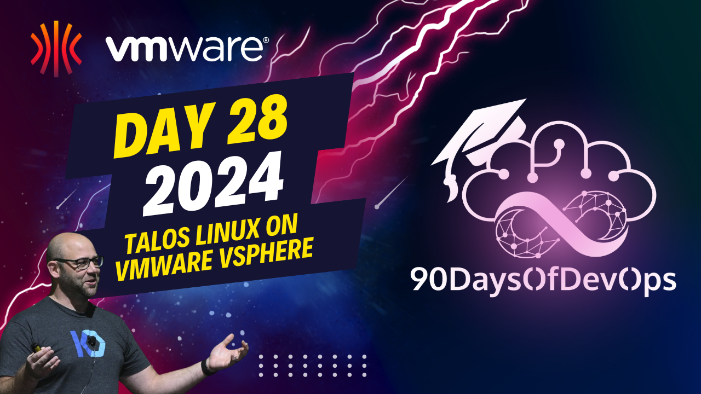

# Day 28 - Talos Linux on vSphere

 Summary:

1. The topic is about setting up a VMware system CSI on a Kubernetes cluster to utilize features like snapshots, and enforcing pod security rules.

2. A configuration file is used to create a secret within the cluster, containing information such as Virtual Center, username, password, and data center details.

3. After creating the secret, the VMware CSI plugin will be installed using a command.

4. A storage class called 'vsphere-storage-class' is defined, utilizing an existing NFS-based volume in the vsphere environment to provide storage for Kubernetes-based virtual machines.

5. An example PVC and PV are created using the defined storage class, resulting in a dynamic PVC and PV.

6. The goal is to build an API-capable way of spinning up multiple Kubernetes clusters using Cube and leveraging Casper K10 to protect any state for workloads running between the SSD and shared NFS server environments.

7. Future plans involve upgrading existing hardware, connecting more units into a managed switch, and exploring methods to automate the process of creating multiple Kubernetes clusters using Cube and Casper K10 for protection.
   

**IDENTITY**: The speaker is an expert in VMware vSphere and Kubernetes, with experience working with Talis and CSI (Container Storage Interface) provisioner.

**PURPOSE**: The speaker's purpose is to share their knowledge and expertise in building a home lab using VMware vSphere and Kubernetes. They want to demonstrate how to use the CSI provisioner to create a dynamic PVC (Persistent Volume Claim) and PV (Persistent Volume) in a vSphere environment, and explore ways to upgrade their existing infrastructure and leverage Casper K10 for workload protection.

**KEY TAKEAWAYS**:

1. The speaker demonstrated the use of the CSI provisioner to create a dynamic PVC and PV in a vSphere environment using Talis.
2. They showed how to apply a storage class to a PVC, which allows for the creation of a dynamic PV.
3. The speaker discussed their plans to upgrade their home lab infrastructure by adding more nodes and leveraging Casper K10 for workload protection.

**KEYWORDS**: VMware vSphere, Kubernetes, CSI provisioner, Talis, Persistent Volume Claim (PVC), Persistent Volume (PV), Casper K10.
