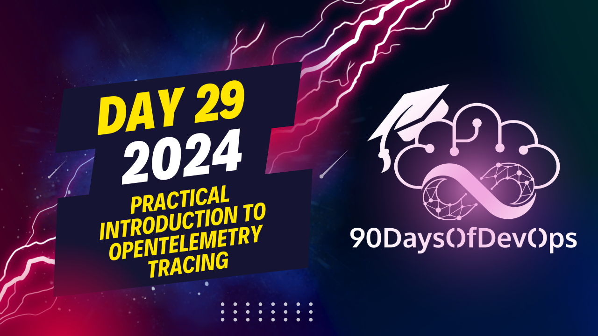

# Day 29 - A Practical introduction to OpenTelemetry tracing

 The speaker is discussing an architecture using Jagger, a complete observability suite that includes OpenTelemetry Collector. They are using Docker to run this setup. The application consists of three services: catalog (Spring Boot app), pricing, and stock. They use the Otel header in their requests for identification purposes.

To configure the Java agent, they set the data output destination as their own service (catalog) on a specific port, and chose not to export metrics or logs. They do the same configuration for their Python and Rust applications but did not elaborate on it as it's not relevant to this talk.

After starting all services, they made a request, checked the logs, and noticed that more spans (traces) appeared in the Jagger UI with more details about the flow of the code within components. They also added manual instrumentation using annotations provided by OpenTelemetry and Spring Boot for capturing additional data inside their components, such as method parameters.

Finally, they encouraged the audience to learn more about OpenTelemetry, explore their demo codes on GitHub, and follow them on Twitter or Masteron (a platform they mentioned but I couldn't find any details about it). They concluded by thanking the audience for their attention and wishing them a great end of the day.
The topic of this talk is identity and purpose, specifically how to use OpenTelemetry for distributed tracing and logging. The speaker starts by introducing the concept of OpenTelemetry and its purpose in providing a unified way to collect and process telemetry data from various sources.

The speaker then demonstrates how to set up OpenTelemetry using the Java library and shows examples of Auto instrumentation and manual instrumentation. Auto instrumentation is used to automatically instrument code without requiring manual configuration, while manual instrumentation requires explicit configuration to capture specific events or attributes.

The speaker also talks about the importance of tracing and logging in understanding the flow of code execution and identifying potential issues. They provide an example of how to use OpenTelemetry to capture additional data such as span attributes, which can be used to understand the flow of code execution.

The talk concludes by highlighting the benefits of using OpenTelemetry for distributed tracing and logging, including improved visibility into application behavior and faster issue resolution.

Overall, this talk aims to provide a comprehensive overview of OpenTelemetry and its use cases, as well as practical examples of how to set up and use it.
