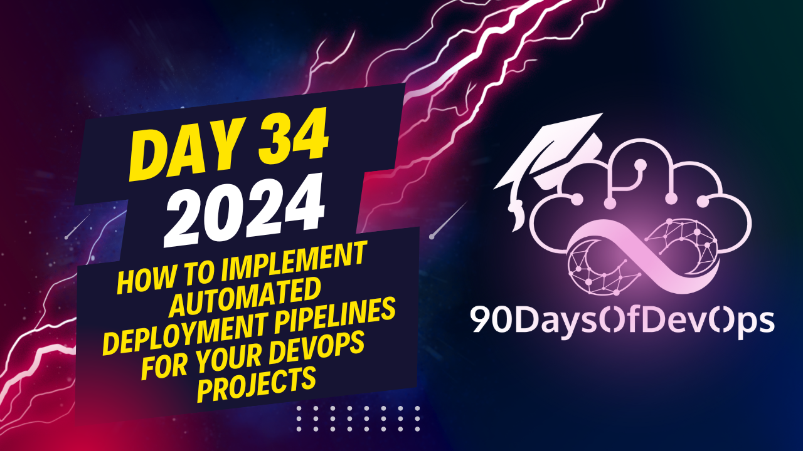

# Day 34 - How to Implement Automated Deployment Pipelines for Your DevOps Projects

An excellent overview of the modern software development pipeline, including topics such as build automation, continuous integration (CI), continuous deployment (CD), configuration management, automated testing, version control, small and frequent deployments, automated rollbacks, monitoring and feedback, security concerns, and containerization.

To summarize:

1. Automation benefits:
   - Faster time to market
   - Release confidence
   - Reduced human errors
   - Consistency in the codebase

2. Key components:
   - Source Code Management (e.g., GitHub, Bitbucket)
   - Build Automation (Jenkins, GitLab CI, CircleCI, Travis CI, etc.)
   - Integrated automated testing
   - Version Control (Git, SVN, Mercurial, etc.)

3. Continuous Deployment vs. Continuous Delivery:
   - Continuous Deployment: Automatic deployment of changes to the production environment after they have been tested in a staging or integration environment.
   - Continuous Delivery: Enables rapid and automated delivery of software changes to any environment, but deployment can be manual or triggered by a human.

4. Security Concerns:
   - Implement Infrastructure as Code (IaC) tools like Terraform, CloudFormation, etc.
   - Adopt security technologies for deployment like Chef, Ansible, etc.
   - Use secret management tools (Vault, AWS Secrets Manager, HashiCorp's Vault)

5. Monitoring and Logging:
   - Proactive issue detection
   - Scalability with application growth
   - Implement automatic logging and real-time alerts
   - Tools like Prometheus, ELK Stack (Elasticsearch, Logstash, Kibana), Grafana, Datadog, etc.

6. Containerization and Orchestration:
   - Container orchestration tools (Kubernetes, Docker Swarm, Rancher, etc.)
   - Serverless architectures provided by main cloud providers like AWS Lambda, Google Cloud Functions, Azure Functions, etc.

7. Machine Learning for Deployment Pipelines:
   - Predicting and optimizing deployment pipelines through machine learning.
The main points from this content are:

* Continuous Integration (CI) and Continuous Deployment (CD) as essential tools for detecting errors, reducing time to market, and increasing release confidence.

**Tools and Technologies**

* Jenkins, GCI, Bamboo, Circle CI, Travis CI, and Team C are popular CI/CD tools.
* Configuration management tools like Ansible and SaltStack are widely used.
* Infrastructure as Code (IaC) tools like Terraform and CloudFormation are essential for automating infrastructure deployment.

**Deployment Pipelines**

* Setting up a deployment pipeline involves choosing the right tools, defining deployment stages, and implementing automated testing.
* Small and frequent deployments help to identify errors quickly and prevent large-scale issues.

**Monitoring and Feedback**

* Continuous monitoring is necessary for automation pipelines to detect errors and provide real-time feedback.
* Automated rollbacks are essential for reverting to previous versions in case of errors.

**Common Deployment Challenges**

* Dependency management, security concerns, and scalability are common challenges faced during deployment.
* Using IaC tools like Terraform can help overcome these challenges.

**Monitoring and Logging**

* Proactive issue detection is crucial through monitoring and logging.
* Implementing automatic logging and real-time alerts helps to detect errors quickly.

**Skillability**

* Monitoring skills must adapt to application growth to ensure proactive issue detection.

**Future Trends**

* Microservices, containerization, and orchestration are trending in the industry.
* Kubernetes is a popular choice for container orchestration, with Rancher and Miso being other options.
* Serverless architecture is gaining popularity due to its scalability and maintenance-free nature.
