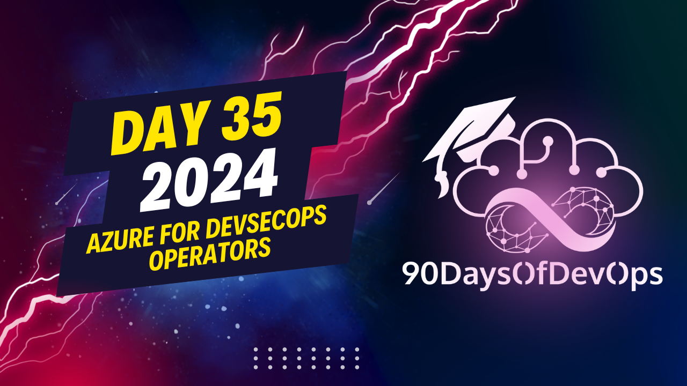

# Day 35 - Azure for DevSecOps Operators
[](https://www.youtube.com/watch?v=5s1w09vGjyY)

 Here is a summary of the steps to create an AKS cluster using Bicep:

1. Create a resource group:
   ```
   az group create --name myResourceGroup --location eastus
   ```

2. Create a Bicep file (myAKS.bicep) with the following content:

   ```
   param clusterName string = 'myAKSCluster'
   param location string = 'eastus'
   param dnsPrefix string = 'mydns'
   param osDiskSizeInGB int = 30
   param agentCount int = 1
   param image string = 'CanonicalUbuntuServer'

   @landingSlot
   resource aks myAKSCluster = Microsoft.ContainerInstances/managedClusters@2020-06-01 {
      name: clusterName
      location: location
      properties: {
         dnsPrefix: dnsPrefix
         kubernetesVersion: '1.27.7'
         osType: 'Linux'
         servicePrincipalProfile: {
            clientId: '<Your Service Principal Client ID>'
            secret: '<Your Service Principal Secret>'
         }
         enableManagedIdentity: true
      }
      sku: {
         tier: Premium
         name: Standard_D4_v3
      }
      agentPoolProfiles: [
         {
            name: 'agentpool'
            count: agentCount
            osType: 'Linux'
            osDiskSizeInGB: osDiskSizeInGB
            vmSize: 'Standard_DS2_v3'
            type: 'VirtualMachineScaleSets'
            mode: System
         }
      ]
   }
   ```

3. Install the Azure CLI and Azure PowerShell, if you haven't already.

4. Run the following command to login to your Azure account:

   ```
   az login
   ```

5. Deploy the Bicep file using the following command:

   ```
   az bicep build myAKS.bicep --output-file aksDeployment.json
   az deployment group create --name myAKSDeployment --resource-group myResourceGroup --template-file aksDeployment.json
   ```

6. Once the deployment is complete, you can connect to the AKS cluster using `kubectl` and `az aks get-credentials`.

7. You can also view the status of your AKS cluster in the Azure portal under "Kubernetes service" > "Clusters".


This content walks through a step-by-step guide on deploying an Azure Kubernetes Service (AKS) cluster using Bicep, a declarative infrastructure as code language developed by Microsoft. The purpose of this deployment is to create a test lab environment for testing and learning.

The video starts with creating a Resource Group in Azure using the Azure CLI tool, followed by generating and copying an SSH key. Then, it deploys a Bicep file to create the AKS cluster, including the necessary resources such as the Linux admin username and SSH RSA public key.

Once the deployment is complete, the video shows how to retrieve the credentials from the AKs cluster using the `az aks get-credentials` command. This allows the user to interact with the deployed resources and manage them through the Azure CLI or other tools.

The video also demonstrates how to use the `kubectl` command-line tool to verify that the deployment was successful, including checking the node pools, workloads, and virtual machine sizes.

Throughout the video, the author provides tips and suggestions for using Bicep and Azure Kubernetes Service, as well as promoting best practices for deploying and managing cloud-based infrastructure. The purpose of this content appears to be educational, with the goal of helping viewers learn about Azure Kubernetes Service and how to deploy it using Bicep.
