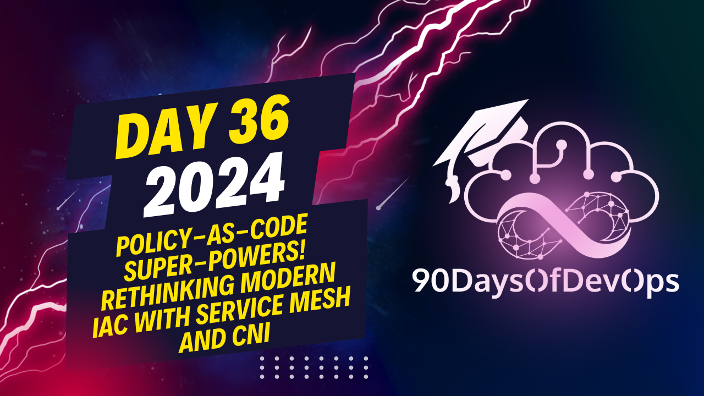

# Day 36 - Policy-as-Code Super-Powers! Rethinking Modern IaC With Service Mesh And CNI

 The question is about how to limit repetition when writing Infrastructure as Code (IAC) projects by using code templates, libraries, and central repositories. The idea is to define methods or components that are common across multiple projects, import them into new projects as libraries, and call the intended components as needed. This way, if there's an update to a policy or resource, it can be updated in the central repository and all consuming projects will automatically benefit from the change. The use of automation tools like GitOps and systems like Palumi helps streamline daily IAC operations, make decisions around provisioning Cloud native infrastructure, support applications on top of that, and scale those applications as needed. It's recommended to try out the steps in a project or choose other tools for similar results, and encouragement is given to follow the team on their social media platforms.
Here are my key takeaways from your content:

**IDENTITY and PURPOSE**

1. The importance of security posture: You emphasized the significance of having a clear understanding of security policies and edicts, especially when working with complex systems like Kubernetes.
2. IAC (Infrastructure as Code) enforcement: You showcased how Palumi can enforce compliance by applying policies at the account level, ensuring that applications are properly tagged and configured to meet security requirements.
3. Reusability and templating: You highlighted the value of reusing code components across projects, reducing repetition and increasing efficiency.

**AUTOMATION**

1. Automation in IAC: You discussed how tools like Palumi enable automation in IAC operations, streamlining processes and minimizing manual intervention.
2. Scalability and synchronization: You emphasized the importance of automating scaling and synchronization between applications and infrastructure to optimize performance.

**FINAL THOUGHTS**

1. Hands-on experience: You encouraged viewers to try Palumi themselves, emphasizing that it's easy to get started even without being an expert.
2. Community engagement: You invited the audience to follow your team on social media platforms like Twitter and LinkedIn, and to engage with the community.
