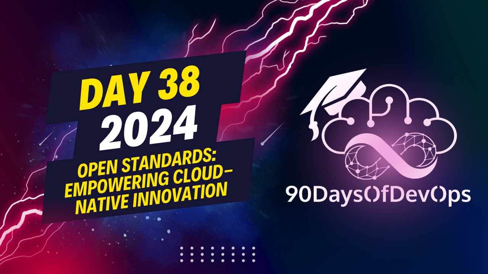

# Day 38 - Open Standards: Empowering Cloud-Native Innovation

 You have provided a comprehensive overview of the role of Open Standards in the Cloud Native Computing Foundation (CNCF) ecosystem. Here is a summary of the key points:

1. ID Telemetry: Focuses on setting the foundation for building new open standards in the observability space.

2. Open Application Model (OAM): An open standard protocol for application deployment that defines a new approach to deploying applications.

3. CUELLA: A CNCF project following the OAM to define a new way of defining the application deployment process.

4. Crossplane: Defines a new framework for creating cloud-native control planes without requiring much coding.

5. Importance of Open Standards:
   - Innovation for vendors: The focus has shifted towards innovation in tools, rather than integration with existing systems.
   - Extensibility for end users: End users can easily compare and choose the best tool based on features provided.
   - Interoperability for the community: Allows users to select from multiple solutions that solve the same problem, reducing vendor lock-in.

The QR code you shared seems to be a way to access resources related to the Open Standards and recent developments in this area. It's great to see how these standards are driving innovation, extensibility, and interoperability within the CNCF ecosystem. Thanks for sharing this informative talk!
The slides from your presentation on "IDENTITY and PURPOSE" are quite detailed, covering various aspects of the cloud-native ecosystem. You discussed several open standards that have been developed to enable the use of multiple container runtimes (CRI), networking solutions (CNi), storage solutions (CSI), and service mesh technologies with Kubernetes. You also mentioned the importance of these standards in enabling interoperability within the community.

You highlighted some specific tools and projects, such as CRI-O, Calico, Flannel, Vite, OpenEBS, and Istio, among others. You emphasized that these open standards have enabled innovation for vendors, extensibility for end-users, and interoperability within the community.

In your presentation, you also touched on two new ecosystems that have developed recently in the cloud-native ecosystem: observability and application deployment. You mentioned open telemetry as an example of a project in the observability space, which aims to simplify instrumentation, reduce data aggregation costs, and standardize formats and frameworks for ensuring visibility across the entire stack.

You also discussed the Open Application Model (OAM) and Crossplane, which are both related to simplifying application deployment on any platform while enriching the developer experience. You noted that OAM defines a new approach to application deployment and is followed by tools such as Cella, which aims to provide a simple way to deploy applications without requiring much code.

You concluded your presentation by summarizing the impact of open standards in the cloud-native ecosystem, highlighting innovation for vendors, extensibility for end-users, and interoperability within the community. You encouraged attendees to explore these resources further and engage with you on social media platforms like Twitter and LinkedIn if they have any questions or feedback.

Overall, your presentation provided a comprehensive overview of the importance of open standards in the cloud-native ecosystem, highlighting their impact on innovation, extensibility, and interoperability within the community.
