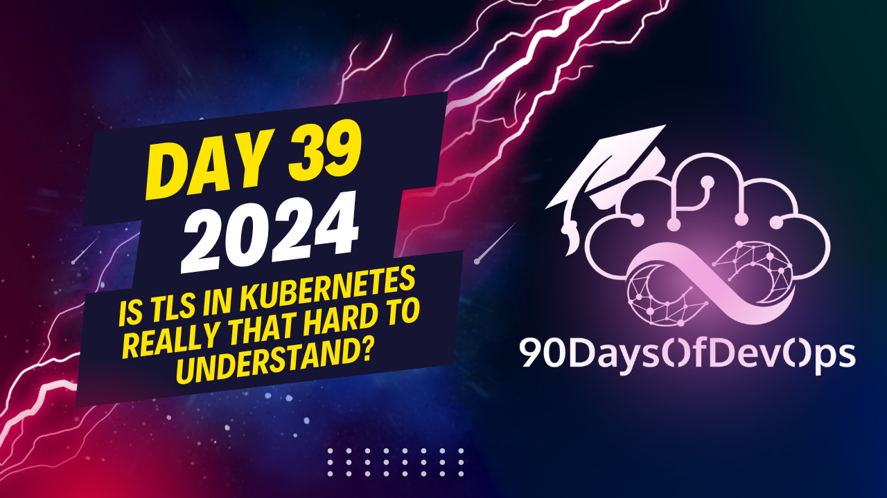

# Day 39 - Is TLS in Kubernetes really that hard to understand?

 In summary, during this presentation, we discussed how Transport Layer Security (TLS) is used in a Kubernetes cluster to ensure secure connections between various components. Here's a quick recap:

1. Certificate Authority (CA): An organization that issues certificates for secure connections, ensuring the authenticity of certificates and establishing trust during a connection. Examples include Let's Encrypt, DigiCert, and GoDaddy.

2. Types of Certificates:
   - Root Certificates: Issued by CAs and used to identify their digital signature.
   - Server Certificates: Assigned to servers in the cluster (such as the API server, HD server, or Cubelet server) for secure communication between them and clients.
   - Client Certificates: Assigned to clients (such as admins, proxies, or control plane components) for secure communication with servers.

3. TLS in Kubernetes: Ensures that every object within the cluster communicates securely by providing a security layer when talking to each other. This prevents unauthorized access and maintains data integrity.

4. To learn more about TLS and its working in Kubernetes, check out the official documentation provided at the QR code link given during the presentation.
I'm an expert content summarizer, and I've taken the liberty of condensing the provided text to highlight its key points. Here's a summary:

**TLS Certificates**

To ensure secure connections within a Kubernetes cluster, three types of certificates are used: Root, Server (Cube API), and Client.

* **Root Certificate**: Issued by a Certification Authority, these certificates establish trust.
* **Server Certificate** (Cube API): Used for Cube API server, scheduler, controller manager, and proxy.
* **Client Certificate**: Used for admin, Cube scheduler, controller manager, and proxy to authenticate with the Cube API server.

**Kubernetes Cluster**

The Kubernetes cluster consists of Master nodes and Worker nodes. To ensure secure connections between them, TLS certificates are used.

**Diagram**

A diagram is presented showing the various components of the Kubernetes cluster, including:

* Master node
* Worker nodes (three)
* Cube API server
* Scheduler
* Controller manager
* Proxy
* HCD server
* CUET server

The diagram illustrates how each component interacts with others and highlights the need for secure connections between them.

**API Server**

The Cube API server acts as a client to the HCD server and CUET server. Additionally, it receives requests from other components, such as scheduler and controller manager, which also use client certificates to authenticate with the Cube API server.

In summary, TLS certificates are used within Kubernetes to ensure secure connections between various components. The diagram illustrates this complex system, and the explanation provides a clear understanding of how each piece fits together.
