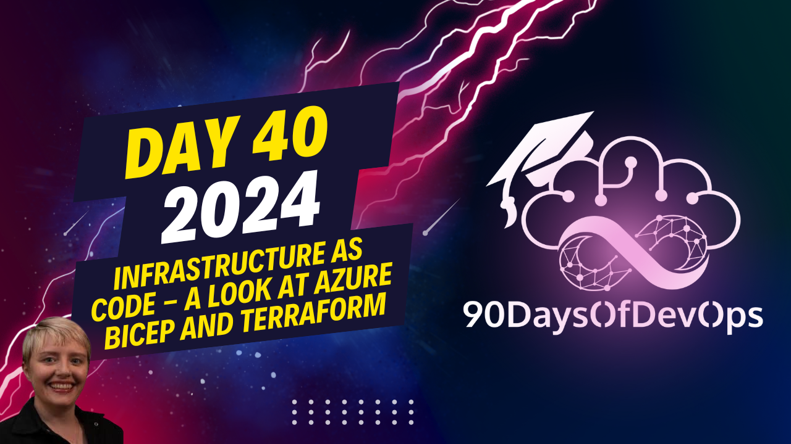

# Day 40 - Infrastructure as Code - A look at Azure Bicep and Terraform

 In this text, the speaker discusses best practices for using Infrastructure as Code (IAC) with a focus on Terraform and Azure Bicep. Here are the key points:

1. Store your infrastructure code in version-controlled systems like GitHub or Azure DevOps to enable collaboration, auditing, and peer reviews.
2. Use static analysis tools for IAC code bases to detect misconfigurations based on business practices and organizational needs.
3. Avoid deploying sensitive information (like secrets) directly within your code. Instead, use a secret manager like Key Vault (Azure), AWS KMS, or HashiCorp Vault.
4. Ensure proper documentation for transparency and knowledge sharing among team members and future coders, including inline comments and specific documentation.
5. Consider using Continuous Integration/Continuous Deployment (CI/CD) pipelines to automate the deployment process and reduce manual effort.
6. Infrastructure as Code helps ensure consistency but can be more efficient with automation tools like CI/CD pipelines.
7. Both Terraform and Azure Bicep use declarative programming paradigms, but Terraform is compatible with multiple cloud providers while Azure Bicep only supports Azure deployments.
8. Store the state files for Terraform in a back end (like Azure Blob Storage or Amazon S3) for larger deployments to maintain a single source of truth. Bicep takes State directly from Azure and does not require State files.
9. Explore additional resources available for learning more about IAC, Terraform, and Azure Bicep through links provided by Microsoft Learn (aka.ms/SAR).
Here are the main points from the video:

**Identity and Purpose**

* The purpose of infrastructure as code is to manage and configure infrastructure using code, rather than manually.
* This helps with consistency, reliability, and version control.

**Best Practices for Infrastructure as Code**

* Avoid deploying credentials or secrets inside your code. Instead, use a secret manager like Key Vault (Azure), AWS Key Management Service, or HashiCorp's Vault.
* Use documentation to share knowledge and transparency about your code. This includes comments in the code itself, as well as separate documentation.

**Tools for Infrastructure as Code**

* Use continuous integration/continuous deployment (CI/CD) tools like Azure DevOps or GitHub Actions to automate deployments.
* Consider using a secret manager to store sensitive information.

**Azure Bicep vs Terraform**

* Both are infrastructure as code languages that use the declarative programming paradigm.
* Azure Bicep is specific to Azure, while Terraform can deploy to multiple cloud providers and on-premises platforms.
* Terraform has been around longer and has a larger community, but Azure Bicep is still a viable option.

**Key Differences between Terraform and Azure Bicep**

* State handling: Terraform uses a state file to track resource modifications, while Azure Bicep takes its state directly from Azure.
* Scalability: Terraform can handle large deployments across multiple providers, while Azure Bicep is best suited for smaller-scale Azure deployments.

**Conclusion**

* The choice between Azure Bicep and Terraform depends on your organization's specific needs and goals.
* Remember to prioritize documentation, use CI/CD tools, and consider using a secret manager to store sensitive information.
