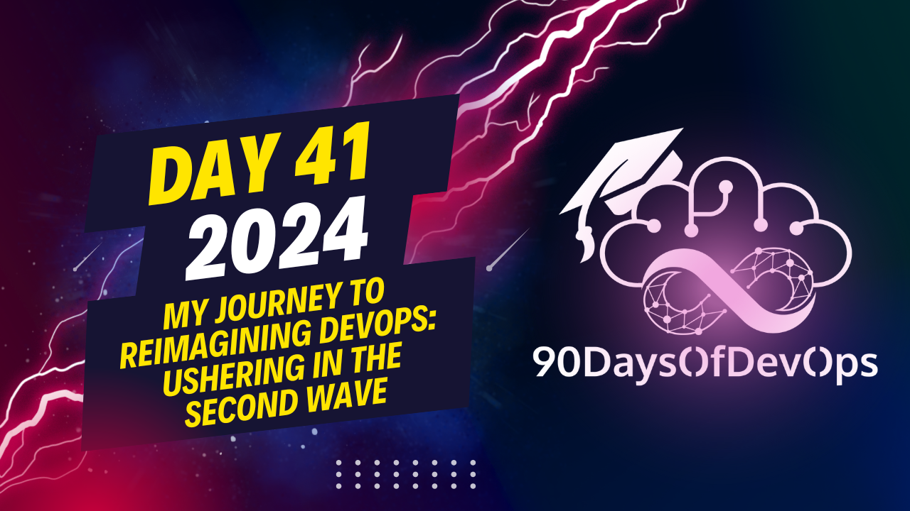

# Day 41 - My journey to reimagining DevOps: Ushering in the Second Wave

the speaker is discussing the challenges in collaboration within a DevOps context, and proposing a solution called "System Initiative." The main issues highlighted are:
1. Context switching - Teams have to constantly learn new technologies, tools, and abstractions, which hinders collaboration as each team may have slightly different perspectives and understandings of the system.
2. Low intelligence of the system - Understanding the state of the infrastructure and production requires heavy reliance on team members' ability to conceptualize information from statically configured files. This makes it hard for everyone to have the same understanding, increasing the risk of mistakes.
3. Handoff city - The current process relies too much on documentation instead of direct communication, leading to delays and misinterpretations in conveying ideas or feedback.

To address these challenges, the speaker proposes a solution called "System Initiative," which aims to:
1. Increase system intelligence by capturing relationships between configuration elements, making it easier to move from decision-making to implementation without needing to remember multiple locations for updates.
2. Simplify context switching and reduce cognitive load by allowing teams to stay in their flow state and reducing the need to constantly dust off old knowledge.
3. Facilitate collaboration through shared understanding of the system's composition, architecture, connections, and workflow. This will make it easier for teams to see who has done what, when, and even who is working on a task simultaneously.
4. Implement short feedback loops, allowing teams to get feedback on their designs before implementing changes in production.

The speaker encourages the audience to learn more about System Initiative through joining their Discord community or visiting their website for open beta access, and welcomes any feedback or ideas about how it could impact individual workflows.

**IDENTITY**: The speaker's identity as a technology leader is crucial to understanding their perspective on improving outcomes through better collaboration and feedback.

**PURPOSE**: The purpose of this talk is to share lessons learned while building a DevOps Center of Excellence, highlighting the importance of prioritization decisions, team dynamics, cognitive load, and leadership support.

**LESSONS LEARNED**:

1. **Prioritization**: Leaders should provide context for teams to make strategic decisions quickly.
2. **Cognitive Load**: Increasing scope or domain complexity can be taxing; leaders must consider this when making decisions.
3. **Leadership Team Dynamics**: The leadership team is a team too; leaders must prioritize collaboration and communication within their own team.

**PROBLEMS TO SOLVE**:

1. **Handoff City**: Poll requests, design documents, and support tickets replace actual collaboration.
2. **Lack of Shared Context**: Teams struggle to understand each other's work due to disparate tools and systems.
3. **High Intelligence Systems**: The speaker envisions a world where systems have high intelligence, reducing context switching and cognitive load.

**SYSTEM INITIATIVE**: This is a novel devops tooling approach that allows for real-time collaboration, multimodal interaction, and full-fidelity modeling of system resources as digital twins.

**CALL TO ACTION**: Join the conversation on Discord to learn more about System Initiative, provide feedback, or join the open beta.
