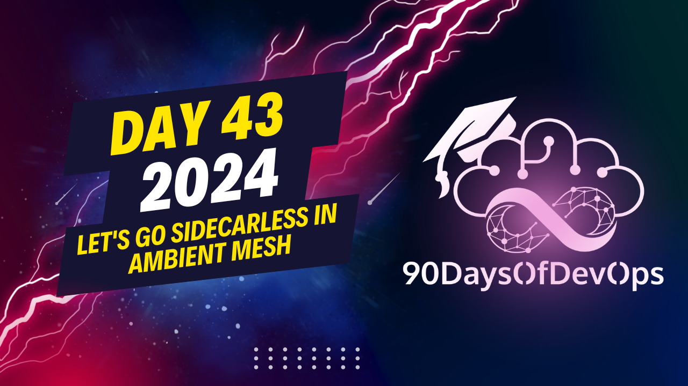

# Day 43 - Let's go sidecarless in Ambient Mesh

 # ONE SENTENCE SUMMARY:
This video discusses Ambient Mesh, an open-source project that simplifies service mesh architecture by using one proxy per node, reducing cost and complexity, and providing improved security with mTLS and identity management.

# MAIN POINTS:
1. Service mesh addresses challenges in microservice architectures, such as cost, complexity, and performance issues.
2. Ambient Mesh is an open-source project that aims to improve service mesh by using one proxy per node instead of one for each container.
3. This reduces costs, simplifies operations, and improves performance.
4. Ambient Mesh provides out-of-the-box security with mTLS and identity management.
5. The architecture uses separate proxies for L3/L4 (Z) and L7 (VPO) to manage traffic.
6. The tunneling protocol used in Ambient Mesh is called ONI, which provides L3/L4 capabilities.
7. Ambient Mesh is under the Cloud Native Computing Foundation (CNCF) and continues to be improved daily.

# ADDITIONAL NOTES:
- In Ambient Mesh, each node has an identity that is impersonated and creates a secure tunnel for communication between nodes.
- The tunneling protocol used in Ambient Mesh is called ONI (Overlay Network Interface).
# OUTPUT SECTIONS

## ONE SENTENCE SUMMARY:
The presentation discusses the concept of a service mesh, specifically Ambient Mesh, and its architecture, highlighting its benefits, such as reduced cost, simplified operations, and improved performance.

## MAIN POINTS:

1. Service meshes provide secure communication between services.
2. Microservices have distributed applications with challenges in observing, securing, and communicating among services.
3. Ambient Mesh is an open-source project that simplifies service mesh architecture by having one proxy per node rather than per container.
4. It provides reduced cost, simplified operations, and improved performance compared to the sidecar pattern.
5. Ambient Mesh uses mutual TLS (mTLS) for secure communication between services.
6. The L7 proxy manages layer 7 features, while the L3/L4 proxy handles layer 3 and 4 traffic.
7. Zel is responsible for securely connecting and authenticating workloads with CN (Certificate Network).
8. The protocol used to connect nodes is called Hone, which provides a secure overlay network.

## PURPOSE:

The presentation aims to educate the audience on the benefits and architecture of Ambient Mesh, highlighting its unique features and advantages over traditional service mesh architectures.
