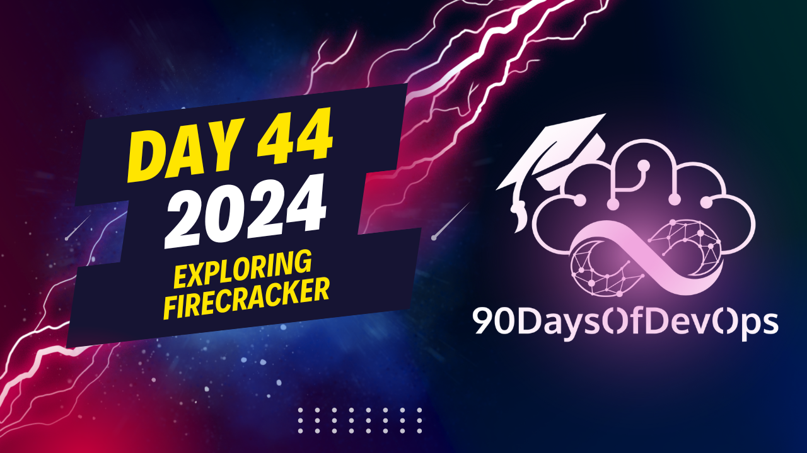

# Day 44 - Exploring Firecracker

 In summary, we discussed the pros and cons of containers and Virtual Machines (VMs), as well as an alternative solution called Firecracker that aims to combine the advantages of both while minimizing their respective disadvantages.

Pros of containers:
- Lightweight (measured in megabytes)
- Require fewer resources to deploy, run, and manage
- Can spin up quickly (milliseconds to minutes)
- High density on a single system (more containers can be hosted compared to VMs)

Cons of containers:
- Newer technology with an evolving ecosystem
- Potential security issues due to shared underlying OS
- All containers must run the same operating system

Firecracker aims to provide a secure, fast, and efficient solution by implementing micro VMS using KVM. Firecracker's advantages include:
- Minimal device model for enhanced security
- Accelerated kernel loading and reduced memory overhead
- High density of micro VMs on a single server
- Fast startup times (up to 150 micro VMs per second per host)

When using Firecracker, considerations include:
- Implementing scheduling, capacity planning, monitoring, node autoscaling, and high availability features yourself
- Suitable for workloads where containers don't work or for short-lived workloads (like Lambda functions)
- Potential use cases for students when you don't want to spin up a full VM for training purposes.

The speaker discusses the concept of "having the best of both worlds" in cloud computing, specifically mentioning containers and virtual machines (VMs). They highlight the limitations of containers, including security concerns and the need for multiple operating systems. VMs, on the other hand, provide better security but are less flexible.

To address these issues, the speaker introduces Firecracker, a technology that runs micro VMs (MVMs) in user space using KVM (Linux kernel-based virtual machine). MVMs offer fast startup times, low memory overhead, and enhanced security. This allows thousands of MVMs to run on a single machine without compromising performance or security.

The speaker emphasizes the benefits of Firecracker, including:

1. **Secure**: MVMs are isolated with common Linux user-space security barriers and have reduced attack surfaces.
2. **Fast**: MVMs can be started quickly, with 150 per second per host being a feasible rate.
3. **Efficient**: MVMs run with reduced memory overhead, enabling high-density packing on each server.

However, the speaker notes that using Firecracker requires consideration of additional factors, such as scheduling, capacity planning, monitoring, node autoscaling, and high availability. They also suggest scenarios where Firecracker is particularly useful:

1. **Short-lived workloads**: MVMs are suitable for short-lived workloads like Lambda functions.
2. **Students**: MVMs can be used to provide a lightweight, easily spin-up-and-down environment for students.

Overall, the speaker aims to demonstrate that Firecracker and MVMs offer an attractive alternative to traditional VMs and containers, providing a secure, fast, and efficient way to run workloads in the cloud.

Here are additional resource:

https://firecracker-microvm.github.io/
https://itnext.io/microvm-another-level-of-abstraction-for-serverless-computing-5f106b030f15
https://github.com/alexellis/firecracker-init-lab
