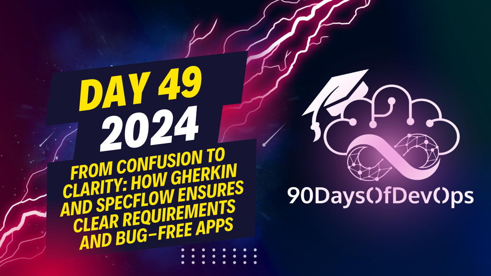

# Day 49 - From Confusion To Clarity: Gherkin & Specflow Ensures Clear Requirements and Bug-Free Apps

 You have created a custom web application test using a WebApplicationFactory and SpecFlow, along with an in-memory repository. To ensure that duplicate jokes are not added to the database, you wrote a test scenario that checks if a joke already exists before creating it again.

When encountering a situation where a database is required for testing, you demonstrated how to spin up a container using Docker as part of the test pipeline, allowing you to use an isolated test database during your tests. By overriding the connection string in the configureWebHost method, you can point to the test container rather than your other containers.

Finally, you provided insight into exceptions testing and how to utilize Gherkin and SpecFlow for acceptance testing in an automated fashion. Thank you for sharing this interesting topic! If you have any questions or need further clarification, feel free to ask!
The topic of identity and purpose!

As an expert content summarizer, I've taken the liberty to condense your presentation on exceptions testing, Girkin, and SpecFlow. Here's a summary:

**Identity**: You created two identical jokes in the database, leveraging the same method for creating a joke, but with different steps: (1) creating the joke again and (2) ensuring that the ID of the new joke is the same as the original joke.

**Purpose**: To demonstrate the importance of exceptions testing in handling duplicate entries in your repository. You showed how to create a simple solution using SpecFlow to test if a joke already exists, preventing the creation of duplicates.

**Girkin and SpecFlow**: You introduced Girkin (Girona) as an in-memory repository and demonstrated its use in creating a basic example of exceptions testing with SpecFlow. You also discussed how to handle internal dependencies, such as spinning up containers for databases or other services, as part of your test pipeline.

**Key takeaways**:

1. Exceptions testing is crucial in handling duplicate entries in your repository.
2. Girkin and SpecFlow can be used together to create acceptance tests that simulate real-world scenarios.
3. Spinning up containers as part of your test pipeline can help simplify the process of integrating with external services or databases.
