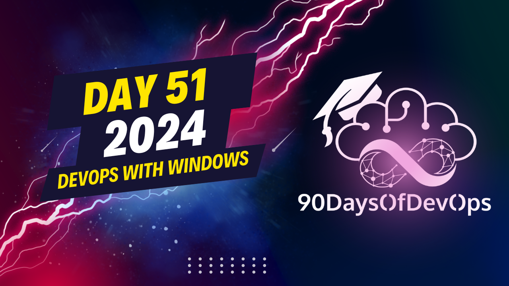

# Day 51 - DevOps on Windows

 In this explanation, you're discussing various tools and environments available for developers using Visual Studio Code (VS Code) on Windows. Here's a summary of the key points:

1. VS Code allows you to connect directly to different environments such as WSL, Dev Containers, Code Spaces, and SSH servers.
2. Git Bash serves as a translation layer between the user's local machine (Windows) and Linux commands, but it doesn't provide access to the Linux file system.
3. Git is accessible by default in VS Code with Git Bash, allowing you to perform git commands natively on Windows while targeting repositories on your Linux file system via WSL.
4. It's essential to work primarily within the WSL file system to avoid performance issues when working with large files or complex operations.
5. VS Code can be used to edit and save files directly from WSL, with extensions like Preview helping you interact with the files in a more visual way.
6. Developers also have options for container management tools such as Docker Desktop, Podman Desktop, Rancher Desktop, and Finch (based on kubectl, podman, and nerdctl).
7. Finch is unique because it shares tooling with Rancher Desktop and leverages Lima, a tool originally developed for macOS, to create container environments on Windows using WSL2 as the driver.
8. Developers can use these tools to run containerized applications and orchestrate them using kubernetes or open shifts.

Overall, the talk emphasizes the growing support for devops tools on Windows platforms and encourages developers to explore these tools further for their projects.
Here's a summary of the content:

**Setting up the Environment**

To start, the speaker sets up their Visual Studio Code (VSCode) with SSH plugin, allowing them to connect remotely to environments and develop there. They also use Git Bash as a translation layer, which allows them to use standard Linux commands on Windows.

**Git and GitHub Desktop**

The speaker highlights the importance of having access to Git commands directly from VSCode or PowerShell. They also mention using GitHub desktop, which is a visual tool that simplifies many Git operations.

**Working with WSL (Windows Subsystem for Linux)**

The speaker explains that WSL allows them to run Linux distributions natively on Windows. This enables the use of various tools and frameworks, including containers and Kubernetes. However, they emphasize the importance of working within the WSL file system to avoid performance issues.

**Containers and Kubernetes**

To support containerization, the speaker mentions three options: Docker desktop, Rancher desktop, and Podman desktop. These tools allow for running containers and managing them through Kubernetes or other runtimes.

**Finch and Lima**

The final tool mentioned is Finch, which was created by the Azure team to provide a Windows-based solution for working with containers and Kubernetes. The speaker notes that Finch uses Lima as its driver on Mac OS and has been ported to Windows using WSL2.

**Conclusion**

The talk concludes by emphasizing the importance of setting up a development environment on Windows and exploring the various tools available, including Git, GitHub desktop, WSL, Docker, Rancher, Podman, and Finch. The speaker encourages continued learning and exploration in the DevOps space.
