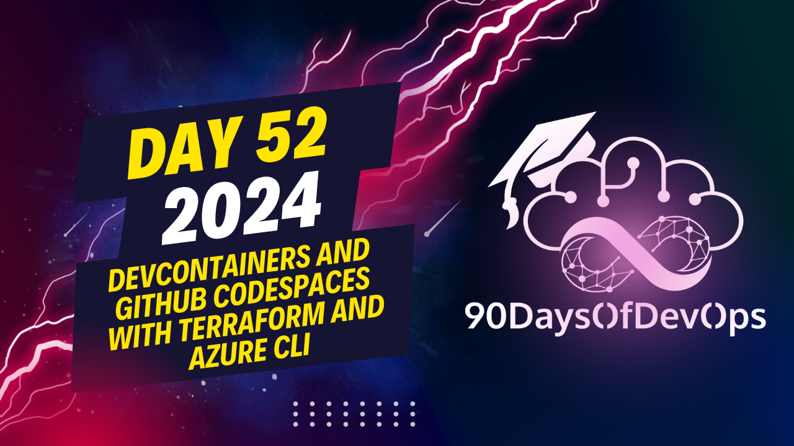

# Day 52 - Creating a custom Dev Container for your GitHub Codespace to start with Terraform on Azure

 # ONE SENTENCE SUMMARY:
Patrick K demonstrates how to create a Dev container for a GitHub repository with Terraform and the Azure CLI, using Visual Studio Code and a Docker file and Dev container JSON file.

# MAIN POINTS:
1. Create an empty repository on GitHub named `Asia terraform code space`.
2. Inside the repository, create a `dev container` folder with two files: `dockerfile` and `devcontainer.json`.
3. In the `dockerfile`, install the Asia CLI, Terraform, and other necessary tools using a base image.
4. Use the `devcontainer.json` to configure the environment for the code space, referencing the `dockerfile`.
5. Commit and push the changes to the main branch of the repository.
6. Use Visual Studio Code's Remote Explorer extension to create a new code space from the repository.
7. The Dev container will be built and run in the background on a virtual machine.
8. Once the code space is finished, Terraform and the Asia CLI should be available within it.
9. To stop the Dev container, click 'disconnect' when you no longer need it.
10. Rebuild the container to extend it with new tools as needed.

# TAKEAWAYS:
1. You can create a Dev container for your GitHub code space using Visual Studio Code and two files: `dockerfile` and `devcontainer.json`.
2. The `dockerfile` installs necessary tools like the Asia CLI and Terraform, while the `devcontainer.json` configures the environment for the code space.
3. Once you have created the Dev container, you can use it to work with Terraform and the Asia CLI within your GitHub code space.
4. To start working with the Dev container, create a new terminal and check if Terraform and the Asia CLI are available.
5. Remember to stop the Dev container when you no longer need it to save resources, and rebuild it as needed to extend its functionality.
Here is the output:

# ONE SENTENCE SUMMARY:
Create a Dev container for your GitHub code space to work with Terraform and the AWS CLI by creating a Docker file and a devcontainer.json file.

# MAIN POINTS:

1. Create an empty repository named Azure terraform code space.
2. Create two files: a Docker file and a devcontainer.json file, inside a dev-container directory.
3. Define the base image and install the necessary tools, including AWS CLI and Terraform.
4. Configure the devcontainer.json file to set up the environment for your code space.
5. Push the changes to the main branch of your repository.

# TAKEAWAYS:

1. Create a new Dev container for your GitHub code space using Visual Studio Code.
2. Use the Docker file to install necessary tools, including AWS CLI and Terraform.
3. Configure the devcontainer.json file to set up the environment for your code space.
4. Push changes to the main branch of your repository to create the code space.
5. Start working with Terraform and the AWS CLI in your code space using the Dev container.
