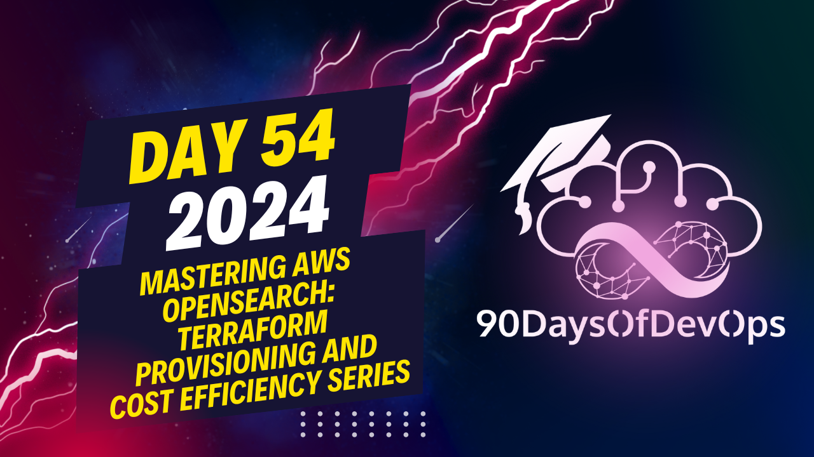

# Day 54 - Mastering AWS OpenSearch: Terraform Provisioning and Cost Efficiency Series

 # ONE SENTENCE SUMMARY:
This session demonstrates how to ingest logs into AWS OpenSearch using a LockStash agent, discussing cost optimization techniques and providing instructions on setting up the environment.

# MAIN POINTS:
1. The content is about ingesting logs into AWS OpenSearch using LockStash.
2. A provision search cluster and a LockStash agent are used for log collection.
3. The design includes two E2 instances in different availability zones, with an OpenSearch cluster deployed on the same VPC.
4. The LockStash agent sends logs to the OpenSearch cluster for processing.
5. A sample pipeline is provided to input and output the desired logs.
6. Terraform is used to provision the AWS OpenSearch cluster.
7. An Amazon EC2 instance is created for the OpenSearch cluster with specific configurations.
8. The code demonstrates creating an OpenSearch cluster in a specified region (US East).
9. Index life cycle policy is introduced as a cost optimization technique.
10. The index life cycle policy deletes older indexes, and there are options to customize the policy based on requirements.

# ADDITIONAL NOTES:
- LinkedIn ID for further questions or contact.
# ONE SENTENCE SUMMARY:

AWS Open Search provides a scalable and cost-effective solution for ingesting logs, with features like provisioned clusters, data collection engines (Lock Stash), and index life cycle policies to manage storage and costs.

# MAIN POINTS:

1. AWS Open Search is used to ingest logs from various sources.
2. A Lock Stash agent is used to send logs to the Open Search cluster in real-time.
3. The Lock Stash pipeline includes input, output, and debug options.
4. Provisioning an Open Search cluster using Terraform involves creating a new region, cluster name, version, instance type, and EBS volume size.
5. Installing the Lock Stash agent requires downloading and extracting the agent, then configuring it to send logs to the Open Search cluster.
6. Index life cycle policies are used to manage storage and costs by deleting older indexes.

# TAKEAWAYS:

1. AWS Open Search is a scalable solution for ingesting logs from various sources.
2. Lock Stash agents can be used to send logs in real-time to an Open Search cluster.
3. Provisioning and configuring an Open Search cluster requires attention to detail, including region, cluster name, version, instance type, and EBS volume size.
4. Index life cycle policies are essential for managing storage and costs by deleting older indexes.
5. Monitoring and optimizing log ingestion can help reduce costs and improve performance.
