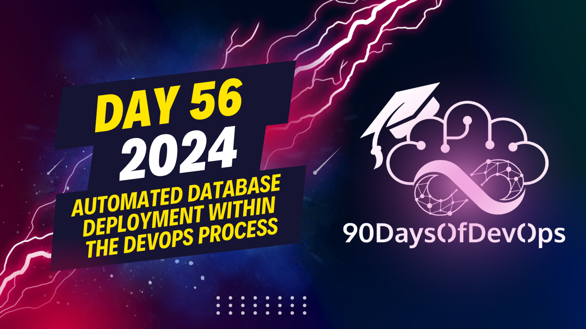

# Day 56 - Automated database deployment within the DevOps process

 To baseline local tests or integration tests within your pipelines, you can use Docker containers to create an initial database state. Here's how it works:

1. Spin up your Docker container with the SQL Server running.
2. Deploy your schema, insert test data, and set up the initial baseline.
3. Commit the Docker container with a tag (e.g., version 001) containing the initial state of the database.
4. Run tests using the tagged Docker container for consistent testing results.
5. If needed, create additional containers for different versions or configurations.
6. For testing purposes, run a Docker container with the desired tag (e.g., version 001) to have a pre-configured database environment.
7. To make things more manageable, you can build custom CLI tools around SQL Package or create your own command line application for business logic execution.
8. Use containers for DB schema deployment instead of deploying SQL Packager to agents.
9. Shift the database deployment logic from the pipeline to the application package (for example, using Kubernetes).
   - Add an init container that blocks the application container until the migration is done.
   - Create a Helm chart with your application container and the migration container as an init container.
   - The init container listens for the success of the migration container, which updates the database schema before deploying the application containers.
10. In summary:
   - Treat your database as code.
   - Automate database schema changes within pipelines (no manual schema changes in production).
   - Handle corner cases with custom migration scripts.
   - Package the database deployment into your application package to simplify pipelines (if possible). If not, keep the database deployment within your pipeline.
Here's a summary of the content:

**Identity and Purpose**

The speaker discusses the importance of integrating database development into the software development process, treating the database as code. They emphasize that manual schema changes should never occur during deployment.

**Using Containers for Database Schema Deployment**

The speaker explains how containers can be used to simplify database schema deployment. They demonstrate how to use Docker containers to deploy and test different database versions, making it easier to maintain consistency across environments.

**Baselining for Local Tests and Integration Tests**

The speaker shows how to create a baseline of the initial database state using Docker containers. This allows for easy testing and resetting of the database to its original state.

**Autonomous Deployment or Self-Contained Deployment**

The speaker discusses how to package SQL packager into a container, allowing for autonomous deployment or self-contained deployment. They explain how this can be achieved in Kubernetes using Helm deployments.

**Shifting Database Deployment Logic from Pipelines to Application Packages**

The speaker shows an example of shifting database deployment logic from the pipeline to the application package using Helm releases. This simplifies the pipeline and makes it easier to manage.

**Recap**

The speaker summarizes the key points, emphasizing the importance of treating databases as code, automating schema changes, handling corner cases with custom migration scripts, and packaging database deployment into application packages or using pipelines for deployment.
