# Day 58 -  The Reverse Technology Thrust
[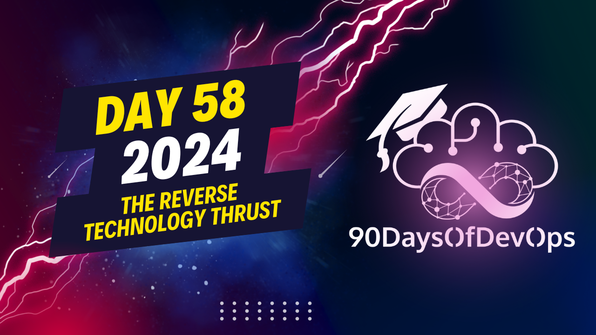](https://www.youtube.com/watch?v=tmwjQnSTE5k)

## Description
This session provides lessons learned from my work as an AppDev Solutions Specialist at Red Hat with large-scale public institutions. Despite investing heavily in technology, their return on agility, operations, and time to market could have been much higher. The leading root cause for failing to achieve these goals is the need for change in their culture and processes at the organizational level. They faced the painful need to learn to unlearn and reskill their personnel with DevOps practices instead of investing in tooling to accelerate innovation.

## Author

Rom Adams (né Romuald Vandepoel) is an open-source strategy and C-Suite advisor with over 20 years of experience in the IT industry. He is a cloud-native expert who helps customer and partner organizations modernize and transform their data center strategies with enterprise open-source solutions. He is also a facilitator, advocate, and contributor to open-source projects, advising companies and lawmakers on their open-source and sustainability strategies.

Previously, he was a Principal Architect at Ondat, a cloud-native storage company acquired by Akamai, where he designed products and implemented hybrid cloud solutions for enterprise customers. He also held various roles at Tyco, NetApp, and Red Hat, gaining certifications and becoming a subject matter expert in storage and hybrid cloud infrastructure. He has participated as a moderator and speaker for several events and publications, sharing his insights and best practices on culture, process, and technology adoption. Rom is passionate about driving transformation and innovation with open-source and cloud-native technologies.

   
  
  

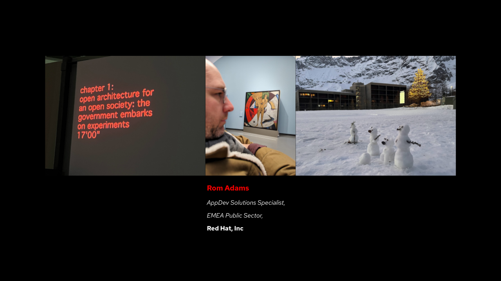

## A quote that I like

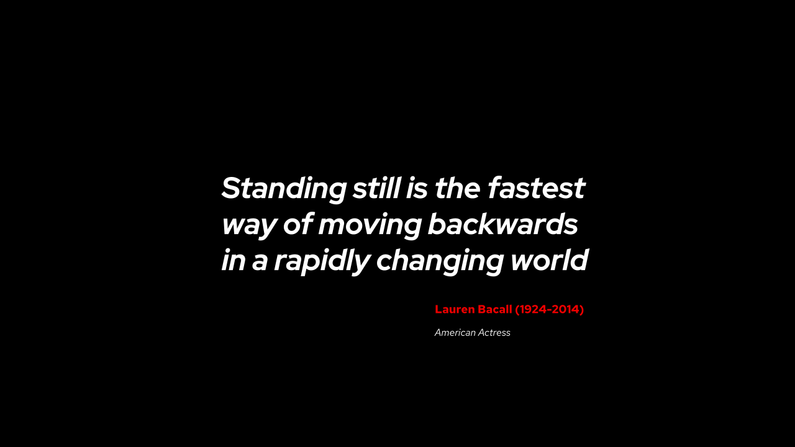

## Talking points

### The Tooling Trail
Surveys done by Forrester of the Container Adoption Journey engagements have shown that the most benefits for an organization are the application modernization opportunities rather than the operational-related or infrastructure part. Yet, the default behavior is to embark on a new Tooling Trail or an endless journey seeking and testing new tools. These might provide substantial benefits, but the organization will evaluate them with a rather standstill point of view rather than an innovative forward mindset. 

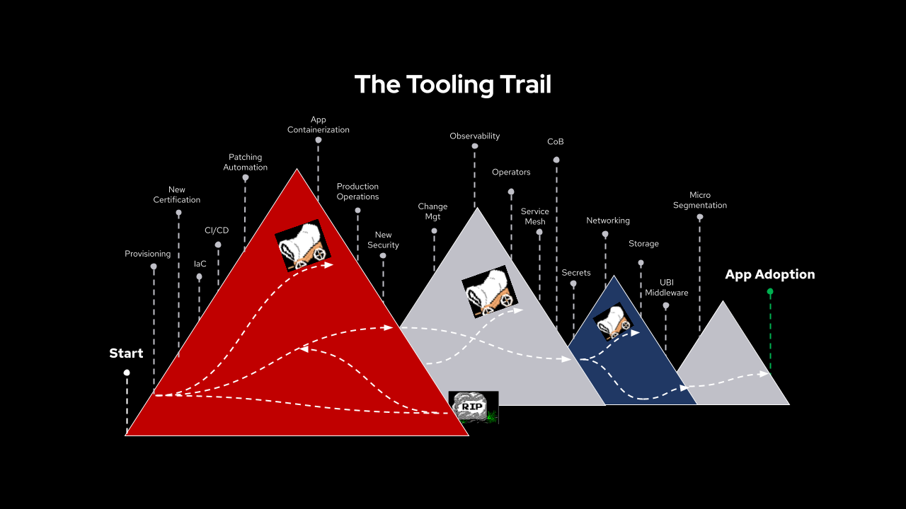

### Practices vs Tools
As we are the only masters of our faith and destiny, we have a funnel vision for improving our daily tasks, whether with automation, containerization, security tooling, or the cloud. 
However, the introduction of this tool will benefit the individual or the team of the individual if adopted. This is a pocket initiative; it could significantly  impact the initiator's daily work but not so much for the team due to the learning curve on top of the existing workload. It can even be a source of fragmentation and entropy for the team and even on a larger scale.
Adopting a new tool has to become a strategic decision at an organizational level to benefit a larger group, which involves changing the culture and processes.

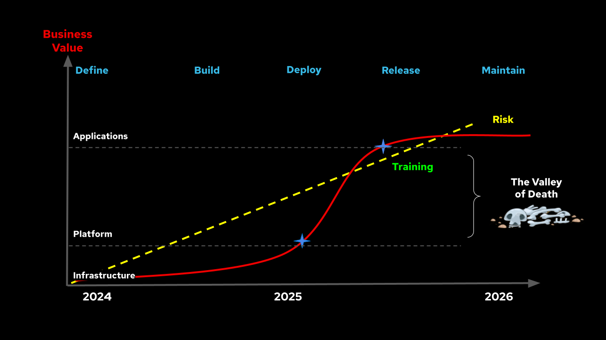
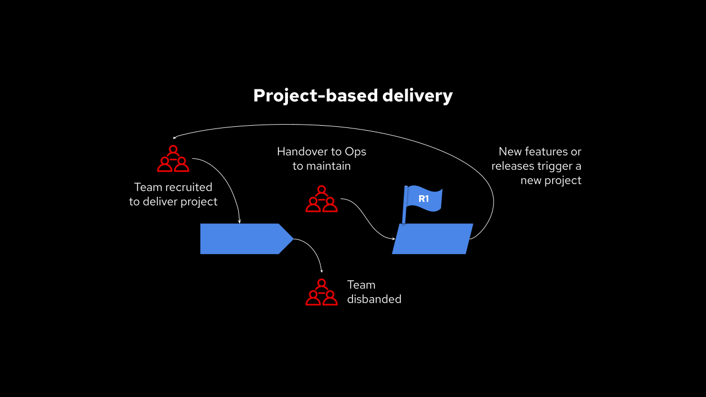

### People and Process
From our open-source roots and customer engagements, we have established that technology adoption can only be successful if there is an opportunity to evolve the organization's culture and processes. This crucial step requires either an organizational change initiative (see [Kotter's approach](https://www.kotterinc.com/methodology/8-steps/) as an example) or a compelling event. 
Most of the slowdown from a time-to-market perspective is spent to avoid embracing the changes. A typical example is the adoption of Kubernetes. It will be another painful platform trail when retrofitting 20 years of legacy experience into its design and implementation instead of creating a safe greenfield to learn the new patterns and build the platform iteratively. 
Although individuals or teams may consider it a given, it is not integrated into the organization's culture and processes.
It is often observed that individuals in organizations are grouped into silos based on their domain knowledge. However, it is interesting to note that every individual from one silo relies on another silo to accomplish their daily mission. Despite this interdependence, organizations (like society) tend to sort, classify, and isolate individuals rather than promote a sense of collectivism. This creates a significant benefit in terms of management but a challenge for collaboration.
The first significant change is to create a core adoption team composed of volunteers with a set of competencies that will constitute a guiding coalition fostering changes from a culture, processes, and technology standpoint. 

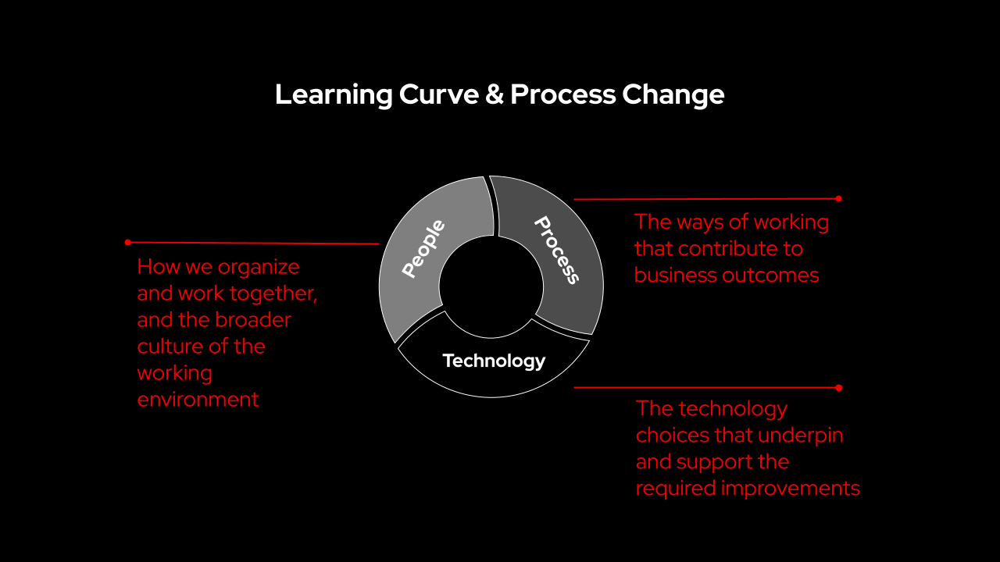

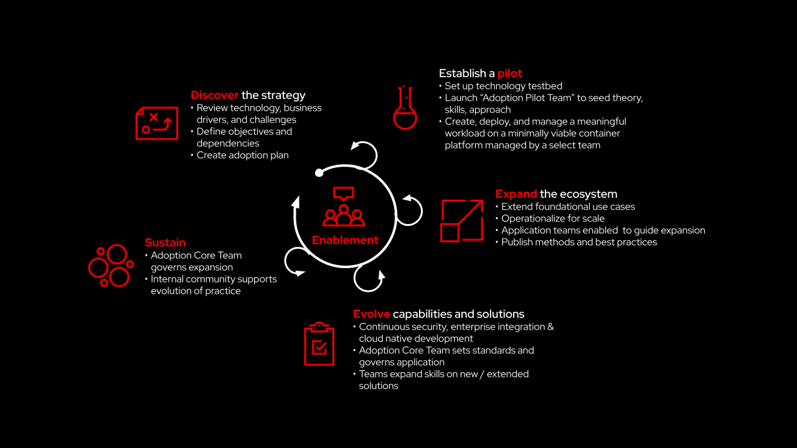

The DevOps model calls for deeper collaboration and interaction at a cross-functional level. It starts by the end, defining the business value and requirements and creating a set of fragmented tasks with meaningful outcomes.
If we think about this process, it's basically breaking down a waterfall planning into small iterative chunks corresponding to a milestone. 
The core adoption team will then start building based on the targeted outcomes in short cycles and enabling the relevant Ops team to operate the solution. This approach reduces the cognitive overload on the entire organization. 

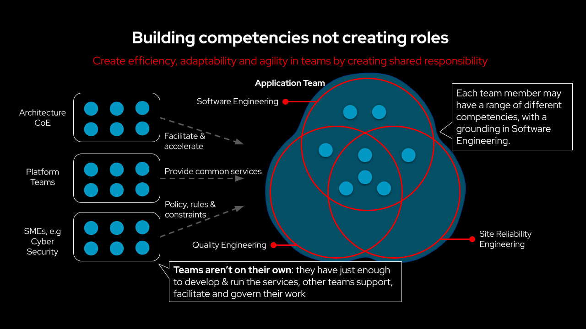

### Fail, Learn, Repeat
For some reason, the practice of failure is often associated with stigma or trauma. However, embracing it with a collective analysis capability enriches the knowledge and know-how. Avoiding it will result in larger and out-of-control incidents with limited capability to respond. 
This is the reason military or fire drills exist.

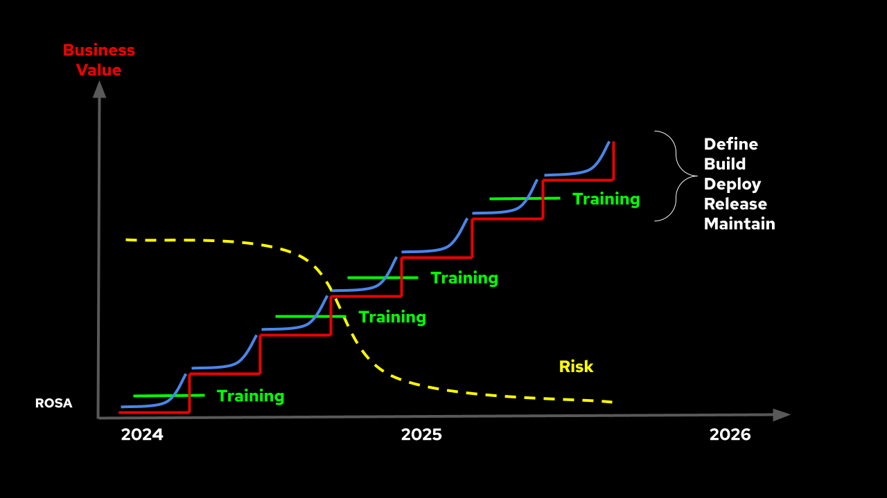

### All the above applied to application modernization
In this example, a legacy application is considered to be containerized. The first obvious question would be: what value does this work bring to the business? 
As you can imagine, if the answer is vague or can not be measurable, then the effort should not be carried over. 
The actual business requirement is to provide autoscaling capability to some modules of the application to cope with unpredictable usage. Then the containerization of the application would not help, but the modernization of it leveraging a hybrid software architecture with microservices would.
A core adoption team will be created with members having knowledge of the application, cloud-native middleware, and microservices. 
The first module is extracted as a microservice. At this stage, part of the original domain knowledge-based team will be trained on the changes. Having a new set of team members enabled on the first iteration will help to carry on on the second. As the work continues on this respective application or a new one, the organization will move towards a Platform-as-a-Product team. 
On a larger scale, the enablement team will move towards the so-called SRE (System Reliability Engineering) model for the organization.

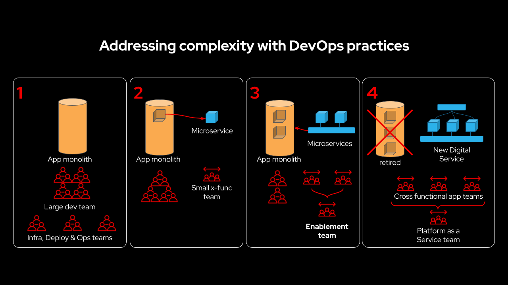
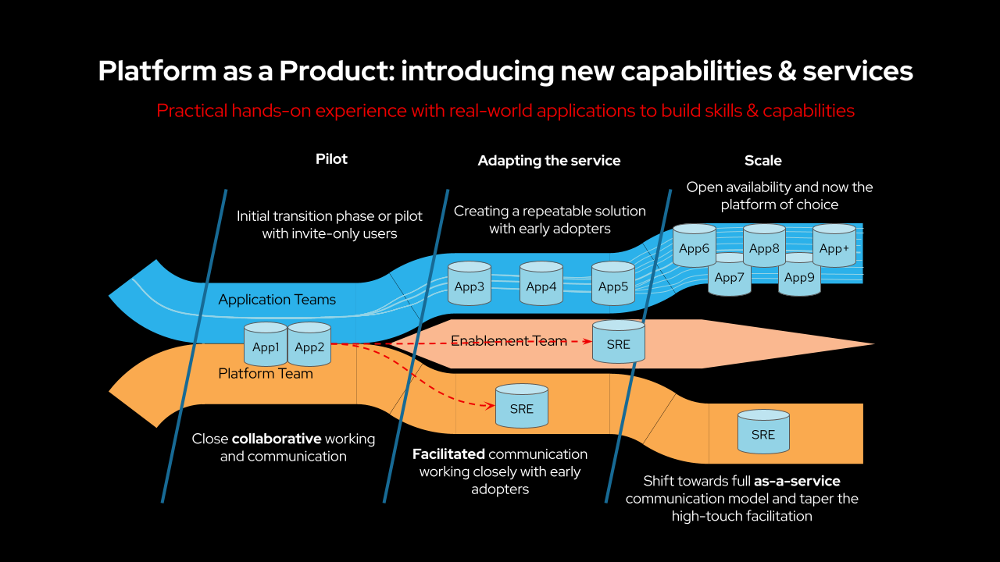

## Thank you!

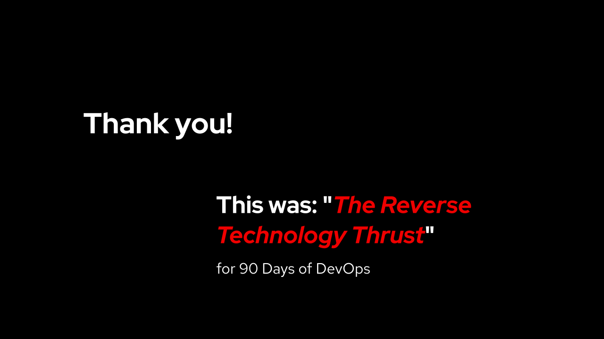
