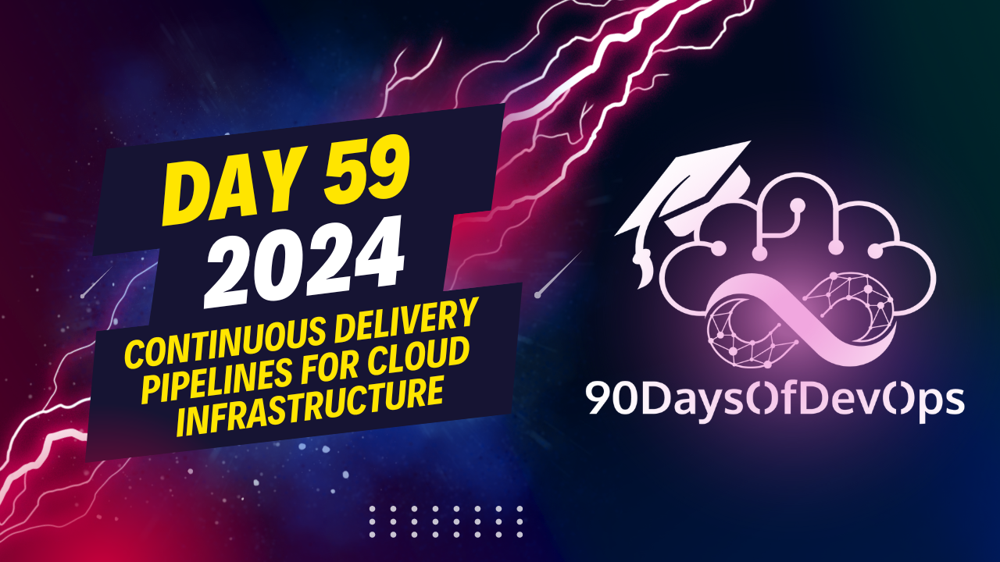

# Day 59 - Continuous Delivery pipelines for cloud infrastructure

 The three principles of Continuous Delivery for Infrastructure Code are:

1. Everything is code, and everything is in version control: This means that all infrastructure components are treated as code, stored in a version control system, and can be easily tracked, managed, and audited.

2. Continuously test and deliver all the work in progress: This principle emphasizes the importance of testing every change before it's deployed to production, ensuring that the infrastructure is always stable and functional. It also encourages automating the deployment process to reduce manual errors and improve efficiency.

3. Work in small simple pieces that you can change independently: This principle suggests dividing infrastructure components into smaller, independent modules or stacks that can be changed without affecting other parts of the infrastructure. This reduces complexity, shortens feedback cycles, and allows for more effective management of permissions and resources.

In terms of organizing technology capabilities within an organization, these are usually structured in a layered approach, with business capabilities at the top, technology capabilities in the middle, and infrastructure resources at the bottom. Technology capabilities are further broken down into infrastructure stacks, which are collections of cloud infrastructure resources managed together as a group.

Examples of infrastructure stacks include a Kubernetes cluster with node groups and a load balancer, a Key Vault for managing secrets, and a Virtual Private Cloud (VPC) network. Good criteria for slicing infrastructure stacks include team or application boundaries, change frequency, permission boundaries, and technical capabilities.

To get started with infrastructure automation, teams can implement what is called the "Walking Skeleton" approach, which involves starting simple and gradually improving over time. This means setting up a basic pipeline that runs a Terraform apply on a development or test stage in the initial iteration, then iterating and improving upon it as the project progresses.

Challenges faced when automating infrastructure code include blast radius (the potential damage a given change could make to the infrastructure) and disaster recovery (the ability to recover from a state where all infrastructure code has been lost). To address these challenges, teams should regularly practice deploying from scratch, design their pipelines to test both spinning up infrastructure from zero and applying changes to the existing infrastructure, and ensure that their infrastructure code is modular and independent.

Recommended resources for diving deeper into this topic include the book "Infrastructure as Code" by Kief Morris, which provides practical guidance on implementing Continuous Delivery for infrastructure.
Here is the summary of the presentation:

**IDENTITY and PURPOSE**

The presenter discussed how to bring together AWS and Google Cloud platforms, specifically focusing on building technology capabilities. They introduced the concept of "infrastructure Stacks" - collections of cloud infrastructure resources managed together as a group.

The presenter then presented criteria for slicing infrastructure stacks:

1. Team or application or domain boundaries
2. Change frequency (e.g., updating Kubernetes clusters more frequently than VPCs)
3. Permission boundaries (to provide least privileges and prevent over-privileging)
4. Technical capabilities (e.g., building a kubernetes cluster as one capability)

The presenter emphasized the importance of starting with infrastructure automation early in a project, using a "walking skeleton" approach to reduce complexity and improve feedback cycles.

**CHALLENGES**

Two challenges were highlighted:

1. Blast radius: the potential damage a given change could make to a system
2. Immutable deployments: replacing old container images with new ones, making it difficult to practice Disaster Recovery

The presenter recommended rethinking how infrastructure changes are handled in a pipeline to include testing from zero to latest version.

**SUMMARY**

The presentation concluded by summarizing the three principles of continuous delivery for infrastructure:

1. Everything is code and everything is inversion control
2. Continuously test and deliver all work in progress
3. Work in small, simple pieces that can be changed independently

The presenter also mentioned the importance of promoting a code base that does not change throughout the individual stages of the pipeline.

**FURTHER READING**

The presenter recommended checking out the book "Infrastructure as Code" by ke Morris (currently working on the Third Edition) on O'Reilly.
