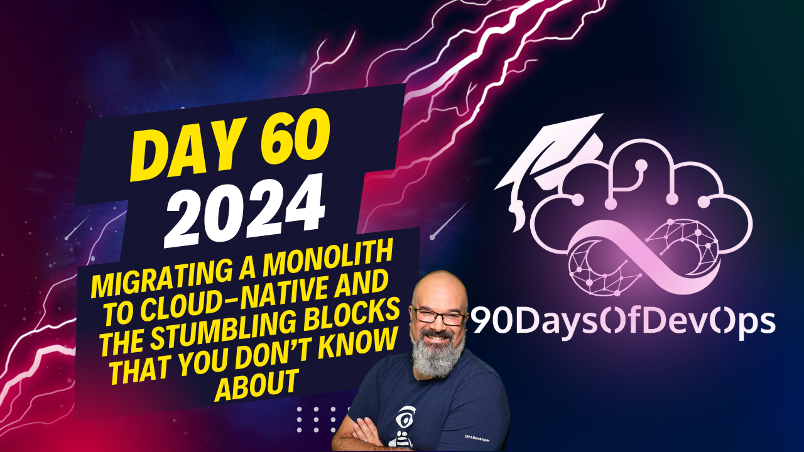

# Day 60 - Migrating a monolith to Cloud-Native and the stumbling blocks that you don’t know about

 In transitioning to the cloud native space, there are concerns about cost savings and financial management. Traditionally, capital expenditures (CapEx) allow for depreciation write-offs, which is beneficial for companies, especially at larger scales. However, with cloud services often paid through a credit card, it becomes challenging to depreciate Operational Expenditures (OpEx). This can lead to problems for CFOs as they require predictability and projectability in their financial planning.

To address these concerns, it is essential to have open discussions with decision-makers about the nature of cloud native solutions and how leasing hardware rather than owning it may affect spending patterns. You will find that costs can fluctuate significantly from month to month due to factors like scaling up or down resources based on demand.

Here are some steps you can take to improve your chances of success in the cloud native space:

1. Assess the current state of your applications and containers: Determine if your application was truly containerized, or if it has just been wrapped using a pod. This is crucial because many organizations still follow an outdated approach to containerization based on early promises from Docker.

2. Prioritize optimization over features: Encourage your teams to focus on optimizing existing applications rather than adding new features, as this will help drive efficiency and save engineering time.

3. Build future cloud native applications from the ground up: If possible, design new cloud-native applications with the appropriate tools for optimal performance. This will prevent you from going into the red while trying to adapt an existing application to fit a cloud native environment.

4. Use the right tool for the job: Just as using a saw when you need a hammer won't work effectively, migrating an application without careful consideration may not be ideal or successful. Ensure that your team understands the specific needs of the application and chooses the appropriate cloud native solution accordingly.

**Main Themes:**

1. **Tribal Knowledge**: The importance of sharing knowledge across teams and microservices in a cloud-native space.
2. **Monitoring and Visibility**: Recognizing that multiple monitoring applications are needed for different teams and perspectives.
3. **Cloud Native Economics**: Understanding the differences between data center and cloud native economics, including Opex vs. Capex and the need for projectability.
4. **Containerization**: The importance of truly containerizing an app rather than just wrapping a pod and moving on.

**Purpose:**

The purpose of this conversation seems to be sharing lessons learned from experience in the cloud-native space, highlighting the importance of:

1. Recognizing tribal knowledge and sharing it across teams.
2. Adapting to the changing landscape of monitoring and visibility in cloud-native environments.
3. Understanding the unique economics of cloud native and its implications for decision-making.
4. Emphasizing the need for true containerization and optimization rather than just wrapping a pod.

**Takeaways:**

1. Share knowledge across teams and microservices to avoid silos.
2. Be prepared for multiple monitoring applications in cloud-native environments.
3. Understand the differences between data center and cloud native economics.
4. Prioritize true containerization and optimization over quick fixes.

By: JJ Asghar
Slides: [here](https://docs.google.com/presentation/d/1Nyh_rfB-P4C1uQI6E42qHMEfAj-ZTXGDVKaw1Em8H5g/edit?usp=sharing)

If you're looking to have a deeper conversation, never hesitate to reach out to JJ [here](https://jjasghar.github.io/about).
