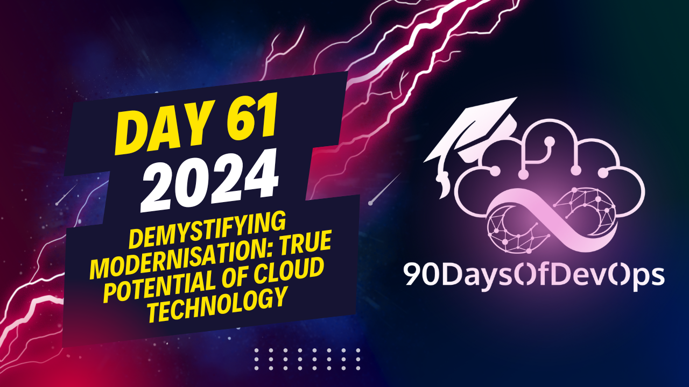

# Day 61 - Demystifying Modernisation: True Potential of Cloud Technology

 In summary, the speaker discussed six strategies (Retire, Retain, Rehost, Replatform, Repurchase, and Re-Architect/Refactor) for modernizing applications within the context of moving them to the cloud. Here's a brief overview of each strategy:

1. Retire: Applications that are no longer needed or no longer provide value can be deprecated and removed from the system.

2. Retain: Keep existing applications as they are, often due to their strategic importance, high cost to modify, or compliance requirements.

3. Rehost: Move an application to a different infrastructure (such as the cloud) without changing its architecture or functionality.

4. Replatform: Adapt the application's underlying technology stack while preserving its core functionality.

5. Repurchase: Buy a new commercial off-the-shelf software solution that can replace an existing one, either because it better meets the organization's needs or is more cost-effective in the long run.

6. Re-Architect/Refactor: Completely redesign and modernize an application to take full advantage of new technologies and improve its performance, scalability, and security.

Application modernization differs from cloud migration in that the former focuses on enhancing the architecture of existing applications, while the latter primarily involves shifting those applications to a cloud environment. Both processes are essential components of a comprehensive digital transformation strategy, as they help organizations improve agility, scalability, and efficiency, ultimately giving them a competitive edge in the digital economy.

The speaker emphasized that it's not enough just to move an application to the cloud; instead, organizations should aim to optimize their applications for success in the digital landscape by modernizing both their infrastructure and data in addition to their applications. They can do this by understanding these three interconnected components of digital modernization: infrastructure modernization (using technologies like Google Cloud Platform), data modernization (managing and analyzing data efficiently), and application modernization (enhancing the functionality, performance, and security of existing applications).

The speaker concluded by encouraging businesses to embrace the power of cloud technology through a comprehensive journey of transforming their applications, infrastructure, and data to fully capitalize on the benefits offered by the digital landscape. They invited listeners to connect with them for further discussions or questions on this topic.

**Application Migration Strategies**

1. **Rehost**: Lift and shift applications from existing infrastructure to cloud, with no changes to the application core architecture.
2. **Replatform**: Replace database backends or re-platform an application using cloud provider's services, while keeping the application core architecture the same.
3. **Repurchase**: Fully replace a Legacy application with a SaaS-based solution that provides similar capabilities.

**Application Modernization**

* Refactoring or rebuilding: Redesign an application in a more Cloud-native manner, breaking down monolithic applications into smaller microservices and leveraging services like Cloud Run or Cloud Functions.

**Digital Transformation Components**

1. **Infrastructure Modernization**: Updating and refactoring existing infrastructure to take advantage of new technologies and cloud computing platforms.
2. **Data Modernization**: Migrating data from existing storage solutions to cloud-native services, such as Cloud Storage, Cloud SQL, or Firestore.
3. **Application Modernization**: Refactoring or rebuilding applications to take advantage of new technologies and cloud computing platforms.

**Key Takeaways**

* Application modernization is a process that updates and refactors existing applications to take advantage of new technologies and cloud computing platforms.
* It involves infrastructure, data, and application architecture modernization.
* The three components of digital transformation - infrastructure, data, and application modernization - are interconnected and essential for comprehensive digital transformation.
