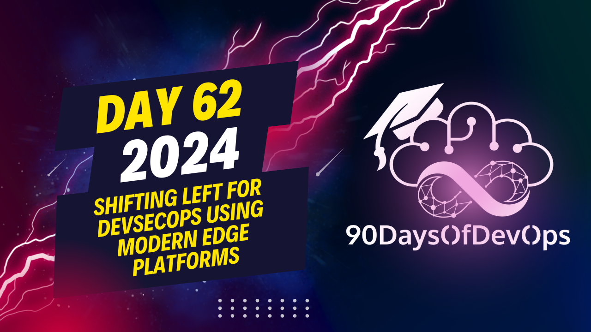

# Day 62 - Shifting Left for DevSecOps Using Modern Edge Platforms

 In this discussion, the participants are discussing a CI/CD workflow with a focus on security (Secure DevOps). The idea is to shift left the security practices from testing and production to the early stages of development. This approach helps mitigate issues that can arise during deployment and operations.

To measure success in this context, they suggest monitoring several metrics:
- Application coverage: Ensure a high percentage of all applications across the organization are covered under the same process, including software composition analysis (SCA), static application security testing (SAST), dynamic application security testing (DAST), web application protection, and API protections.
- Frequency of releases and rollbacks: Track how often releases have to be rolled back due to security vulnerabilities, with a focus on reducing the number of production rollbacks since these are more costly than addressing issues earlier in the process.
- Mean Time To Detect (MTTD) and Mean Time To Respond (MTTR) for vulnerabilities within the organization: Strive to reduce the time from disclosure of a vulnerability to detection, response, and resolution within the organization. A mature organization should aim for a short MTTD and MTTR.
- Cost and revenue implications: In the current interest rate environment, profitability is crucial. Security practices can impact both costs (e.g., internal costs related to fixing vulnerabilities) and revenue (e.g., ability to close deals faster by addressing security concerns in the Redline discussions).
Here's a summary of the conversation:

**Identity**: The importance of shifting left in the development process, specifically in the context of web application and API protection.

**Purpose**: To discuss the benefits of integrating security into the DevOps lifecycle, including reducing meantime to detect (MTTD) and meantime to resolve (MTTR), as well as improving revenue and profitability.

**Key Points**:

1. **Meantime to Detect (MTTD)**: Measure how long it takes from vulnerability disclosure to detection within your organization.
2. **Meantime to Resolve (MTTR)**: Track how quickly you can resolve vulnerabilities after they are detected.
3. **Cost Savings**: Shifting left can reduce internal costs, such as those related to code reviews and testing.
4. **Revenue Implications**: Integrating security into the DevOps lifecycle can help close deals faster by demonstrating a commitment to security and minimizing risk.
5. **False Positives**: Reduce false positives by incorporating security checks earlier in the development process.

**Metrics to Track**:

1. MTTD (meantime to detect)
2. MTTR (meantime to resolve)
3. Revenue growth
4. Cost savings

**Takeaways**:

1. Shifting left is essential for reducing MTTD and MTTR.
2. Integrating security into the DevOps lifecycle can improve revenue and profitability.
3. Measuring success through metrics such as MTTD, MTTR, and revenue growth is crucial.

Overall, the conversation emphasized the importance of integrating security into the development process to reduce risks and improve business outcomes.
