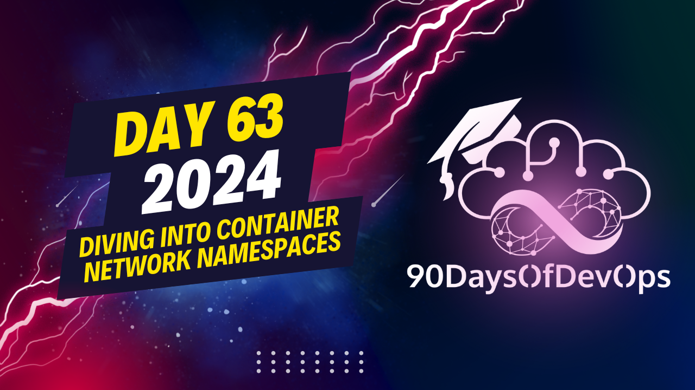

# Day 63 - Diving into Container Network Namespaces

 In summary, the user created two network namespaces named orange and purple. They added a static route in the orange namespace that directs any unknown destination traffic to the super bridge (192.168.52.0) which allows the outbound traffic to reach the external world.

The user also enabled IP forwarding on both network namespaces so that traffic can flow between them and to the outside world. They were able to ping a website from the orange namespace, indicating successful communication with the outside world.

For production scale, the user plans to use a container networking interface (CNI) system, which automates the onboarding and offboarding process using network namespaces for containers. The CNI also manages IP addresses and provides an offboarding mechanism for releasing IPs back into the pool when needed.

The user ended by thanking the audience and expressing hope to see them in future episodes of 90 Days of DevOps. They were addressed as Marino Wi, and Michael Cade was acknowledged along with the rest of the community.

**Identity and Purpose**

The speaker, Marino, is discussing a scenario where he created two network namespaces (orange and purple) and wants to enable communication between them. He explains that they are isolated from each other by default, but with some configuration changes, they can be made to communicate.

**Main Points**

1. The speaker creates two network namespaces (orange and purple) and brings their interfaces online.
2. Initially, he cannot ping the bridge IP address (192.168.52.0) from either namespace.
3. He enables IP forwarding and sets up an IP tables rule to allow outbound traffic from the orange namespace.
4. He adds a static route to the default route table in each namespace to enable communication with the outside world.
5. With these changes, he is able to ping the bridge IP address (192.168.52.0) from both namespaces.
6. The speaker explains that this scenario demonstrates how pod networking works, using network namespaces and the container networking interface (CNI) specification.

**Key Takeaways**

1. Network namespaces can be isolated from each other by default.
2. With proper configuration changes, they can be made to communicate with each other.
3. IP forwarding and static routing are necessary for communication between network namespaces.
4. The CNI specification is used to automate the onboarding and offboarding process of containers in a network.

**Purpose**

The purpose of this exercise is to demonstrate how pod networking works, using network namespaces and the CNI specification. This is relevant to production-scale scenarios where multiple containers need to communicate with each other.
