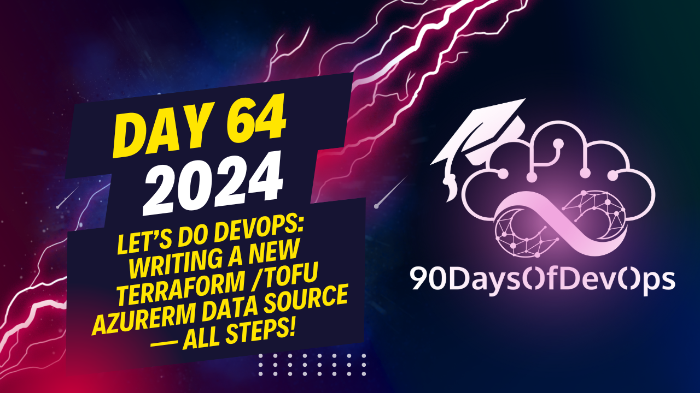

# Day 64 - Let’s Do DevOps: Writing a New Terraform /Tofu AzureRm Data Source — All Steps!

This session goes into explaining the process of creating a Terraform data source using Go, and testing it with unit tests in Visual Studio Code. You also mentioned using an environment file (EnV) to store secrets for authentication when running the tests. Here's a summary:

1. Create a Go project, and at the root of the project, create an environment file (EnV) containing secrets required for authentication.

2. Write unit tests for your Terraform data source in Visual Studio Code using IDhenticate to authenticate with Azure or other services when running the tests.

3. Run the tests from the command line using the `make ACC tests service network test args run` command, which will run all tests that match the given pattern (in this case, "service", "network", and variations).

4. To use a local provider in Terraform instead of the one published in the library, build the provider using `go build`, which will create a binary and place it in your Go path under the `bin` folder.

5. Create a `terraform.rc` file in your home directory with a Dev override to tell Terraform to look for the local binary when called.

6. Run Terraform using the command line, e.g., `terraform plan`, to see if it works as expected and outputs the desired data.

7. The provided Terraform code can be used by others, who only need to ensure they are on version 3890 or newer and follow the instructions for finding and using existing IP groups in Terraform.

Overall, you have created a custom Terraform data source and tested it thoroughly using unit tests, Visual Studio Code, and the command line interface (CLI). You can find more information on your website at [ky.url.lol9 daysof devops 2024](ky.url.lol9 daysof devops 2024). Thank you for sharing this informative presentation!
Here's a summary of the content:

The speaker, Kyler Middleton, is an expert in Terraform and Go programming languages. He presents a case study on how to create a custom Terraform data source using Go language. The goal was to create a data source that could retrieve IP groups from Azure, which did not exist as a built-in Terraform resource.

Kyler explains the process of researching and finding a solution. He and his team realized that they could hack together a solution using external CLIs and outputs and inputs. However, this approach had limitations and was not scalable. Therefore, they decided to write their own Terraform data source in Go language.

The speaker then walks through the steps taken:

1. Writing three unit tests for the provider
2. Compiling the provider and testing it
3. Integrating Visual Studio Code (VSCode) with the terraform provider language
4. Running unit tests within VSCode
5. Writing Terraform code to use the local binary that was compiled
6. Testing the Terraform code
7. Opening a Pull Request (PR) and getting it merged

Kyler concludes by stating that the custom Terraform data source is now available for everyone to use, starting from version 3890 of the HashiCorp Azure RM provider.

## About Me
I'm [Kyler Middleton](https://www.linkedin.com/in/kylermiddleton/), Cloud Security Chick, Day Two Podcast host, Hashi Ambassador, and AWS Cloud Builder. 
I started my journey fixing computers on a farm, and now build automation tools in the healthcare industry. I write my [Medium blog]([https://www.linkedin.com/in/kylermiddleton/](https://medium.com/@kymidd) on how to make DevOps accessible and I'll teach anyone who will listen about the benefits of automation and the cloud. 
I think computers are neat. 

## Life Stuff
Kyler is married to her partner Lindsey of more than 15 years, and co-mom'ing it up raising their 2 year old toddler Kennedy, the light of her moms' eyes. Kyler and crew currently live in Madison, Wisconsin, USA. 

## Let's do DevOps!
