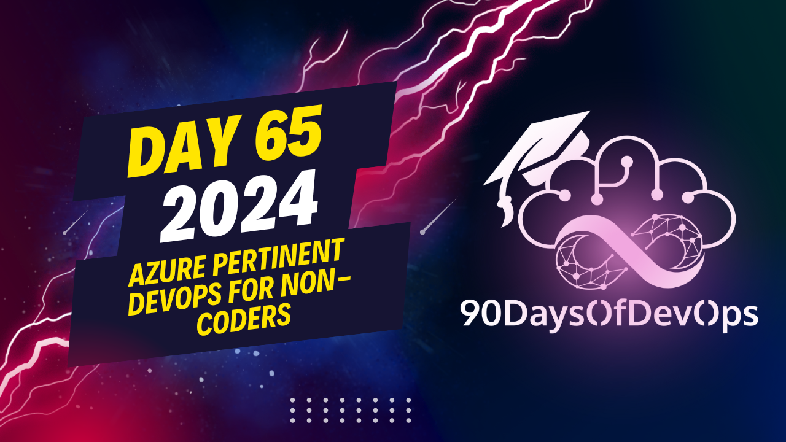

# Day 65 - Azure pertinent DevOps for non-coders

 The presentation discusses several DevOps practices, their implications, and how they can be leveraged by non-coders. Here's a summary:

1. Continuous Delivery (CD) practice focuses on automating the software delivery process, with the goal of reducing time to market and improving quality. For non-coders, understanding CD principles can help streamline IT operations and improve collaboration.

2. Infrastructure as Code (IAC) is a practice that treats infrastructure resources like software code, making it easier to manage, version, and automate infrastructure changes. Familiarity with IAC tools such as Terraform, Ansible, or Azure Resource Manager (ARM) is important for Azure administrators and folks working in infrastructure roles.

3. Configuration Management focuses on enforcing desired States, tracking changes, and automating issue resolution. While it has a broader organizational scope, understanding configuration management can help non-coders contribute to more efficient IT environments and improve their professional development.

4. Continuous Monitoring provides real-time visibility into application performance, aiding in issue resolution and improvement. Proficiency in Azure Monitor and Azure Log Analytics is beneficial for admins working to ensure the continuous performance and availability of applications and services.

The presentation concludes by suggesting studying for the Microsoft DevOps Engineer Expert certification (AZ 400) as a way to deepen one's knowledge of DevOps concepts and enhance career prospects. This expert-level certification focuses on optimizing practices, improving communications and collaboration, creating automation, and designing and implementing application code and infrastructure strategies using Azure technologies.

The presentation covers the following topics:

1. **GitHub**: A development platform for version control, project management, and software deployment. GitHub provides a range of services, including code hosting, collaboration tools, and automation workflows.
2. **Agile**: An iterative approach to software development that emphasizes team collaboration, continual planning, and learning. Agile is not a process but rather a philosophy or mindset for planning work.
3. **Infrastructure as Code (IAC)**: A practice that treats infrastructure as code, enabling precise management of system resources through version control systems. IAC bridges the gap between development and operations teams by automating the creation and tear-down of complex systems and environments.
4. **Configuration Management**: A DevOps practice that enforces desired states, tracks changes, and automates issue resolution. This practice simplifies managing complex environments and is essential for modern infrastructure management.

**Key Takeaways:**

* Non-coders can contribute to DevOps practices, such as GitHub, agile, IAC, and configuration management.
* These practices are essential for efficient, secure, and collaborative IT environments.
* DevOps professionals design and implement application code and infrastructure strategies that enable continuous integration, testing, delivery, monitoring, and feedback.
* The Azure Administrator Associate or Azure Developer Associate exam is a prerequisite to take the AZ-400: Designing and Implementing Microsoft DevOps Solutions certification exam.

**Next Steps:**

1. Study towards the official certification from Microsoft related to DevOps (DevOps Engineer Expert).
2. Prepare for the AZ-400: Designing and Implementing Microsoft DevOps Solutions certification exam by following the Azure Learn path series.
3. Continuously update knowledge on DevOps practices, GitHub, agile, IAC, and configuration management.

**Conclusion:**

In conclusion, the presentation has provided an overview of DevOps practices and their applications in various scenarios. Non-coders can contribute to these practices, which are essential for efficient, secure, and collaborative IT environments. The certification path outlined in this summary provides a clear roadmap for professionals looking to enhance their skills and knowledge in DevOps.
