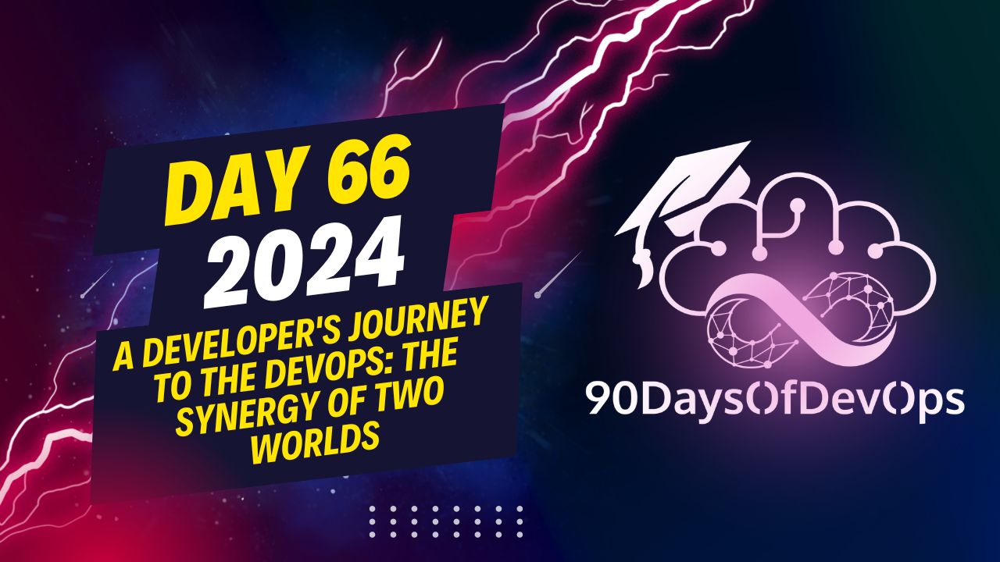

# Day 66 - A Developer's Journey to the DevOps: The Synergy of Two Worlds

 The speaker is discussing the concept of a T-shaped developer, which refers to someone who has broad knowledge and skills across multiple areas (represented by the horizontal bar of the "T") but also deep expertise in one specific area (represented by the vertical bar). This model allows developers to work effectively with others from different teams, learn new things, and mentor junior developers.

The speaker emphasizes that being T-shaped offers opportunities for collaboration, learning, and growth, both personally and professionally. They also mention their passion for sharing knowledge and helping others, especially those starting out in their careers, and discuss the role of a mentor within a development team.

Lastly, the speaker uses gardening as an analogy for personal and professional growth, emphasizing the importance of adopting a growth mindset and continuously learning and improving one's skills. They conclude by encouraging listeners to pursue their passions and not limit themselves based on career roles or labels, and to share their knowledge with others.

Overall, the speaker is advocating for a T-shaped approach to development, emphasizing collaboration, mentoring, growth, and the pursuit of personal passions as key elements in a successful career in the field.
The speaker is an expert in DevOps and has shared their top seven lessons learned in the field. The main points are:

1. Continuous Learning (CD) - always learn new things and develop your skills.
2. T-shaped skills - become proficient in multiple areas to solve complex problems.
3. Collaboration - work with others to achieve common goals.
4. Synergize - combine your strengths with those of others to create something greater than the sum of its parts.
5. Help others - mentor or help colleagues who need guidance.
6. Grow and develop - as you learn and take on new challenges, you will grow professionally and personally.

The speaker also emphasizes the importance of having a positive mindset and being open to change and learning.

As for the purpose of identity, the speaker believes that it is important to define what you want to achieve in your career and be willing to put in the effort required to get there. They encourage others to do the same and not limit themselves to specific roles or labels. The speaker also quotes a book they read, "Daily Stoics" by Robert Green, which says, "At the center of your being you have the answer; you know who you are and you know what you want."

The speaker's key takeaway is to be true to oneself and follow one's passions, saying "Do what you love and love what you do." They also offer a QR code to access their online book on DevOps and invite others to join their user group.
